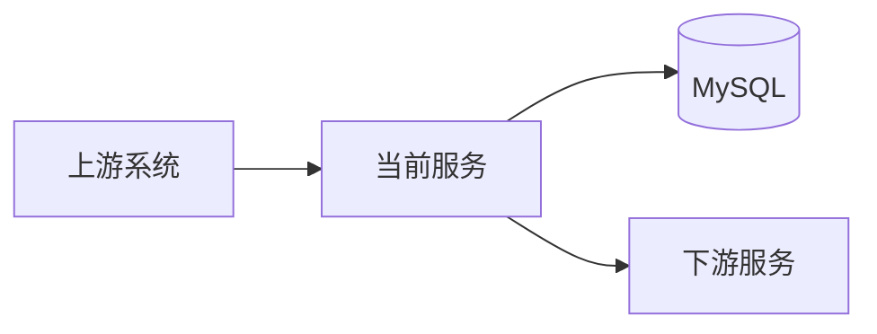
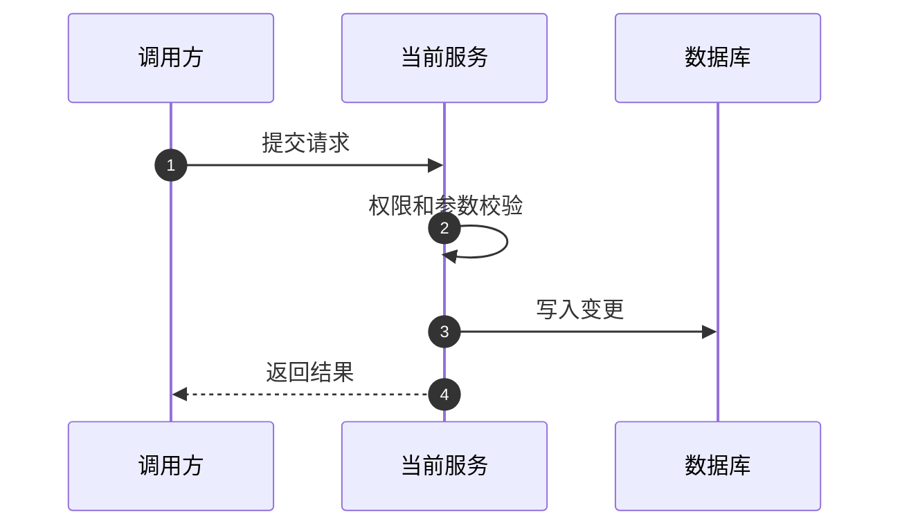
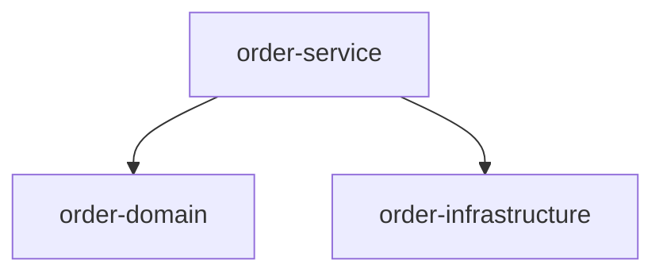

# Java 后端实现计划: [FEATURE]

**分支**: `[###-feature-name]` | **日期**: [DATE] | **规格说明**: [link]
**输入**: `/specs/[###-feature-name]/spec.md` 中的功能规格说明

**说明**: 本模板由 `__SPECKIT_COMMAND_PLAN__` 命令填充。执行时会先复制 `.specify/templates/overrides/plan-template.md` 到当前功能目录的 `plan.md`，再基于 `spec.md`、`constitution.md` 和调研结果补全内容。

## 摘要

[从 spec.md 提取：核心需求、涉及的 Java 后端改动范围、主要技术方案、关键风险、发布策略。不要重复完整业务背景，只保留对技术设计有影响的信息。]

## 1. 技术上下文 (Technical Context)

<!--
  必填：把占位符替换为当前项目的真实技术信息。
  如果某项无法从 spec.md 或现有代码中确认，标记为 NEEDS CLARIFICATION，
  让 Phase 0 research.md 明确调研结论。
-->

**Java 版本**: [例如 Java 17、Java 21 或 NEEDS CLARIFICATION]  
**后端框架**: [例如 Spring Boot 3.x、Spring Cloud、Dubbo 或 NEEDS CLARIFICATION]  
**构建工具**: [例如 Maven、Gradle、多模块 Maven 或 NEEDS CLARIFICATION]  
**主要依赖**: [例如 Spring Web、MyBatis/JPA、Redis Client、MQ Client、OpenFeign 或 NEEDS CLARIFICATION]  
**数据存储**: [例如 MySQL、MongoDB、Redis、Elasticsearch、对象存储或 NEEDS CLARIFICATION]  
**消息 / 定时任务**: [例如 Kafka、RabbitMQ、RocketMQ、XXL-JOB、Quartz 或 N/A]  
**测试方案**: [例如 JUnit 5、Mockito、Testcontainers、SpringBootTest、REST Assured 或 NEEDS CLARIFICATION]  
**目标运行环境**: [例如 Linux、Kubernetes、VM、内部 PaaS 或 NEEDS CLARIFICATION]  
**项目类型**: [例如 Spring Boot Web 服务、批处理任务、公共库、内部工具或 NEEDS CLARIFICATION]  
**性能目标**: [例如 p99 < 200ms、500 QPS、批任务 30 分钟内完成或 NEEDS CLARIFICATION]  
**约束条件**: [例如 API 向后兼容、零停机迁移、必须支持灰度发布或 NEEDS CLARIFICATION]  
**规模范围**: [例如日增数据量、峰值 QPS、表规模、上下游系统数量或 NEEDS CLARIFICATION]

## 2. 需求影响摘要

<!--
  spec.md 已经承载完整业务背景，这里只记录会影响技术方案的需求点。
  用于让评审人快速理解：哪些现有逻辑会变、哪些功能点受影响。
-->

| 需求点 | 当前逻辑 | 目标逻辑 | 影响的功能 / 模块 |
|--------|----------|----------|-------------------|
| [需求点] | [当前行为或 N/A] | [目标行为] | [模块、接口、任务、数据模型等] |

## 3. 架构设计

### 3.1 系统架构现状与目标

说明当前系统上下文、目标架构，以及本需求引入的架构变化。优先使用 Mermaid 图表达系统之间的关系。

<!-- 示例格式：

-->

**当前架构**: [图示和说明]

**目标架构**: [图示和说明]

**架构变更点**:

| 变更点 | 变更原因 | 影响系统 / 团队 |
|--------|----------|-----------------|
| [变更] | [为什么需要] | [服务、模块、团队] |

### 3.2 核心流程现状与目标

用流程图或时序图说明核心链路。需要体现新增逻辑、变更的判断点、重试、异步处理、失败处理和降级路径。

<!-- 示例格式：

-->

**当前流程**: [图示和说明]

**目标流程**: [图示和说明]

**流程差异**:

| 步骤 | 当前行为 | 目标行为 | 风险 / 备注 |
|------|----------|----------|-------------|
| [步骤] | [当前行为] | [目标行为] | [风险或 N/A] |

### 3.3 应用 / Maven 模块架构

说明本需求涉及哪些可部署应用、Maven Module、公共库或任务模块。可部署服务和共享库需要分开描述。

<!-- 示例格式：

-->

| 应用 / 模块 | 类型 | 职责 | 本次变化 |
|-------------|------|------|----------|
| [服务或模块] | [可部署服务 / Maven Module / 公共库] | [职责] | [新增 / 修改 / 不变] |

### 3.4 上下游依赖

**下游依赖**

| 系统 | 依赖说明 | Service Name | 负责人 | SLA / 风险 |
|------|----------|--------------|--------|------------|
| [系统] | [为什么依赖它] | [service-name] | [负责人] | [SLA、超时、风险] |

**上游调用方**

| 系统 | 调用说明 | Service Name | 负责人 | 兼容性要求 |
|------|----------|--------------|--------|------------|
| [系统] | [如何调用当前服务] | [service-name] | [负责人] | [向后兼容要求] |

## 4. 详细设计

### 4.1 功能改动点

把需求拆成系统功能、开发动作和技术风险。需要覆盖数据模型变化、复杂业务逻辑、长链路、并发一致性、权限、安全和性能敏感点。

| 需求点 | 系统功能 | 开发动作 | 技术因素 / 风险 |
|--------|----------|----------|-----------------|
| [需求点] | [功能点] | [实现动作] | [一致性、性能、权限、幂等、兼容等] |

### 4.2 模块设计

每个主要业务模块复制一份本小节。没有涉及的子项可以删除。

#### 模块: [模块名称]

**职责**: [这个模块负责什么]

**用例 / 使用场景**: [参与方和核心行为；必要时补充用例图]

**处理流程 / 时序**: [核心流程图和说明]

**关键规则与异常场景**:

| 场景 | 处理方式 |
|------|----------|
| [正常主流程之外的特殊情况、限制条件、重复请求、失败分支] | [系统如何判断、返回什么、是否重试/补偿/告警] |

**异常处理**:

| 异常场景 | 调用方结果 | 日志 / 指标 | 恢复方式 |
|----------|------------|-------------|----------|
| [异常] | [返回结果] | [日志或指标] | [恢复方式] |

### 4.3 数据模型与存储设计

本节记录 plan 级别的数据设计和关键决策。完整实体、字段、关系、校验规则和状态流转写入 `data-model.md`；完整接口 / 消息契约写入 `contracts/`。

#### 4.3.1 存储选型调研结论

如果本需求需要新增持久化数据，必须说明为什么选择 MySQL、MongoDB 或其他存储。不能只写“新增表”或“放 MongoDB”。

**选型规则参考**:

| 场景 | 倾向选择 | 原因 |
|------|----------|------|
| 强事务、关系清晰、需要 JOIN、需要唯一约束、需要严格一致性 | MySQL / 关系型数据库 | 事务、约束、索引和关系建模更稳定 |
| 文档结构灵活、字段差异大、嵌套结构多、主要按整体文档读写 | MongoDB | Schema 灵活，适合文档型数据 |
| 高频读、可重建、允许短暂不一致、需要 TTL | Redis | 缓存和短期状态更合适 |
| 全文检索、复杂搜索、聚合分析 | Elasticsearch | 搜索和分析能力更合适 |

**本需求存储选型**:

| 数据对象 | 候选存储 | 最终选择 | 选择原因 | 放弃其他方案的原因 | 一致性 / 事务要求 |
|----------|----------|----------|----------|--------------------|-------------------|
| [数据对象] | [MySQL / MongoDB / Redis / ES / 其他] | [最终选择或 NEEDS CLARIFICATION] | [业务访问模式、事务、查询、数据结构、容量原因] | [为什么不用其他存储] | [强一致 / 最终一致 / 无事务要求] |

> 如果最终选择仍不明确，在这里标 `NEEDS CLARIFICATION`，并在 `research.md` 中补充 Decision / Rationale / Alternatives considered。

#### 4.3.2 MySQL / 关系型数据库

<!-- 示例格式：
| 表名 | 变更类型 | 关键字段 | 索引 | 迁移 / 兼容说明 |
|------|----------|----------|------|-----------------|
| t_order_audit | 新增 | id, order_id, status | idx_order_id | 存储订单审计记录 |
-->

| 表名 | 变更类型 | 关键字段 | 索引 | 迁移 / 兼容说明 |
|------|----------|----------|------|-----------------|
| [表名] | [新增 / 修改 / 不变 / N/A] | [字段摘要] | [索引] | [迁移说明] |

**索引设计**

| 查询场景 | 查询条件 / SQL 形态 | 索引 | 设计原因 |
|----------|---------------------|------|----------|
| [场景] | [WHERE / JOIN / ORDER BY 形态] | [索引] | [为什么这个索引能支撑查询] |

#### 4.3.3 MongoDB

| Collection | 变更类型 | 文档结构摘要 | 索引 | 说明 |
|------------|----------|--------------|------|------|
| [collection] | [新增 / 修改 / 不变 / N/A] | [结构摘要] | [索引] | [说明] |

#### 4.3.4 Redis

<!-- 示例格式：
| Key 模式 | 数据类型 | TTL | 用途 | 一致性策略 |
|----------|----------|-----|------|------------|
| order:{id}:status | String | 24h | 缓存订单状态 | DB 更新后删除缓存 |
-->

| Key 模式 | 数据类型 | TTL | 用途 | 一致性策略 |
|----------|----------|-----|------|------------|
| [key] | [String / Hash / Set / ZSet / N/A] | [TTL] | [用途] | [删除 / 更新 / 重建策略] |

#### 4.3.5 Elasticsearch / 搜索索引

| 索引 | 变更类型 | 主要字段 | 同步方式 | 说明 |
|------|----------|----------|----------|------|
| [index] | [新增 / 修改 / N/A] | [字段] | [同步机制] | [说明] |

### 4.4 接口与消息契约

这里列出 plan 级别的接口变化。完整 OpenAPI、RPC、MQ 消息结构放到 `contracts/`。

#### 对外提供 HTTP API

| URI | Method | 接口名 | 入参字段 | 出参字段 | 是否幂等 | 权限 / 鉴权 |
|-----|--------|--------|----------|----------|----------|-------------|
| [URI] | [GET/POST/PUT/DELETE] | [名称] | [字段和校验] | [字段] | [是/否] | [权限校验] |

#### 对外输出 MQ 事件

| Topic / Queue | 事件说明 | 消息体摘要 | 幂等键 | 消费方 |
|---------------|----------|------------|--------|--------|
| [topic] | [事件] | [字段] | [key] | [consumer] |

#### 外部 HTTP / RPC 依赖

| Service Name | URI / Method | 接口名 | 用途 | 超时 / 熔断 | 重试策略 | 异常返回处理 |
|--------------|--------------|--------|------|-------------|----------|--------------|
| [service] | [URI/method] | [名称] | [用途] | [timeout/breaker] | [重试、幂等性] | [兜底/异常处理] |

#### 外部 MQ 依赖

| Topic / Queue | 场景 | 消息体摘要 | 幂等策略 | 负责人 |
|---------------|------|------------|----------|--------|
| [topic] | [场景] | [字段] | [策略] | [负责人] |

### 4.5 业务配置

| 配置 Key | 配置说明 | 默认值 | 生效范围 | 回滚 / 变更策略 |
|----------|----------|--------|----------|-----------------|
| [key] | [说明] | [默认值] | [全局 / 租户 / 用户 / 地区] | [如何安全变更] |

### 4.6 定时任务

| 任务名称 | 作用 | 执行策略 | 执行方式 | 依赖 | 失败处理 |
|----------|------|----------|----------|------|----------|
| [任务] | [作用] | [cron/频率] | [单节点 / 全节点 / 分片] | [依赖] | [重试/告警/人工恢复] |

## 5. 稳定性设计

### 5.1 监控与报警

说明上线后如何判断功能正常。需要包含业务指标和技术指标。

| 指标类型 | 指标名称 | 指标说明 | 告警策略 |
|----------|----------|----------|----------|
| [业务 / 技术] | [指标] | [含义] | [阈值、持续时间、负责人] |

### 5.2 安全风险评估

| 分类 | 检查项 | 是否有风险 | 应对策略 |
|------|--------|------------|----------|
| 接口安全 | 是否做了水平越权和垂直越权控制 | [是/否/N/A] | [策略] |
| 参数校验 | 是否校验类型、长度、格式、枚举、分页、内容 | [是/否/N/A] | [策略] |
| 敏感数据 | 敏感字段是否传输加密、存储加密、日志脱敏 | [是/否/N/A] | [策略] |
| 密钥管理 | 密码、Token、Key 是否避免写入代码或普通配置 | [是/否/N/A] | [策略] |
| 后门风险 | 是否不存在隐藏接口、脚本、特殊账号逻辑 | [是/否/N/A] | [策略] |

### 5.3 性能与容量

#### 核心接口 SLA

| 接口 / 场景 | 容量目标 | 延迟目标 | 评估方式 |
|-------------|----------|----------|----------|
| [接口/场景] | [QPS/TPS/数据量] | [TP99/TP999] | [压测 / 线上指标] |

#### 应用服务风险检查

| 领域 | 评估项 | 是 / 否 / N/A | 风险与应对 |
|------|--------|---------------|------------|
| 性能 | 本次变更是否影响服务 SLA 或峰值 QPS | [值] | [风险/应对] |
| 数据量 | 单次请求是否可能处理过多数据导致 OOM | [值] | [风险/应对] |
| 查询限制 | 批量查询、导入导出、时间范围是否有限制 | [值] | [风险/应对] |
| 外部调用 | 是否存在循环调用 DB 或下游，可否批量化 | [值] | [风险/应对] |
| 一致性 | 是否有写后读、并发修改、主从延迟风险 | [值] | [风险/应对] |
| 线程池 | 线程池大小、队列、拒绝策略、隔离是否清楚 | [值] | [风险/应对] |

#### 中间件风险检查

| 中间件 | 评估项 | 是 / 否 / N/A | 风险与应对 |
|--------|--------|---------------|------------|
| DB | 是否评估索引、JOIN、模糊查询、大批量更新 | [值] | [风险/应对] |
| Redis | 是否评估大 Value、热点 Key、TTL、缓存一致性 | [值] | [风险/应对] |
| MQ | 是否评估幂等、顺序、重试、积压风险 | [值] | [风险/应对] |
| 网关 | 是否评估限流、响应体大小、序列化成本 | [值] | [风险/应对] |

#### 容量评估

| 资源 | 变更类型 | 名称 | 日增量 | 2 年估算 | 是否需要分片 / 归档 |
|------|----------|------|--------|----------|---------------------|
| MySQL / MongoDB / ES / Redis / MQ | [新增 / 存量] | [表/Key/索引/Topic] | [容量] | [容量] | [策略或 N/A] |

### 5.4 限流、降级、补偿与兜底

**限流**

| 接口 / 场景 | 限流方式 | 阈值 | 负责人 / 操作 |
|-------------|----------|------|---------------|
| [接口] | [网关 / 应用 / 令牌桶等] | [阈值] | [负责人] |

**降级**

| Service Name | 降级方式 | 触发条件 | 操作方式 | 预期效果 | 恢复策略 |
|--------------|----------|----------|----------|----------|----------|
| [service] | [开关 / fallback / 关闭链路] | [条件] | [操作] | [效果] | [恢复] |

**补偿 / 兜底**

| 场景 | 补偿方式 | 为什么不能放到产品流程中 | 操作人 | 审计 / 监控 |
|------|----------|--------------------------|--------|------------|
| [场景] | [方式] | [原因] | [操作人] | [审计/监控] |

## 6. 灰度、发布与回滚

### 6.1 灰度策略

说明本需求是否需要灰度。如果需要，明确灰度维度、配置、步骤和验证指标；如果不需要，说明回滚或降级策略。

| 阶段 | 范围 | 进入条件 | 验证指标 | 退出 / 回滚条件 |
|------|------|----------|----------|-----------------|
| [阶段] | [用户/地区/租户/流量比例] | [条件] | [指标] | [条件] |

### 6.2 发布计划

| 步骤 | 操作 | 负责人 | 验证方式 |
|------|------|--------|----------|
| [步骤] | [操作] | [负责人] | [如何验证] |

### 6.3 回滚计划

| 回滚触发条件 | 回滚动作 | 数据兼容 / 清理 | 验证方式 |
|--------------|----------|-----------------|----------|
| [触发条件] | [动作] | [数据处理] | [验证] |

## 7. Phase Outputs（阶段产物）

`__SPECKIT_COMMAND_PLAN__` 命令必须生成或更新以下产物：

- `research.md`: Phase 0 技术调研结论。每个未解决的 `NEEDS CLARIFICATION`、主要技术选型、MySQL/MongoDB 等存储选型，都必须包含 Decision / Rationale / Alternatives considered。
- `data-model.md`: Phase 1 实体、字段、关系、校验规则和状态流转。
- `contracts/`: Phase 1 HTTP / RPC / MQ 契约。
- `quickstart.md`: Phase 1 最小运行手册，包含启动服务和验证一个端到端场景的步骤。
- Agent context file: 更新托管的 Spec Kit 区块，让后续命令能指向当前 `plan.md`。

## 8. Constitution Check（宪法检查）

*GATE: Must pass before Phase 0 research. Re-check after Phase 1 design.*

[根据 constitution.md 填写检查项。若有违反，必须在 Complexity Tracking 中说明为什么需要违反、为什么更简单的方案不可行。]

## 9. Project Structure（项目结构）

### Documentation（当前功能文档）

```text
specs/[###-feature]/
├── plan.md              # 当前文件（__SPECKIT_COMMAND_PLAN__ command output）
├── research.md          # Phase 0 输出（__SPECKIT_COMMAND_PLAN__ command）
├── data-model.md        # Phase 1 输出（__SPECKIT_COMMAND_PLAN__ command）
├── quickstart.md        # Phase 1 输出（__SPECKIT_COMMAND_PLAN__ command）
├── contracts/           # Phase 1 输出（__SPECKIT_COMMAND_PLAN__ command）
└── tasks.md             # Phase 2 输出（__SPECKIT_COMMAND_TASKS__ command - NOT created by __SPECKIT_COMMAND_PLAN__）
```

### Source Code（仓库根目录）

<!--
  必填：替换为当前功能真实涉及的 Java 后端目录。
  删除无关路径，不要把示例目录原样保留在最终 plan.md 中。
-->

```text
src/main/java/[base-package]/
├── api/                 # Controller、Request/Response DTO
├── application/         # Application Service / Use Case
├── domain/              # Domain Model / Domain Service
├── infrastructure/      # Persistence、外部 Client、MQ、Cache
└── config/              # Spring 配置

src/main/resources/
├── application.yml
└── mapper/              # 如使用 MyBatis XML

src/test/java/[base-package]/
├── unit/
├── integration/
└── contract/

# 多模块 Maven 示例，仅在适用时保留：
[service-name]/
├── [service-name]-api/
├── [service-name]-application/
├── [service-name]-domain/
├── [service-name]-infrastructure/
└── [service-name]-starter/
```

**结构决策**: [说明最终采用的目录结构，并引用上面的真实路径]

## 10. Complexity Tracking（复杂度例外记录）

> 只有 Constitution Check 存在违反项时才填写。

| Violation | Why Needed | Simpler Alternative Rejected Because |
|-----------|------------|-------------------------------------|
| [例如新增模块/服务] | [当前为什么需要] | [为什么现有模块/服务不足] |
| [例如自定义抽象/框架] | [解决什么具体问题] | [为什么直接实现不足] |
