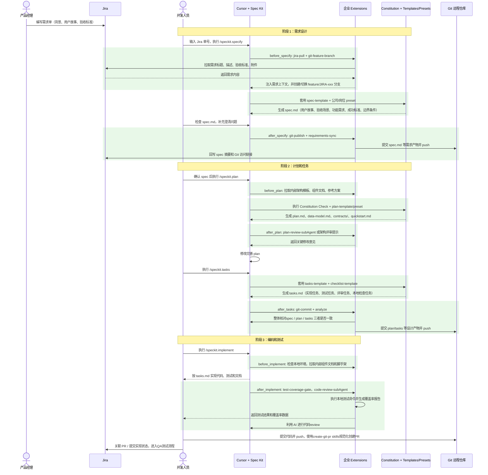
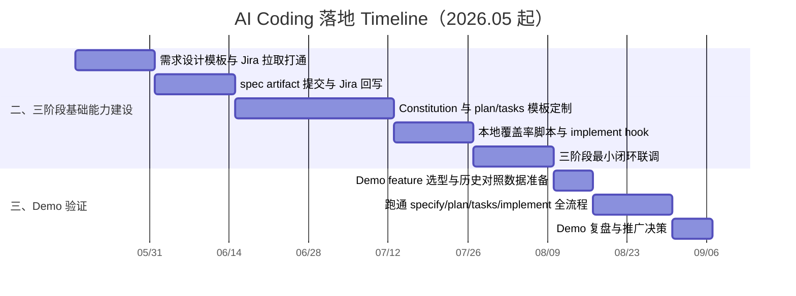
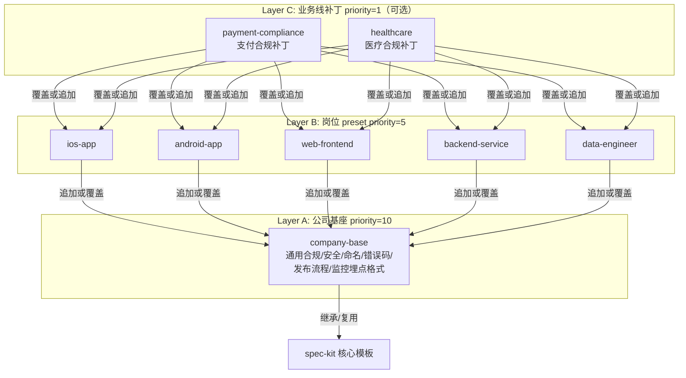

# 企业级 AI Coding 落地计划

这份计划的主线是：先看清 AI Coding 在公司研发流程里的完整闭环，再按闭环拆出需要定制的模板、扩展和门禁；等基础能力准备好后，用 1 个真实 demo 验证效率提升，最后再进入团队试点、全研发覆盖和数据驱动迭代。

---

## 一、AI Coding 开发流程全景图

下面这张图描述的是一个完整的 Cursor + Spec Kit 企业研发闭环：PM 仍然在 Jira 写需求，开发人员在 Cursor 里拉取需求、生成 `spec.md`、`plan.md`、`tasks.md`，再按任务完成编码、测试和本地覆盖率检查。企业 Extensions 负责把 Jira、Git、内部文档、本地测试脚本等能力接进来。

颜色说明：

- 浅绿色：需要公司定制或开发的部分，包括 Extension、Constitution、Templates、Presets、本地脚本和 hook。
- 无底色：主要是人机交互或已有系统操作，通常不属于第一批定制开发重点。

这张图里有三个关键结论：

1. `spec.md`、`plan.md`、`tasks.md` 不是孤立文档，而是从需求到实现的连续输入输出链路。
2. Templates/Presets 负责让 AI 生成的内容符合公司规范，Extensions 负责把这些内容同步到 Jira、Git 和内部协作系统。
3. 覆盖率检查不应该只写在文档里，能自动化的要通过 hook 或本地脚本直接执行。

---

## 二、基于全景图拆分的三阶段建设任务

落地时不要一开始就做全量平台。建议先围绕“需求设计、计划和任务、编码和测试”三段，各自完成最小可用的模板和 Extension，再用 demo 串起来验证。

### 阶段 1：需求设计

**目标**：把 Jira 里的自然语言需求变成研发和 PM 都能确认的 `spec.md`，并保证 spec 有清晰的用户故事、验收场景、功能需求、成功标准和边界条件。

**周期**：3 周。

**需要定制的 Templates / Presets**：

| 定制项                     | 内容                                       |
| ----------------------- | ---------------------------------------- |
| `spec-template.md`      | 增加业务价值、上下游依赖、用户影响范围、合规/隐私影响、成功指标         |
| `checklist-template.md` | 增加需求完整性检查：验收场景是否覆盖主流程、边界条件是否明确、成功标准是否可衡量 |
| `company-base` preset   | 固化公司通用需求规范，如：敏感数据、对外接口                   |

**需要开发的 Extensions**：

| Hook             | Extension            | 作用                                   |
| ---------------- | -------------------- | ------------------------------------ |
| `before_specify` | `jira-pull`          | 输入 Jira 单号后自动拉取标题、描述、验收标准、附件         |
| `before_specify` | `git-feature-branch` | 按照DE规范自动创建或切换 `feature/JIRA-xxx` 分支  |
| `after_specify`  | `git-publish`        | 将 `spec.md` 提交到远程 Git，并生成可访问链接       |
| `after_specify`  | `requirements-sync`  | 将 spec 摘要和链接同步回 Jira，避免 PM 和研发维护两份需求 |

**阶段完成标准**：

- 开发人员可以只输入 Jira 单号就生成第一版 `spec.md`。
- PM 和开发可以基于同一份 `spec.md` 确认需求。
- `spec.md` 能被后续 `/speckit.plan` 直接使用，且没有明显的需求断层。

### 阶段 2：计划和任务

**目标**：把确认后的 `spec.md` 转成符合公司工程规范的 `plan.md` 和 `tasks.md`，提前暴露架构、DB、API、监控、性能、安全和评审要求。

**周期**：5 周。

**需要定制的 Templates / Presets**：

| 定制项                               | 内容                                            |
| --------------------------------- | --------------------------------------------- |
| `.specify/memory/constitution.md` | 写入公司红线：安全、合规、核心链路测试、架构边界                      |
| `plan-template.md`                | 增加 DB 设计、API 设计、监控埋点、日志规范、错误码、性能基线、灰度/回滚、隐私合规 |
| `tasks-template.md`               | 增加测试任务、Code Review、本地覆盖率检查、文档更新、上线检查等任务类型     |
| `checklist-template.md`           | 增加计划评审 checklist：接口是否可测、监控是否可验收               |
| 岗位 preset                         | 为后端、前端、iOS、Android分别补充岗位特有检查项                 |

**需要开发的 Extensions**：

| Hook          | Extension               | 作用                                       |
| ------------- | ----------------------- | ---------------------------------------- |
| `before_plan` | `arch-template-fetcher` | 根据项目类型拉取内部架构模板、技术组件文档和参考方案               |
| `after_plan`  | `plan-review-subAgent`  | 自动检查 plan质量，以及是否缺少 DB、API、监控、性能、灰度、合规等章节 |
| `after_tasks` | `git-commit`            | 将 `plan.md`、`tasks.md` 等设计产物单独提交，便于审计和回滚 |
| `after_tasks` | `analyze`               | 整体核对spec / plan / tasks 三者是否一致           |

**阶段完成标准**：

- `plan.md` 能覆盖技术方案中的核心要点，而不是只写实现思路。
- `tasks.md` 不只是开发 TODO，还包含测试、评审、本地检查和文档任务。

### 阶段 3：编码和测试

**目标**：让AI 按 `tasks.md` 完成代码、测试和文档，并用本地脚本获取测试覆盖率，确认“完成”不是主观声明。

**建议周期**：4 周。

**需要定制的 Templates / Presets**：

| 定制项                 | 内容                                                                         |
| ------------------- | -------------------------------------------------------------------------- |
| `tasks-template.md` | 明确每类任务的完成定义，例如测试通过、覆盖率达标、文档更新、API 契约同步                                     |
| `quickstart.md` 约定  | 规定最小可复现验证路径，方便跑通主流程                                                        |
| 岗位 preset           | 前端增加 E2E(跑通核心用户流程)/Lighthouse(检查页面性能/质量)，后端增加 contract test，移动端增加包体积和兼容性测试 |

**需要开发的 Extensions / 脚本**：

| Hook / 位置          | Extension 或脚本          | 作用                              |
| ------------------ | ---------------------- | ------------------------------- |
| `before_implement` | `internal-doc-fetcher` | 拉取内部组件、API 网关、SDK、脚手架文档         |
| `after_implement`  | `test-coverage-gate`   | 在本地运行测试命令，生成覆盖率报告，不达标则返回失败      |
| 本地脚本               | `coverage-report`      | 读取覆盖率结果并输出摘要，例如行覆盖率、分支覆盖率、未覆盖文件 |
| `after_implement`  | `code-review-subAgent` | review 生成的代码质量                  |
| skills             | `create-git-pr`        | 为代码创建 PR，按照一定的格式规范。             |

**阶段完成标准**：

- AI 能按 `tasks.md` 完成代码和测试，不遗漏功能。
- 覆盖率检查在本地运行，输出覆盖率报告和是否达标的结论。
- code review可以发现明显的代码问题
- 可以按照指定格式创建pr
---

## 三、Demo 验证：先证明流程有效，再推广

前三阶段的基础能力完成后，不建议马上全公司推广。应该先选 1 个真实业务 demo，完整跑通从 Jira 到 spec、plan、tasks、implement、本地覆盖率检查的闭环，用数据证明效率提升。

**建议周期**：4 周。

**Demo 选型原则**：

- 选择“中等复杂度、小而全”的 feature，最好包含前端、后端、DB、API、测试和文档。
- 不要选太大的项目，容易跑不完；也不要选太简单的改文案需求，体现不出 Spec Kit 的价值。
- 最好选一个历史上经常返工的类型，例如接口字段反复变更、DBA 审查经常补材料、验收标准不清晰。

**Demo 执行方式**：

1. 准备一个历史对照 feature，记录它的需求确认耗时、开发耗时、PR 轮次、返工次数、线上 bug。
2. 用新的 AI Coding 流程跑一个同等复杂度 feature。
3. 记录每一步耗时：`specify`、`plan`、`tasks`、`implement`、测试修复、评审修复。
4. 评估 artifact 质量：PM 是否看得懂 `spec.md`，Tech Lead 是否能直接审 `plan.md`，开发是否能按 `tasks.md` 独立推进。
5. 输出 1 份 demo 复盘文档，说明节省了哪里、增加了哪里、哪些能力还不适合推广。

**进入公司推广的判断标准**：

- `spec.md` 能明显减少需求澄清轮次。
- `plan.md` 能提前暴露 DB、API、监控、灰度、合规等问题。
- `tasks.md` 能减少 Tech Lead 手工拆任务成本。
- 覆盖率检查能在本地稳定运行，并能输出清晰的覆盖率数据。
- 至少有一个真实 feature 的 lead time、返工次数或评审轮次有可量化改善。

---

## 整体 Timeline

下面的时间线从 2026 年 5 月开始，以两周为一个时间刻度。先完成三阶段基础能力建设，再做 1 个真实 demo 验证。

这条路线的关键不是一次性把所有模板和扩展做完，而是先打通最小闭环，用真实 demo 证明效率提升，再把有效部分产品化、版本化、治理化。

---

# 附录
## 基础能力说明

这一部分不是独立的落地阶段，而是对前文三阶段中反复出现的底层能力做补充说明。真正排期时，仍然应该按“需求设计、计划和任务、编码和测试”的主流程推进。

### 1. Constitution：公司红线

`.specify/memory/constitution.md` 适合放 `/speckit.plan` 阶段就能判断的设计和实现前置条件，例如：

| 类别  | 例子                                  |
| --- | ----------------------------------- |
| 合规  | 敏感数据必须脱敏存储，关键数据必须有生命周期和留存说明         |
| 安全  | 禁止明文存储密码、token、密钥，外部输入必须校验          |
| 质量  | 核心链路必须有 contract test，关键模块覆盖率必须达到阈值 |
| 架构  | 禁止跨库 JOIN，外部依赖必须有降级或超时策略            |

注意：Constitution 适合做设计期约束，不应该替代真实发布系统里的审批、灰度、变更窗口和生产运维控制。

### 2. Preset：模板分层

不要为每个岗位从头复制一套模板。推荐用三层 preset：

这样公司基座升级一次，可以自动影响所有岗位 preset，避免 5 套模板各自漂移。

### 3. Extension：流程自动化

Extensions 的作用不是让文档更漂亮，而是减少手工动作：拉 Jira、建分支、提交 artifact、同步 Jira、触发本地测试、生成覆盖率报告、检查 API 文档。优先做高频且重复的动作，低频审批不要一开始就自动化。

### 4. Integration：统一 Agent 使用方式

企业落地要避免“有人用 Cursor、有人用 Copilot、有人用 Claude”导致上下文规则不一致。建议先选 1 个主力 agent，在 context 文件中注入公司级 rules，例如代码风格、命名规范、注释语言、禁用 API 清单。

---

## 四、公司推广落地路线

Demo 通过后，再进入推广。节奏建议是：1 个团队深度使用，全研发覆盖，根据数据持续迭代。不要跳过单团队试点，否则问题会在全公司范围内同时爆发。

### P1：1 个团队深度使用

**周期**：6 周。

**目标**：让一个完整研发小组形成稳定用法，而不是只跑一次演示。

**动作清单**：

- 选择 1 个愿意配合、业务复杂度适中的团队，5-10 人比较合适。
- 该团队所有新 feature 默认走 `/speckit.specify`、`/speckit.plan`、`/speckit.tasks`。
- Tech Lead 每周复盘模板是否过重、哪些字段没人看、哪些 extension 真正省时间。
- 产出 `company-base@1.0`、核心 extension v1、团队使用手册。
- 收集指标：lead time、PR 轮次、返工次数、线上 bug、模板遵从率、开发满意度。

**成功标志**：

- 团队成员不依赖推动者也能独立完成流程。
- 真实 feature 数量达到 3-5 个。
- 至少 2 个指标出现改善，例如 lead time 下降、PR 返工减少、需求澄清减少。

### P2：全研发覆盖

**周期**：12 周。如果公司规模较大，可以先经过 3-5 个团队的扩展期，再进入全覆盖。

**目标**：让 AI Coding 流程成为默认研发流程，而不是少数团队的试验。

**动作清单**：

- 建内部 preset catalog 和 extension catalog，提供统一安装入口。
- 发布岗位 preset：`backend-service`、`web-frontend`、`ios-app`、`android-app`、`data-engineer`。
- 建立培训体系：30 分钟入门视频、1 小时深入讲座、分岗位 Q&A、每周 office hour。
- 增加轻量门禁：PR 必须关联 `specs/NNN-xxx/`，没有 `plan.md` 的复杂 feature 需要额外说明。
- 建立治理小组：架构师、资深工程师、PM、安全、DBA 共同维护 constitution、preset 和 extension。

**成功标志**：

- 大部分新 feature 都有 `spec.md`、`plan.md`、`tasks.md`。
- 不同岗位使用同一套公司基座规则，没有明显模板漂移。
- Jira、Git 和本地检查脚本的关键动作基本自动化。

### P3：根据数据持续迭代

**建议周期**：持续进行，建议按月复盘、按季度发版。

**目标**：把 AI Coding 从“一次推广项目”变成持续演进的研发基础设施。

**动作清单**：

- 建立度量 dashboard：lead time、rework rate、覆盖率、线上 bug、需求澄清次数、artifact 完整度。
- 每月复盘低效模板字段，删除没人读的字段，强化真正影响质量的字段。
- 每季度发布 `company-base`、岗位 preset、核心 extension 的版本。
- 将优秀 spec、plan、tasks 作为样例沉淀到内部文档。
- 根据数据决定是否扩大到算法、测试、SRE、数据平台等团队。

**成功标志**：

- 模板和 extension 能根据数据持续变轻、变准。
- 新人 onboarding 可以通过标准流程快速理解需求、计划和任务。
- 管理层能看到效率指标，而不是只听“AI Coding 很好用”的主观反馈。