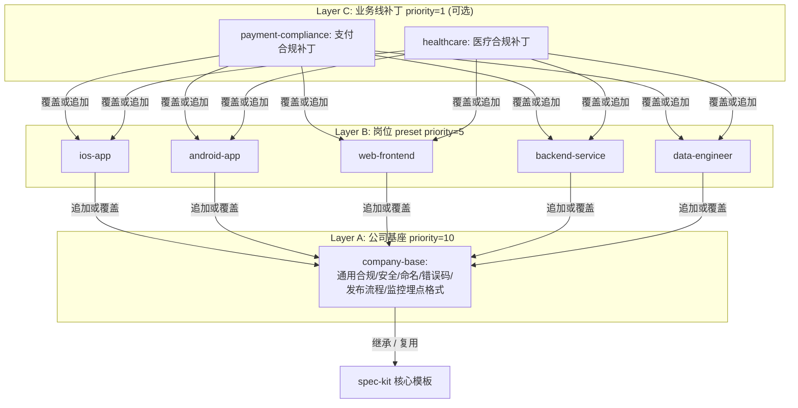
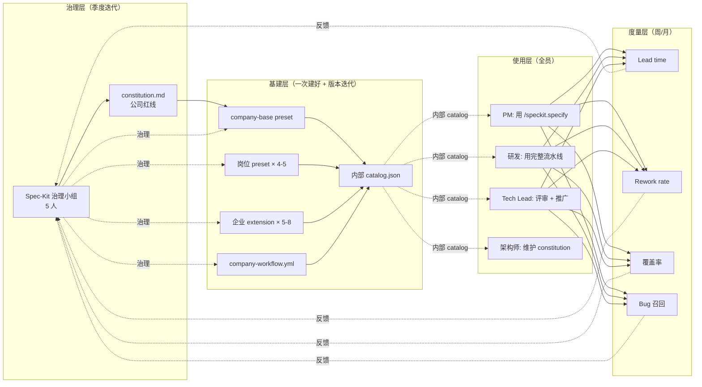

这是个典型的"企业级 AI coding 规范化落地"场景。基于前面我们梳理的 spec-kit 架构，我按**扩展点地图 → 模板分层策略 → 推广落地 Plan** 三部分给你一套完整方案。

---

## 一、企业定制化的扩展点全景——你想到的只是一小块

spec-kit 给了**五层**可扩展性，你说的"plan 环节符合公司规定"只触及其中一层（Templates）。先看完整地图：

```
┌──────────────────────────────────────────────────────────────────┐
│ Layer 5  Integrations (Agent 层)                                 │
│ → 统一公司用的 AI Agent、context 规则                             │
├──────────────────────────────────────────────────────────────────┤
│ Layer 4  Workflows (编排层)                                      │
│ → 把公司 SOP 编排成可一键执行的流水线（评审→实施→上线）           │
├──────────────────────────────────────────────────────────────────┤
│ Layer 3  Extensions (插件层)                                     │
│ → 9 对 before_*/after_* hook 对接 Jira/GitLab/DBA/SAST/API 网关   │
├──────────────────────────────────────────────────────────────────┤
│ Layer 2  Templates + Presets (内容框架)                          │
│ → spec/plan/tasks/checklist 四张模板的岗位定制                    │
├──────────────────────────────────────────────────────────────────┤
│ Layer 1  Constitution (宪法层)                                   │
│ → 公司级红线（合规/安全/TDD/审查等），被 /speckit.plan 硬审判     │
└──────────────────────────────────────────────────────────────────┘
```

### Layer 1：Constitution（最先要做，也最容易被忽略）

你现在完全**没提到**这一层，但它是最上游的定海神针。建议放入的"公司红线"：

| 类别 | 例子 |
|---|---|
| **合规** | 个保法/GDPR 数据最小化、敏感数据（身份证、手机号、金额）必须脱敏存储；未通过数据分类评级的字段禁止入库 |
| **安全** | 禁止明文存储密码 / 凭证；对外 API 强制 TLS；禁用 eval/反序列化不可信数据；引入 SAST/SCA 规则 |
| **质量** | 核心链路单测覆盖率 ≥70%；contract test 是 MUST；P0 bug 48h 响应 SLA |
| **架构** | 微服务边界需要架构委员会备案；不允许绕过统一网关；禁止跨库 JOIN |
| **发布** | 灰度比例 → 1% → 10% → 100%；回滚预案必填；变更窗口 |
| **开源** | 只许用 License 白名单内的依赖（MIT/Apache/BSD）；GPL/AGPL 需法务审批 |

这些写进 `.specify/memory/constitution.md`，任何 `/speckit.plan` 违规都会在 Constitution Check 门禁暴露——**比事后 code review 捕获早 3-5 天**。

### Layer 2：Templates / Presets（你已经想到的部分，但漏了很多）

你提到的 "DB 表结构设计、API 设计" 属于 `plan-template.md`，但这两个点都有**隐藏深度**，我给你把企业实际要管的维度全列出来：

#### 2.1 `plan-template.md` 企业定制必补的章节

| 章节 | 你提到了吗 | 为什么必须补 |
|---|---|---|
| **数据库设计** | ✅ | 但不只是"表结构"，还要有：命名规范、索引策略、**迁移脚本与回滚脚本成对**、DDL 变更审计 |
| **API 设计** | ✅ | 同样不只是接口，还要：版本策略（URL/Header/Accept）、鉴权模式（OAuth2/JWT/API-Key）、**限流阈值**、兼容性承诺、错误码 |
| **监控埋点** | ❌ | 每个关键操作要列埋点字段、上报通道、告警阈值 |
| **日志规范** | ❌ | 结构化日志 schema、关键 traceId 链路 |
| **错误码** | ❌ | 统一错误码段位分配、用户可见 vs 内部 code |
| **容量 / 性能基线** | ❌ | QPS、P99 延时、内存占用目标——这是上线的硬门槛 |
| **灰度 / 回滚策略** | ❌ | 发布计划、开关设计、回滚 SOP |
| **隐私合规评估** | ❌ | 是否涉及个人信息？数据生命周期？留存时长？ |
| **第三方依赖白名单** | ❌ | 新引入的库需列出 license、维护状态、CVE 记录 |
| **国际化 / 本地化** | ❌ | 如面向多国家/语言 |
| **可观测性** | ❌ | SLO/SLI 定义、告警 runbook |

一条经验法则：**凡是"发布前被 review 过的点"都应该提前写进模板**，让 `/speckit.plan` 生成时 AI 就主动填，而不是 PR 阶段被审委会一条条打回。

#### 2.2 `spec-template.md` 也要改

| 补充章节 | 作用 |
|---|---|
| 业务价值 / 北极星指标 | 让产品需求和业务目标对齐 |
| 上下游依赖方 | 协调字段、避免临时加急 |
| 法务 / 合规评估 | 涉及金融、医疗、儿童数据等前置判断 |
| 数据分类分级 | 对每一类字段做级别标注（公开/内部/敏感/核心） |

#### 2.3 `tasks-template.md`、`checklist-template.md` 也要改

- tasks: 在 Phase 末尾加 `[ ] Code Review by Tech Lead`、`[ ] DBA Review`、`[ ] Security Scan Pass`
- checklist: 各岗位的岗位级 QA 清单（见第二部分）

### Layer 3：Extensions（流程自动化——这是 ROI 最高的扩展点）

你完全没提这一层，但这是**真正把"规范"变成"不费力就遵守"的关键**。利用 9 对 `before_*/after_*` hook，把公司内部系统串进来：

| Hook 时机 | 可挂的 extension | 解决的痛点 |
|---|---|---|
| `before_specify` | `jira-pull`：自动从 Jira/TAPD 拉需求单 | 开发者不用复制粘贴 PM 的需求 |
| `after_specify` | `requirements-sync`：把生成的 spec.md 反推回 PM 系统 | PM 和研发拿同一份 spec |
| `before_plan` | `arch-template-fetcher`：从内部架构库拉参考模板 | 别从零想架构 |
| `after_plan` | `dba-review-auto`：DDL 自动提 DBA 工单 / `security-scan`：扫 plan 里的架构隐患 | 提早介入，不卡在 release 阶段 |
| `after_tasks` | `jira-issues-sync`（类似 taskstoissues 但对接 Jira）| tasks.md 自动落地到公司看板 |
| `before_implement` | `ide-setup-check`：验证本地环境 / 拉脚手架 | 降低新人启动成本 |
| `after_implement` | `sonar-trigger`：推送代码扫描 / `api-doc-push`：API 文档自动上架内部网关 / `test-coverage-gate` | 符合 DoD |

**实现成本**：每个 extension 本质就是一个 `extension.yml` + 若干 Markdown 命令 + 可选脚本，约 50-200 行代码。小团队内部 1-2 周能产出一个核心 extension。

### Layer 4：Workflows（团队级 SOP 编排）

你问的"推广"本质上就是"SOP 化"。用 spec-kit 的 workflow 引擎可以把公司研发流程编排成一条可一键执行的流水线：

```yaml
# company-standard-workflow.yml（示例骨架）
id: company-feature-delivery
steps:
  - id: pull-requirement
    type: command
    command: /speckit.specify          # 自动触发 jira-pull hook

  - id: clarify-gate
    type: gate
    approvers: [product-owner]         # PM 确认 spec 与需求对齐

  - id: plan
    type: command
    command: /speckit.plan

  - id: arch-review
    type: gate
    approvers: [tech-lead, architect]  # 架构评审（Constitution Check 之外的人工确认）

  - id: tasks
    type: command
    command: /speckit.tasks

  - id: dba-review
    type: if_then
    if: "{{ plan.has_ddl_changes }}"
    then:
      - type: gate
        approvers: [dba]

  - id: implement
    type: command
    command: /speckit.implement

  - id: security-scan
    type: shell
    command: "company-sast-cli scan ."
```

好处：**新人不用记步骤，跑 `specify workflow run company-feature-delivery` 就按规范走一遍**。

### Layer 5：Integrations（统一 Agent 选型）

企业落地要避免"有人用 Cursor、有人用 Copilot、有人用 Claude"造成的不一致体验。建议：

- 推荐 1-2 个主力 agent（例如 Cursor 做主力、Copilot 做备选）
- 在 context 文件（如 `.cursor/rules/specify-rules.mdc`）里注入**公司级的 rules**：代码风格、命名、注释语言、禁用 API 清单

---

## 二、多岗位模板策略：用 **3 层 Preset 继承**，不是"每个岗位一套从头写"

你的问题非常关键：**单套不够用，但每个岗位一套又会爆炸**。正确的做法是利用 **Preset 的 priority 栈 + `{CORE_TEMPLATE}` 占位符** 做继承：



### 实现方式：每个 preset 的模板长这样

```markdown
<!-- presets/ios-app/templates/plan-template.md -->
{CORE_TEMPLATE}

## iOS 专属设计（由 ios-app preset 追加）

### App Store 合规
- [ ] 涉及 IDFA/IDFV 使用的 App Tracking Transparency 文案
- [ ] 新增权限（相机/相册/定位）的 Info.plist 用途说明
- [ ] 若用到第三方 SDK 需列出 Privacy Manifest 字段

### 版本兼容
- [ ] 最低支持 iOS 版本：[填]
- [ ] 废弃 API 替代方案：[填]

### 性能基线
- [ ] 启动时间 < [X]ms
- [ ] 主线程阻塞 < [Y]ms
- [ ] 包体积增量 < [Z]MB
```

这样**基座升级自动传递给所有岗位**，升级一次而不是 5 次。

### 5 个岗位的核心差异点（参考清单）

| 岗位 | spec-template 补充 | plan-template 补充 | tasks-template 补充 |
|---|---|---|---|
| **iOS** | App Store 审核要点、权限清单 | Info.plist 字段、iOS 版本矩阵、包体积目标、电量/内存 | 生成 `.xcodeproj`/SPM 配置、TestFlight 上传 |
| **Android** | Google Play 政策、权限矩阵 | minSdk/targetSdk、ABI 拆分、ProGuard 规则、启动优化 | `build.gradle` 配置、签名、内测通道 |
| **Web 前端** | 浏览器兼容矩阵、A11y、SEO | 打包策略、首屏性能预算、CDN、骨架屏 | 组件库对齐、E2E、Lighthouse 分数门禁 |
| **后端** | 流量预估、SLA、多活要求 | **DB schema / API 设计**（你想到的）、限流、幂等、事务边界、缓存策略 | 迁移脚本、压测、监控接入 |
| **数据工程** | 数据源血缘、数据质量 SLA | 表分区策略、数据生命周期、指标口径、回刷策略 | 调度配置、数据质量 check |

### 跨岗位协作场景（最常见也最容易踩坑）

现实里一个 feature 经常横跨前后端。三种处理模式：

| 模式 | 适用 | 实现 |
|---|---|---|
| **单 spec + 多 plan** | 小 feature，前后端有强耦合 | 一个 spec.md；`/speckit.plan` 跑两次（加 `--integration-options` 切 preset）产出 `plan-backend.md` + `plan-frontend.md` |
| **多 spec + 契约对齐** | 中大型 feature | 为每端建独立 feature 目录，用 `contracts/` 作为前后端契约，通过 workflow 编排同步 |
| **monorepo 模式** | 全栈工程师/小团队 | 允许多 preset 共存；`/speckit.plan` 时自动识别文件路径选 preset |

---

## 三、公司推广落地 Plan（分 5 个阶段 × 6 个月）

推广 AI coding 工具最大的阻力**不是技术**，是**人不愿改习惯**。所以 plan 核心是"每阶段都让核心痛点被解决，让人主动想用"。

### 阶段总览

| 阶段 | 时长 | 目标 | 关键交付 | 成功标志 |
|---|---|---|---|---|
| **P0 种子期** | 2-4 周 | 技术 PoC + 决策对齐 | 1 个 demo、1 份决策文档 | 核心决策层认可方向 |
| **P1 试点期** | 4-8 周 | 1 个团队深度使用 | constitution + 基座 preset | 该团队 lead time 下降可量化 |
| **P2 扩展期** | 8-12 周 | 3-5 个团队 + 基建成型 | 全部岗位 preset + 核心 extension | ≥50% 新 feature 走 spec-kit |
| **P3 普及期** | 12-24 周 | 全研发覆盖 | 培训体系 + 度量 dashboard | 成为默认工作流 |
| **P4 进化期** | 持续 | 根据数据迭代 | 版本化治理机制 | 季度迭代常态化 |

### P0 种子期（第 1-4 周）：证明它能解决真问题

**目标**：用一个**真实业务 feature** 完整跑通 SDD 流水线，给决策层看"same feature 用 spec-kit 前后的对比"。

**动作清单**：

- [ ] 选 **1 个"小而全"的业务 feature**（有前端、后端、DB、API，但不要太大）
- [ ] 由 1 个**你信任的资深工程师**（非新人）操刀
- [ ] 完整走 `/speckit.constitution` → `/speckit.specify` → `/speckit.clarify` → `/speckit.plan` → `/speckit.tasks` → `/speckit.implement`
- [ ] 记录**每一步的耗时、发现的问题、生成的 artifact 质量**
- [ ] 准备对照组：同等规模的历史 feature，统计"从需求到上线"时间、返工次数、PR 轮次
- [ ] 产出**一份 1-2 页的决策文档**给管理层：解决什么、ROI 预估、投入需求、风险

**产出**：
1. 一份可演示的 demo feature
2. 一份 `SPEC-KIT-ENTERPRISE-DECISION.md`：建议要不要推、推多大范围、预算需求

**常见坑**：选太大的 feature（跑不完显得 spec-kit 低效）、选太"水"的 feature（显得 spec-kit 没必要）。选**中等复杂度、有跨端协作、以前踩过坑的 feature**最有说服力。

### P1 试点期（第 5-12 周）：1 个团队深度使用

**目标**：在一个完整的研发小组（5-10 人）里落地，形成**公司的 constitution + 基座 preset**。

**动作清单**（按周排期）：

| 周 | 动作 | 产出 |
|---|---|---|
| W1 | 和架构委员会、安全、DBA、QA 各 1 个人 workshop | `.specify/memory/constitution.md` v1 |
| W2 | 核心工程师一起定 `company-base` preset（spec/plan/tasks 模板） | `company-base@1.0` preset |
| W3 | 开发 `git-enterprise` extension（对接内部 GitLab + Jira） | 首个企业 extension |
| W4-6 | 试点团队每个新 feature 都走 spec-kit，**Tech Lead 全程陪跑** | 3-5 个真实 feature 的完整 artifact |
| W7 | 回顾会，收集痛点（模板哪里不合适？哪些步骤反而更慢？） | v1.1 迭代清单 |
| W8 | 快速迭代 `company-base` 和 `git-enterprise` | v1.1 |

**度量指标**（必须量化，否则推不动决策层）：

- **Lead time**：需求接收 → 上线时长
- **Rework rate**：PR 被打回次数 / 总 PR
- **Spec 完整度**：新人看 spec 能独立上手的比例
- **Bug 召回**：上线后 P1/P2 bug 数
- **模板遵从率**：PR 模板字段填写完整度

典型试点成果指标目标（基于业内经验）：lead time -15%~-30%、rework rate -40%+、spec 完整度 +50%+。

### P2 扩展期（第 13-24 周）：3-5 个团队 + 基建成型

**目标**：把"单团队能用"变成"多团队都能用"；岗位 preset 和 extension 成体系。

**动作清单**：

- [ ] **基础设施落地**
  - 内部 GitLab 建 `spec-kit-enterprise` 组
  - 建**内部 extension catalog** + **内部 preset catalog**（`specify extension catalog add https://gitlab.company.com/spec-kit/catalog.json`）
  - 预装脚本：`specify init` 后一步把公司基座全装好
- [ ] **岗位 preset 成套输出**：`ios-app` / `android-app` / `web-frontend` / `backend-service` 四个 preset v1
- [ ] **核心 extension 成套输出**（优先级排序）：
  1. `jira-sync`（需求双向同步）——影响面最大
  2. `dba-review`（DDL 自动送审）——风险点最高
  3. `sonar-trigger`（代码扫描）——质量门禁
  4. `api-catalog-push`（API 自动上架）——下游最痛
  5. 公司自定义 `security-gate`（法务/合规）
- [ ] **编排 `company-standard-workflow`**：把 SOP 固化
- [ ] **培训体系**
  - 30 分钟入门视频
  - 1 小时深入讲座（流水线、扩展原理）
  - 分岗位 Q&A 文档
  - Office Hour（每周 1 次答疑）

**组织层面**：
- 成立 **"Spec-Kit 治理小组"**（3-5 人：1 架构师、1 资深工程师、1 PM、1 安全、1 DBA），负责 constitution 和 preset 的变更评审
- **每月 1 次迭代例会**：收集 feedback、评审变更、发版

### P3 普及期（第 25-36 周）：全研发覆盖

**目标**：让 spec-kit 成为**默认研发工作流**，而不是"可选流程"。

**动作清单**：

- [ ] **工具化门禁**：
  - PR 模板检查：要求链接到对应的 `specs/NNN-xxx/` 目录
  - CI 门禁：无 `plan.md` 的 PR 需要额外审批
  - Jira 集成：需求创建时自动跑 `specify workflow run`
- [ ] **数据驱动**：
  - 建立**度量 dashboard**（Grafana/内部 BI）：覆盖率、lead time 趋势、rework rate
  - 每月向管理层汇报数据
- [ ] **激励机制**：
  - 季度评选"最佳 spec 案例"
  - 把"是否用 spec-kit"纳入新团队 onboarding checklist
  - Tech Lead 的 OKR 里加入推广指标
- [ ] **新人 onboarding**：入职培训加入 1 天 spec-kit 专题

### P4 进化期（6 个月后持续）

- **版本化治理**：constitution / preset / extension 都走半年迭代
- **跨部门推广**：如果效果好，推给算法团队、测试团队、SRE 团队
- **对外开源**（可选）：把打磨好的 preset 贡献给社区 catalog.community.json

### 三条最容易翻车的警告

1. **别试图一步到位把 constitution 写得完美**。v1 简陋没关系，关键是让它被真实 `/speckit.plan` 跑一遍，跑出痛点再改——**constitution 也是迭代的**。

2. **别把"填模板"变成"填卷子"**。如果模板里有 30 个"必填"字段，工程师会敷衍填"N/A"。原则是：**每个字段必须有人真的会读**。DBA review 看 DB 章节、Security 看合规章节，有 reader 才有 writer 的严肃性。

3. **别忽视 PM 侧的参与**。spec-kit 的 `/speckit.specify` 本质是 PM 和研发共建 spec。如果只有研发用，PM 还在用 Word/飞书文档写需求，会形成**两份需求**，比没用还糟。试点团队必须**把 PM 一起拉进来**。

---

## 四、一张图：推广全景



---

## 总结

1. **扩展点选择**：别只盯着 Templates，你真正的杠杆在 **Constitution（硬门禁）+ Extensions（流程自动化）+ Workflows（SOP 编排）**，前者是规则、后两者是让规则"不费力就遵守"的放大器。
2. **模板策略**：用 `company-base` + 5 个岗位 preset 的**两层继承**（`{CORE_TEMPLATE}` 占位符），而不是每个岗位一套从头写。
3. **落地节奏**：P0 技术证明 → P1 单团队试点 → P2 多团队扩展 → P3 全员普及 → P4 持续进化；**关键是每阶段都有可量化指标**，而不是凭感觉推。

如果要进一步细化，我建议下一步先**做 P0 的 demo feature 选型 + constitution v0.1 草稿**——这两件事做完你就能判断在贵公司推的可行性与节奏了。需要我帮你起草某一块（比如 constitution 的 skeleton、某个岗位 preset 的模板样例、或者某个 extension 的 `extension.yml` 示例）可以直接说。