# spec-kit 实现原理笔记（中文）

> 本文整理 `specify init` + 9 条 `/speckit.*` 命令（constitution / specify / clarify / plan / tasks / analyze / checklist / implement / taskstoissues）的完整实现原理、**Extensions / Presets / Workflows 三条扩展线**、`**.specify/` 目录全景 + 4 级模板解析优先级栈**、`**specify` CLI 全部子命令**，以及 **spec-kit 仓库自身 CI/CD**，便于在阅读源码和日常使用时对照查阅。
>
> 文档结构：第一 ~ 十章按 SDD 流水线顺序逐命令拆解；第十一章一张图串起全局；附录 A ~ E 补齐工程细节（CLI / 目录 / 扩展体系 / 边缘命令 / 仓库 CI）。

## 目录

- [spec-kit 实现原理笔记（中文）](#spec-kit-实现原理笔记中文)
  - [目录](#目录)
  - [一、`specify init . --ai cursor-agent` 的作用与原理](#一specify-init----ai-cursor-agent-的作用与原理)
    - [1.1 命令做了什么（一句话）](#11-命令做了什么一句话)
    - [1.2 顶层执行流程](#12-顶层执行流程)
    - [1.3 Integration 注册表与统一框架](#13-integration-注册表与统一框架)
    - [1.4 安装产物：`.cursor/` 与 `.specify/`](#14-安装产物cursor-与-specify)
    - [1.5 上下文规则文件 `.cursor/rules/specify-rules.mdc` 的作用](#15-上下文规则文件-cursorrulesspecify-rulesmdc-的作用)
    - [1.6 命令模板到 SKILL.md 的转换](#16-命令模板到-skillmd-的转换)
    - [1.7 Manifest：可安全卸载与升级的基础](#17-manifest可安全卸载与升级的基础)
  - [二、`/speckit.constitution` 的作用与原理](#二speckitconstitution-的作用与原理)
    - [2.1 命令本质：一段给 AI 执行的工作流](#21-命令本质一段给-ai-执行的工作流)
    - [2.2 三层解耦的文件关系](#22-三层解耦的文件关系)
    - [2.3 AI Agent 的 8 步执行流程](#23-ai-agent-的-8-步执行流程)
    - [2.4 Pre/Post 扩展 Hook 机制](#24-prepost-扩展-hook-机制)
  - [三、`/speckit.specify` 的作用与原理](#三speckitspecify-的作用与原理)
    - [3.1 它在 SDD 流水线里的定位](#31-它在-sdd-流水线里的定位)
    - [3.2 澄清：它并不直接读 `constitution.md`](#32-澄清它并不直接读-constitutionmd)
    - [3.3 为什么要建 `specs/NNN-xxx/` 目录](#33-为什么要建-specsnnn-xxx-目录)
    - [3.4 编号是怎么选出来的](#34-编号是怎么选出来的)
    - [3.5 `feature.json`：下游命令定位 feature 的唯一权威](#35-featurejson下游命令定位-feature-的唯一权威)
    - [3.6 AI Agent 的 9 步执行流程](#36-ai-agent-的-9-步执行流程)
    - [3.7 不同 agent 下的 frontmatter 与 handoff 差异](#37-不同-agent-下的-frontmatter-与-handoff-差异)
  - [四、`/speckit.clarify` 的作用与原理](#四speckitclarify-的作用与原理)
    - [4.1 它在 SDD 流水线里的位置](#41-它在-sdd-流水线里的位置)
    - [4.2 和 `/speckit.specify` 的 "3 问 validation" 的区别](#42-和-speckitspecify-的-3-问-validation-的区别)
    - [4.3 核心原理：11 类 taxonomy 扫描](#43-核心原理11-类-taxonomy-扫描)
    - [4.4 AI Agent 的 9 步执行流程](#44-ai-agent-的-9-步执行流程)
    - [4.5 提问 UI 的三个硬约束](#45-提问-ui-的三个硬约束)
    - [4.6 整合到 spec 的规则](#46-整合到-spec-的规则)
    - [4.7 和 `constitution.md` 的关系与使用边界](#47-和-constitutionmd-的关系与使用边界)
  - [五、`/speckit.plan` 的作用与原理](#五speckitplan-的作用与原理)
    - [5.1 它在 SDD 流水线里的定位](#51-它在-sdd-流水线里的定位)
    - [5.2 `setup-plan.sh`：先把骨架摆好](#52-setup-plansh先把骨架摆好)
    - [5.3 整体 3 阶段结构（Pre → Phase 0 → Phase 1）](#53-整体-3-阶段结构pre--phase-0--phase-1)
    - [5.4 Phase 0：Outline \& Research](#54-phase-0outline--research)
    - [5.5 Phase 1：Design \& Contracts](#55-phase-1design--contracts)
    - [5.6 Constitution Check：宪法真正"开审"的地方](#56-constitution-check宪法真正开审的地方)
    - [5.7 完整执行时序](#57-完整执行时序)
    - [5.8 产出清单与 plan.md 内部结构](#58-产出清单与-planmd-内部结构)
    - [5.9 与前后命令的串联关系](#59-与前后命令的串联关系)
    - [5.10 为什么停在 Phase 1，不顺手把 tasks 生成了](#510-为什么停在-phase-1不顺手把-tasks-生成了)
  - [六、`/speckit.tasks` 的作用与原理](#六speckittasks-的作用与原理)
    - [6.1 它在 SDD 流水线里的定位](#61-它在-sdd-流水线里的定位)
    - [6.2 输入 / 输出与执行骨架](#62-输入--输出与执行骨架)
    - [6.3 核心：任务组织的"三维切分"](#63-核心任务组织的三维切分)
    - [6.4 粒度怎么把握：六条约束压出的"甜区"](#64-粒度怎么把握六条约束压出的甜区)
    - [6.5 完整执行时序](#65-完整执行时序)
    - [6.6 一句话总结粒度控制策略](#66-一句话总结粒度控制策略)
  - [七、Extensions 机制：可装拆的插件系统](#七extensions-机制可装拆的插件系统)
    - [7.1 为什么需要 extensions](#71-为什么需要-extensions)
    - [7.2 不装 vs 装（以 `git` extension 为例）](#72-不装-vs-装以-git-extension-为例)
    - [7.3 一个 extension 的物理组成](#73-一个-extension-的物理组成)
    - [7.4 三板斧：发现 / 安装 / 管理](#74-三板斧发现--安装--管理)
    - [7.5 Hook 机制：核心命令是怎么被"注入"的](#75-hook-机制核心命令是怎么被注入的)
    - [7.6 Hook 的 condition 表达式](#76-hook-的-condition-表达式)
    - [7.7 原理全景：从 catalog 到命令执行](#77-原理全景从-catalog-到命令执行)
  - [八、`/speckit.implement` 的作用与原理](#八speckitimplement-的作用与原理)
    - [8.1 它在 SDD 流水线里的定位](#81-它在-sdd-流水线里的定位)
    - [8.2 命令签名与前置脚本](#82-命令签名与前置脚本)
    - [8.3 九步执行骨架](#83-九步执行骨架)
    - [8.4 Checklists 门禁：动手前最后一扇门](#84-checklists-门禁动手前最后一扇门)
    - [8.5 Project Setup Verification：ignore 文件自动维护](#85-project-setup-verificationignore-文件自动维护)
    - [8.6 Phase-by-Phase 执行语义](#86-phase-by-phase-执行语义)
    - [8.7 状态回写：tasks.md 的"活心脏"](#87-状态回写tasksmd-的活心脏)
    - [8.8 错误处理策略](#88-错误处理策略)
    - [8.9 Completion validation 与 Extensions 在 implement 阶段的位置](#89-completion-validation-与-extensions-在-implement-阶段的位置)
    - [8.10 为什么它没有 Constitution Check](#810-为什么它没有-constitution-check)
  - [九、可选命令使用指南：`/speckit.clarify` / `/speckit.analyze` / `/speckit.checklist`](#九可选命令使用指南speckitclarify--speckitanalyze--speckitchecklist)
    - [9.1 为什么这三个命令是“可选”的](#91-为什么这三个命令是可选的)
    - [9.2 三个命令各自回答什么问题](#92-三个命令各自回答什么问题)
    - [9.3 什么情况下应该使用](#93-什么情况下应该使用)
    - [9.4 如何融入 workflow](#94-如何融入-workflow)
    - [9.5 用前 vs 用后对比：三个真实案例](#95-用前-vs-用后对比三个真实案例)
      - [案例 1：电商支付 feature（有 clarify / 无 clarify）](#案例-1电商支付-feature有-clarify--无-clarify)
      - [案例 2：UI 组件库 feature（有 checklist / 无 checklist）](#案例-2ui-组件库-feature有-checklist--无-checklist)
      - [案例 3：spec 中途修改后的 analyze（有 analyze / 无 analyze）](#案例-3spec-中途修改后的-analyze有-analyze--无-analyze)
    - [9.6 三命令的关系与典型反模式](#96-三命令的关系与典型反模式)
    - [9.7 一句话总结](#97-一句话总结)
  - [十、`constitution.md` 的作用，以及与 `AGENTS.md` 的区别](#十constitutionmd-的作用以及与-agentsmd-的区别)
    - [10.1 它是项目的“宪法”而非“说明书”](#101-它是项目的宪法而非说明书)
    - [10.2 它具体承担什么](#102-它具体承担什么)
    - [10.3 与 `AGENTS.md` / `CLAUDE.md` / `.cursor/rules/`\* 的区别](#103-与-agentsmd--claudemd--cursorrules-的区别)
    - [10.4 为什么不能用 `AGENTS.md` 替代](#104-为什么不能用-agentsmd-替代)
  - [十一、一张图串起各环节关系](#十一一张图串起各环节关系)
  - [附录 A：`specify` CLI 全貌](#附录-aspecify-cli-全貌)
  - [附录 B：`.specify/` 目录全景与模板解析优先级栈](#附录-bspecify-目录全景与模板解析优先级栈)
    - [B.1 完整目录布局](#b1-完整目录布局)
    - [B.2 模板解析优先级栈（关键机制）](#b2-模板解析优先级栈关键机制)
    - [B.3 非 git 场景降级](#b3-非-git-场景降级)
  - [附录 C：Presets 与 Workflows（Extensions 之外的两条扩展线）](#附录-cpresets-与-workflowsextensions-之外的两条扩展线)
    - [C.1 Presets：版本化的模板覆盖包](#c1-presets版本化的模板覆盖包)
    - [C.2 Workflows：可恢复的多步编排](#c2-workflows可恢复的多步编排)
      - [C.2.1 适合什么场景？](#c21-适合什么场景)
      - [C.2.2 当前 bundled `speckit` workflow 做了什么？](#c22-当前-bundled-speckit-workflow-做了什么)
      - [C.2.3 它是如何执行的？](#c23-它是如何执行的)
      - [C.2.4 10 种 step 类型该怎么理解？](#c24-10-种-step-类型该怎么理解)
      - [C.2.5 企业落地的推荐改造](#c25-企业落地的推荐改造)
  - [附录 D：`/speckit.taskstoissues`——把 tasks 翻译成 GitHub issues](#附录-dspeckittaskstoissues把-tasks-翻译成-github-issues)
  - [附录 E：`.github/workflows/`——spec-kit 仓库自己的 CI/CD](#附录-egithubworkflowsspec-kit-仓库自己的-cicd)

---

## 一、`specify init . --ai cursor-agent` 的作用与原理

### 1.1 命令做了什么（一句话）

> 它不是从 GitHub 下载模板，也不是执行一段复杂的脚本，而是**把本地打包好的 `spec-kit` 资产（命令模板、脚本、memory、workflows），按照所选 AI agent 的约定“布线”到当前项目里**，并写入安装清单以便后续安全升级/卸载。

### 1.2 顶层执行流程

```mermaid
flowchart TD
    A["specify init . --ai cursor-agent"] --> B["参数解析 (Typer)"]
    B --> C["--ai 规范化 + 与 --integration 互斥校验"]
    C --> D["加载 INTEGRATION_REGISTRY<br/>（28 个 agent 一次性注册）"]
    D --> E["选中 CursorAgentIntegration"]
    E --> F["解析项目路径 + 安全检查<br/>(--here / --force / 目录冲突)"]
    F --> G["展开 bundled assets<br/>(core_pack 或源码内资产)"]
    G --> T1["Tracker 开始 10 步渲染"]
    T1 --> H["① integration.setup()<br/>渲染命令模板 → 写 .cursor/skills/*"]
    H --> I["② _install_shared_infra()<br/>安装 .specify/ 共享基础设施"]
    I --> J["③ chmod +x 全部脚本"]
    J --> K["④ ensure_constitution_from_template<br/>⚠️ init 就把 memory/constitution.md<br/>从模板拷过来（非空初版）"]
    K --> L["⑤ 初始化 git 仓库（若需要）"]
    L --> M["⑥ 自动安装 bundled 'git' extension<br/>(写入 .specify/extensions/git/ + extensions.yml)"]
    M --> N["⑦ 自动安装 bundled 'speckit' workflow<br/>(.specify/workflows/speckit/)"]
    N --> O["⑧ 写 .specify/integration.json<br/>(key + version)"]
    O --> P["⑨ IntegrationManifest.save()<br/>(每文件内容哈希，供升级/卸载用)"]
    P --> Q["⑩ 写 init-options.json<br/>(记录 --ai / --script / --preset 等全部入参)"]
    Q --> R["创建/更新 .cursor/rules/specify-rules.mdc<br/>（Hook 渲染会用到它记录的 ai_skills 等）"]
    R --> S["打印成功信息 + 下一步提示"]
```


关键入口在 `src/specify_cli/__init__.py` 的 `init()` 函数（约 600 行）。与 "下载 + 解压" 那种纯搬运不同，它做了 **10 件有副作用的事**：

1. **解析 + 校验 CLI flags**（`--ai` 与 `--integration` 互斥；`--ai-commands-dir` 只配 `generic`；`--branch-numbering` 仅能是 `sequential` 或 `timestamp` 等）
2. **选 agent**：交互选或命令行指定，最终拿到 `resolved_integration`（`IntegrationBase` 子类实例）
3. **选 script 类型**：`sh` 或 `ps`（非交互环境自动按平台兜底）
4. **跑 integration.setup()**：把通用模板转写成 agent 专属命令（如 `.cursor/skills/speckit-*/SKILL.md`），同时写出 agent 的 context 文件（如 `.cursor/rules/specify-rules.mdc`）
5. **安装共享基础设施** `.specify/`：`scripts/`、`templates/`、`memory/` 目录全部拷入
6. **初始化 constitution**：哪怕你没跑 `/speckit.constitution`，init 也会通过 `ensure_constitution_from_template()` 把一份**初版** `constitution.md` 从模板拷到 `.specify/memory/` —— 所以"constitution 永远存在，只是内容是占位符"
7. **可选 git 初始化 + 自动装 `git` extension**：只要没传 `--no-git`，spec-kit 会先 `git init`，再从仓库内置的 `extensions/git/` 目录自动把 `git` extension 安装到项目的 `.specify/extensions/` 下（这就是为什么刚 init 完的项目 `.specify/extensions.yml` 里已经有 `git` 的 hook 注册）
8. **自动装 bundled `speckit` workflow**：从内置 `src/specify_cli/workflows/bundled/speckit/` 把 `workflow.yml` 拷贝到 `.specify/workflows/speckit/` 并注册到 `WorkflowRegistry`
9. **写 `.specify/integration.json`**：记录 `{"integration": "cursor-agent", "version": "..."}`，后续 `specify integration upgrade / switch` 要读它
10. **写 `IntegrationManifest` + `init-options.json`**：前者是**安装文件清单**（每个文件一个内容哈希，用于升级/卸载），后者是**本次 init 的参数快照**（后续 HookExecutor 渲染不同 agent 的 skill 调用字符串时会读它）

**关于 CLI flags 的完整清单**（2026-04 版本）：


| Flag                           | 用途                 | 说明                         |
| ------------------------------ | ------------------ | -------------------------- |
| `--ai <key>`                   | 选 AI agent         | 28 个内置 key 之一（见 §1.3）      |
| `--integration <key>`          | 新式写法               | 与 `--ai` 互斥，语义完全等价         |
| `--script sh                   | ps`                | 选脚本类型                      |
| `--here` / `.`                 | 在当前目录初始化           | 二者等价                       |
| `--force`                      | 跳过"目录非空"确认         | 与 `--here` 或已存在目录配合        |
| `--no-git`                     | 不初始化 git           | 连带跳过 git extension 自动安装    |
| `--ignore-agent-tools`         | 跳过 agent CLI 存在性检查 | 某些 agent 需要本地 CLI          |
| `--preset <id>`                | 初始化时同时装一个 preset   | 见第十二章                      |
| `--branch-numbering sequential | timestamp`         | feature 分支命名策略             |
| `--ai-commands-dir <dir>`      | 自定义命令目录            | 仅 `--ai generic` 需要        |
| `--ai-skills`                  | 强制以 skills 方式安装    | 对 `SkillsIntegration` 已是默认 |
| `--integration-options "..."`  | 透传给 integration    | 每种 integration 自己声明接受哪些    |


几个已 deprecated 的 flag（`--skip-tls` / `--debug` / `--github-token` / `--offline`）在源码里被标 `hidden=True`，新版本都已是 no-op——这是因为 **v0.x 中期开始资产改为"bundled"**（打在 wheel 里随 CLI 一起装），不再从 GitHub 下载，也就用不到网络配置选项。

### 1.3 Integration 注册表与统一框架

`spec-kit` 把“支持哪些 AI agent”做成了**插件化注册表**，避免一个个 if/else：

- `src/specify_cli/integrations/__init__.py` 维护 `INTEGRATION_REGISTRY`，把 key（如 `cursor-agent`、`claude`、`codex`）映射到对应的 `IntegrationBase` 子类。
- 基类 `IntegrationBase` 定义所有通用能力：
  - 读取/写入 `AGENT_CONFIG`
  - `process_template()` 占位符替换（把通用模板转成 agent 专属命令）
  - `upsert_context_section()` 安全写入上下文文件（带 START/END 标记）
  - 安装清单、路径改写、卸载回收
- 派生类只需要声明差异项：
  - `SkillsIntegration` 约定产物形如 `speckit-<name>/SKILL.md`
  - `MarkdownIntegration`、`TomlIntegration`、`YamlIntegration` 对应不同 agent 的命令承载格式

**当前注册的 28 个 integration**（alphabetical，取自 `src/specify_cli/integrations/__init__.py`）：

```
agy, amp, auggie, bob, claude, codebuddy, codex, copilot, cursor-agent,
forge, gemini, generic, goose, iflow, junie, kilocode, kimi, kiro-cli,
opencode, pi, qodercli, qwen, roo, shai, tabnine, trae, vibe, windsurf
```

其中 `generic` 比较特别：它是 **"自定义 agent" 的逃生舱**——如果你用的 agent 不在上述列表里，可以用 `specify init --integration generic --integration-options="--commands-dir .myagent/commands/"` 把命令装到任意目录，命令以纯 Markdown 形式写出，手动让目标 agent 加载即可。

此外 `CommandRegistrar`（定义在 `src/specify_cli/agents.py`）会从 `INTEGRATION_REGISTRY` 动态派生出 `AGENT_CONFIGS` 字典，**这是唯一的 agent 配置数据源**（extensions/presets 都通过它往 agent 目录写命令，避免命令注册逻辑四处散落）。

`CursorAgentIntegration` 的关键声明：


| 属性                    | 值                                 | 含义                     |
| --------------------- | --------------------------------- | ---------------------- |
| `key`                 | `cursor-agent`                    | CLI 选择标识               |
| `folder`              | `.cursor/`                        | agent 目录前缀             |
| `commands_subdir`     | `skills`                          | 命令放在 `.cursor/skills/` |
| `registrar.dir`       | `.cursor/skills`                  | Registrar 输出目录         |
| `registrar.extension` | `/SKILL.md`                       | 每条命令一个子目录 + `SKILL.md` |
| `context_file`        | `.cursor/rules/specify-rules.mdc` | 全局规则锚点                 |
| `requires_cli`        | `False`                           | 不需要额外 CLI              |


### 1.4 安装产物：`.cursor/` 与 `.specify/`

执行完命令后，项目目录下出现两类产物：

```text
<project>/
├── .cursor/                           # ← agent 专属（换 agent 就换一套）
│   ├── rules/
│   │   └── specify-rules.mdc          # alwaysApply:true 的规则锚点
│   └── skills/
│       ├── speckit-constitution/SKILL.md
│       ├── speckit-specify/SKILL.md
│       ├── speckit-clarify/SKILL.md
│       ├── speckit-plan/SKILL.md
│       ├── speckit-tasks/SKILL.md
│       ├── speckit-analyze/SKILL.md
│       ├── speckit-checklist/SKILL.md
│       ├── speckit-implement/SKILL.md
│       └── speckit-taskstoissues/SKILL.md
└── .specify/                          # ← 项目级共享基础设施（与 agent 无关）
    ├── scripts/                       # 跨平台脚本（bash / powershell）
    ├── templates/
    │   ├── constitution-template.md
    │   ├── plan-template.md
    │   ├── spec-template.md
    │   ├── tasks-template.md
    │   ├── checklist-template.md
    │   └── overrides/                 # 项目级模板覆盖（优先级最高，见附录 B）
    ├── memory/
    │   └── constitution.md            # 项目宪法（init 就已拷入）
    ├── extensions/                    # 已安装的 extension 根目录
    │   └── git/                       # init 会自动装
    ├── extensions.yml                 # extension 注册表 + hook 绑定
    ├── workflows/                     # 已安装的 workflow 根目录
    │   └── speckit/                   # init 会自动装 bundled 版
    ├── presets/                       # 已安装的 preset 根目录（首次 --preset 后才有）
    │   └── .registry                  # preset 注册表 + priority（模板解析用）
    ├── integration.json               # 当前 integration + CLI 版本
    ├── init-options.json              # 本次 init 的参数快照（HookExecutor 会读）
    └── feature.json                   # 当前激活 feature 目录（/speckit.specify 维护）
```

两边职责严格分工：

- `**.cursor/**` → 给**具体 agent 用**的命令入口与规则锚点；换 agent（`specify integration switch`）会生成一套新的 agent 目录。
- `**.specify/`** → **项目级共享基础设施**，与 agent 无关；换 agent 不动，这也是 spec-kit 能随时切 agent 的关键。

关于每一项的详细说明、模板解析优先级，见 **附录 B：`.specify/` 目录全景**。

### 1.5 上下文规则文件 `.cursor/rules/specify-rules.mdc` 的作用

这个文件乍看“没啥内容”，但它承担的角色很明确：

> **它是 Cursor 的全局规则锚点**：通过 `.mdc` 文件的 `alwaysApply: true`，Cursor 每次会话都会自动加载它；它里面放的是**一段指向当前 plan 的“单跳路牌”**，而不是大段内容本身。

它的特征：

- 文件首部是 YAML frontmatter：`alwaysApply: true`
- 中间是受管理的区块，由 START/END 注释包裹：
  - `<!-- SPECKIT START -->`
  - `<!-- SPECKIT END -->`
- `upsert_context_section()` 只会更新这对标记之间的内容，不会破坏用户在同一文件里写的其它个性化规则
- 默认内容由 `IntegrationBase._build_context_section()` 生成，**固定的两行文字**：
  ```text
  For additional context about technologies to be used, project structure,
  shell commands, and other important information, read the current plan
  [at specs/<feature>/plan.md]   ← plan_path 非空时追加这一行
  ```

**重要澄清**：这段受管内容**只引导 agent 去读 `plan.md`，不直接引用 `constitution.md`**。真正让 constitution 生效的链路是**两跳**：

```text
specify-rules.mdc → 指向 current plan
        ↓
/speckit.plan 的 SKILL.md 指令里显式 "Read FEATURE_SPEC and /memory/constitution.md"
        ↓
Constitution 的约束被填入 plan.md 的 "Constitution Check" 段落
```

所以 `specify-rules.mdc` 和 `constitution.md` 的关系是**间接的**：前者只把 agent 带到 plan 的上下文，后者由 `/speckit.plan`、`/speckit.analyze` 等命令**在执行时自行显式加载**。这也是设计上刻意的——规则锚点保持极简、稳定，真正要读哪些硬约束交给各个命令自己声明。

### 1.6 命令模板到 SKILL.md 的转换

`templates/commands/*.md` 是**通用模板**（与 agent 无关），它必须被“翻译”成每个 agent 的专属格式。这一步由 `IntegrationBase.process_template()` 完成，核心 7 个变换：

1. 提取 `scripts:` 字段，生成真正的命令行 `{SCRIPT}`
2. 替换 `$ARGUMENTS` 为 agent 约定的参数占位
3. 替换 `__AGENT__`、`__CONTEXT_FILE__` 为当前 integration 的实际值
4. 移除仅用于管线的 `scripts:` 原始区段
5. 重写项目相对路径（保证在子目录执行时仍然可解析）
6. 针对 `SkillsIntegration` 额外加 YAML frontmatter（`name`、`description`、`compatibility`）
7. 写入目标位置（如 `.cursor/skills/speckit-constitution/SKILL.md`）

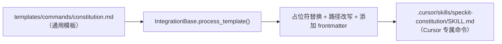


### 1.7 Manifest：可安全卸载与升级的基础

为了避免以后“升级覆盖用户改动”或“卸载留下垃圾”，`IntegrationManifest` 会对每个被写入的文件记录**内容哈希**：

- 升级时：哈希一致 → 可安全覆盖；哈希不同 → 识别为用户改动，跳过或提示
- 卸载时：按 manifest 精确回收，不会误删用户的其它文件

这也是为什么多次运行 `specify init` 不会重复“污染”项目。

---

## 二、`/speckit.constitution` 的作用与原理

### 2.1 命令本质：一段给 AI 执行的工作流

容易产生的误解：以为 `/speckit.constitution` 会跑一段 Python 脚本。**实际并不是。**

真相是：

> `/speckit.constitution` 就是一份 `SKILL.md`，它里面写的是**给 AI agent 看的一整套步骤指令**。Agent（Cursor）按照这份指令去读模板、填占位符、跨文件一致性检查、生成 Sync Impact Report，最后把结果写回 `.specify/memory/constitution.md`。

所以它本质是“**AI 主导 + 工作流编排 + 模板填充**”。

### 2.2 三层解耦的文件关系

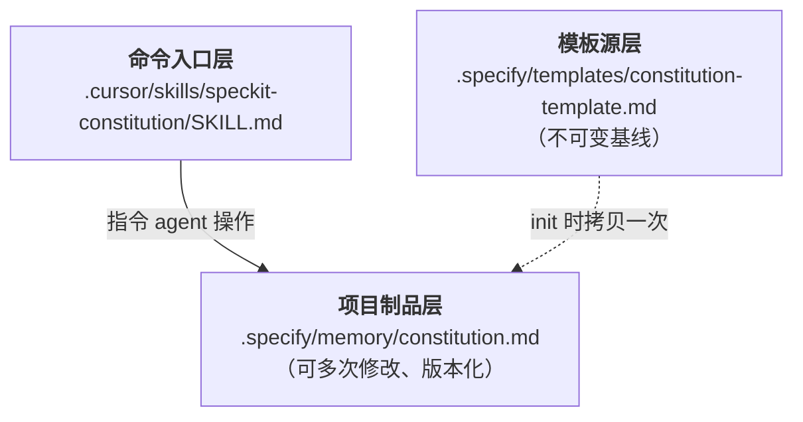


三层各司其职：

- **命令入口**：写给 agent 看的“怎么做”。
- **项目制品**：项目真正的宪法，会被其他命令反复读取。
- **模板源**：只读基线，永远留着，用于首次初始化或丢失时重建。

### 2.3 AI Agent 的 8 步执行流程

按 `SKILL.md` 中的指令，Agent 会做：

1. **Load**：读取当前 `.specify/memory/constitution.md`，识别所有 `[PLACEHOLDER]`。
2. **Collect**：从用户输入、仓库上下文、默认规则中**收集或派生**占位符值（日期、版本号等可自动计算）。
3. **Draft**：在内存中拼出更新后的宪法内容。
4. **Propagate**：**跨文件一致性检查**，同步更新 `plan-template.md`、`spec-template.md`、`tasks-template.md`、其它 command 文件、`README.md` 等依赖项。
5. **Sync Impact Report**：生成“修宪报告”，以 HTML 注释形式**插入到宪法文件顶部**，记录：版本变动、修改的原则、受影响的下游文件。
6. **Validate**：做一轮最终校验（没有遗留 `[PLACEHOLDER]`、日期合法、semver 合理等）。
7. **Write**：覆盖写回 `.specify/memory/constitution.md`。
8. **Summarize**：在聊天里输出改动摘要给用户。

版本号按 semver：

- **MAJOR**：移除/改写某条核心原则
- **MINOR**：新增原则或章节
- **PATCH**：措辞、示例、格式修正

### 2.4 Pre/Post 扩展 Hook 机制

`spec-kit` 允许扩展（如 `extensions/git/`）声明 hook，比如：

- `before_constitution` → 在修宪之前自动触发（例如 `speckit.git.initialize` 确保仓库已初始化）
- `after_constitution` → 修宪完成后收尾（例如自动 commit、打 tag）

Hook 的触发方式也是**由 agent 自己读取 `extensions.yml` 发起**，而不是后台常驻进程。这保持了 `spec-kit` 的“无服务”特征：它只产出规则和模板，真正的执行者是 AI。

---

## 三、`/speckit.specify` 的作用与原理

### 3.1 它在 SDD 流水线里的定位

`/speckit.specify` 是 SDD（Spec-Driven Development）流水线的**第二棒**——在 `/speckit.constitution` 之后、`/speckit.plan` 之前——它把用户一段自然语言的功能描述，翻译成一份结构化、WHAT-only 的 `spec.md`，并为本 feature 建立一个独立的工作目录 `specs/NNN-xxx/`。

它做的核心三件事：

1. **建目录**：`specs/<prefix>-<short-name>/`（可选 + 建 git 分支）
2. **填模板**：`cp templates/spec-template.md → specs/<feature>/spec.md`，然后按模板填入 User Stories / FR / Success Criteria
3. **跑质量闭环**：生成 `checklists/requirements.md`，最多 3 轮自检，必要时向用户提 ≤3 个 `[NEEDS CLARIFICATION]` 问题

### 3.2 澄清：它并不直接读 `constitution.md`

一个容易产生的误解：以为 `/speckit.specify` 会加载宪法来"对齐"。**实际不会**——在 `templates/commands/specify.md` 里全文搜索 `constitution` 是 0 个匹配。真正的 Constitution Check 硬门槛在下一棒 `/speckit.plan`。

那 spec 阶段的"宪法对齐"是怎么发生的？通过**三条间接链路**：

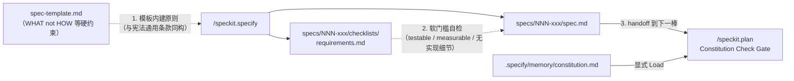


1. **spec 模板自带"宪法化表达"**：`spec-template.md` + `specify.md` 的 Quick Guidelines 强制要求只写 WHAT、FR 可测试、Success Criteria 可度量且 technology-agnostic。这些要求和大多数项目 constitution 的通用条款高度同构。
2. **质量 Checklist 是软门槛**：生成的 `requirements.md` 验证项（"No implementation details"、"Requirements are testable and unambiguous"、"Success criteria are technology-agnostic"）本身就是宪法语义的下沉。
3. **handoff 到 `/speckit.plan`**：真正"审判宪法"由下一棒完成（`plan.md` 命令模板第 2 步显式 `Read FEATURE_SPEC and /memory/constitution.md`）。

> 一句话：**spec 阶段只做语言翻译和质量闭环，宪法审判留给 plan 阶段**。这是 spec-kit 刻意的分层设计——降低每个命令的职责耦合。

### 3.3 为什么要建 `specs/NNN-xxx/` 目录

不是"顺手建个文件夹"，背后有五个硬需求。

**一个 feature = 一个独立的制品集合**。后续命令会在这个目录里陆续生成一整套互相关联的文件：

```text
specs/003-user-auth/
├── spec.md                 # /speckit.specify 生成 ← 本阶段
├── checklists/
│   └── requirements.md     # /speckit.specify 自检 ← 本阶段
├── plan.md                 # /speckit.plan
├── research.md             # /speckit.plan Phase 0
├── data-model.md           # /speckit.plan Phase 1
├── contracts/              # /speckit.plan Phase 1
├── quickstart.md           # /speckit.plan Phase 1
└── tasks.md                # /speckit.tasks
```

这是"**一 feature 一自治目录**"的设计：每个 feature 拥有完整上下文、可单独交付、可单独归档、可并行推进，多个 feature 互不污染。

`**NNN-<short-name>` 前缀的五个收益**：


| 收益            | 具体机制                                                                                               |
| ------------- | -------------------------------------------------------------------------------------------------- |
| **确定性排序**     | `ls specs/` 按时间顺序天然是开发时间线                                                                          |
| **全局唯一编号**    | 下游命令、PR 标题、issue 引用可直接用 `#003` 寻址                                                                  |
| **跨分支追溯**     | 编号是全局递增的（扫描本地分支 + `git ls-remote` 取最大值 + 1），不会和已 merge 的老 feature 冲突                               |
| **目录 ≠ 分支**   | 多个 git 分支可以同时挂在同一 spec（如 `004-fix-bug` 和 `004-add-feature`），`find_feature_dir_by_prefix` 按数字前缀模糊匹配 |
| **GitHub 兼容** | 强制检查 ≤ 244 字节（`MAX_BRANCH_LENGTH`），超过自动截断                                                          |


short-name 由 `scripts/bash/create-new-feature.sh` 的 `generate_branch_name()` 生成：小写化 → 去非字母数字 → 过滤停用词（`the/to/for/want/add/...`）→ 取前 3-4 个"有意义"的词 → 用 `-` 连接，并保留大写缩写（OAuth/API/JWT）。

### 3.4 编号是怎么选出来的

核心逻辑在 `check_existing_branches()`，由 `.specify/init-options.json` 的 `branch_numbering` 决定走哪条分支：

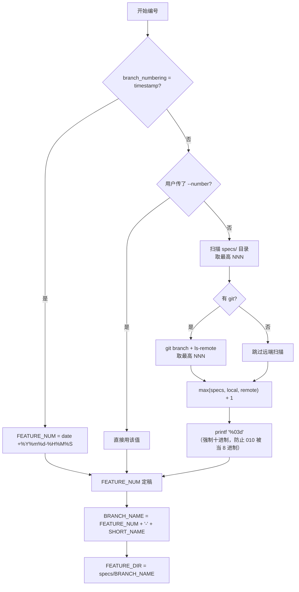


几个值得注意的实现细节：

- `number=$((10#$number))`：显式十进制解析，避免 `010` 被 shell 当成 8 进制。
- `get_highest_from_remote_refs()`：用 `git ls-remote --heads` 而不是 `git fetch`，**只读、无副作用**，dry-run 不会污染本地。
- sequential 前缀正则 `^[0-9]{3,}-`：不只是 3 位，**≥3 位都算**，过 999 自动变 4 位，无需迁移。
- 跳过"疑似 timestamp 但格式不对"的伪 sequential 分支，避免误判。

**实际支持的三种分支命名形态**（由 `common.sh::check_feature_branch` 验证，`spec_kit_effective_branch_name` 归一化）：


| 形态             | 示例                                              | 说明                                           |
| -------------- | ----------------------------------------------- | -------------------------------------------- |
| **sequential** | `001-user-auth`、`1234-refactor`                 | `--branch-numbering sequential`（默认），≥3 位数字前缀 |
| **timestamp**  | `20260319-143022-user-auth`                     | `--branch-numbering timestamp`，冲突概率极低        |
| **gitflow**    | `feat/004-user-auth`、`hotfix/20260319-143022-x` | 单层前缀会被剥离成 `004-user-auth`，与 GitFlow 工作流共存    |


非 git 仓库下，`check_feature_branch` 会打印 warning 但**不阻断流程**：此时 `get_current_branch()` 退化为"扫 `specs/` 目录取最新子目录名"，保证非 git 场景下 `/speckit.plan` 等命令仍能工作（参见附录 B）。

### 3.5 `feature.json`：下游命令定位 feature 的唯一权威

`/speckit.specify` 的 step 3 会写这个文件：

```json
// .specify/feature.json
{ "feature_directory": "specs/003-user-auth" }
```

下游命令（`/speckit.plan`、`/speckit.tasks` 等）解析 feature 目录的优先级在 `scripts/bash/common.sh` 的 `get_feature_paths()` 里**严格固定为三级**：

1. `SPECIFY_FEATURE_DIRECTORY` 环境变量（最高优先，显式覆盖一切）
2. `.specify/feature.json` 的 `feature_directory` 键（`/speckit.specify` 持久化在这里）
3. `find_feature_dir_by_prefix(current_branch)`（兜底：按当前分支前缀到 `specs/` 里找）

另外 `get_current_branch()` 还有一个独立的环境变量开关：`SPECIFY_FEATURE`——它**只覆盖"当前分支"这个值**，间接影响 (3) 的前缀匹配；不会直接指定目录。换句话说：

- 想"跳脱分支绑定，直接锁定目录" → 用 `SPECIFY_FEATURE_DIRECTORY`
- 想"在非 git 项目里模拟分支" → 用 `SPECIFY_FEATURE`
- 正常 SDD 流程 → 什么都不设，靠 `feature.json`

这个设计的意义：**spec 目录一旦被 `/speckit.specify` 定下来并写入 `feature.json`，下游命令就不再依赖 git 分支名**。这让用户可以：

- 在非 git 项目里用 spec-kit
- 在任意分支上继续 `/speckit.plan`
- 切分支做子任务而不丢失 spec 上下文

**职责边界**：`specify.md` 里明确写了：

> "The spec directory and file are always created by this command, never by the hook. Branch creation is handled by the `before_specify` hook (git extension)."


| 动作                                   | 谁负责                                                               |
| ------------------------------------ | ----------------------------------------------------------------- |
| 创建 git 分支                            | `extensions/git/` 的 `before_specify` hook → `speckit.git.feature` |
| 创建 spec 目录 + 拷贝模板 + 写 `feature.json` | `/speckit.specify` 本身（不可外包）                                       |
| Commit 变更                            | `after_specify` hook（可选）                                          |


即便用户没装 git 扩展、甚至没 git 仓库，`/speckit.specify` 依然能工作——**目录创建不依赖 git**。

### 3.6 AI Agent 的 9 步执行流程

按生成的 `SKILL.md` 指令，Agent 会按顺序做：

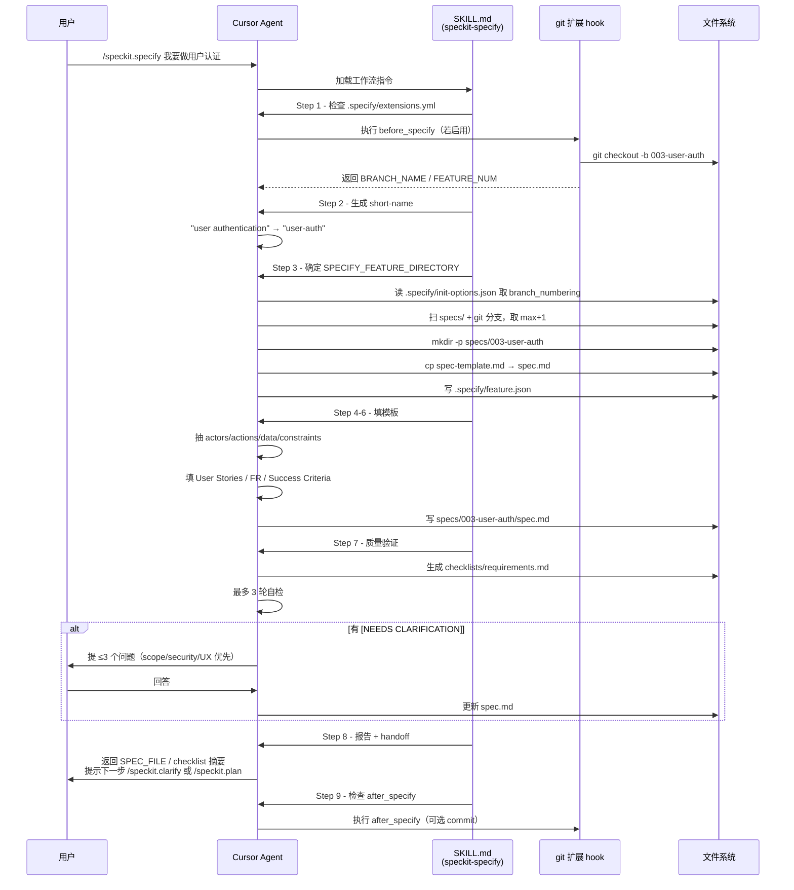


### 3.7 不同 agent 下的 frontmatter 与 handoff 差异

**一个重要事实**：`templates/commands/specify.md` 源模板里的 `handoffs` 字段**在 Cursor 下并不出现在生成物中**。这是 integration 渲染路径的差异：

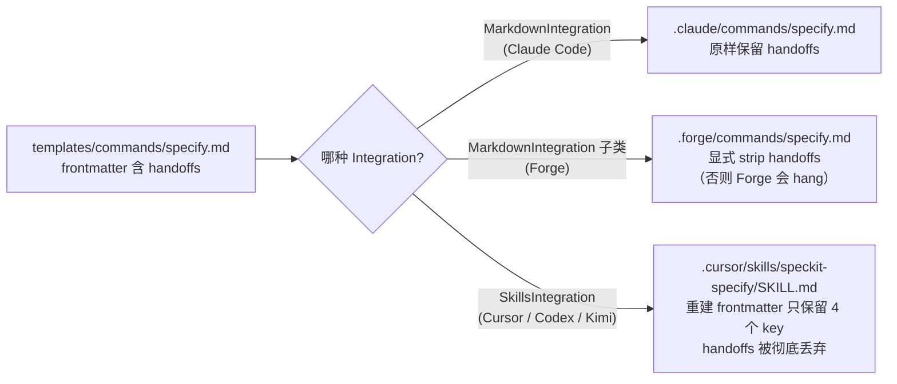


关键代码在 `src/specify_cli/agents.py` 的 `render_skill_command()` / `build_skill_frontmatter()`：**SKILL.md 的 frontmatter 是"整块重建"的**，只从源 frontmatter 取 `description` 这一个字段，其它全部丢弃，然后用固定 4 个 key 重写：

```yaml
---
name: "speckit-specify"
description: "..."
compatibility: "Requires spec-kit project structure with .specify/ directory"
metadata:
  author: "github-spec-kit"
  source: "templates/commands/specify.md"
---
```

Forge 的处理更直白，源码里注释写着：

> `Strips 'handoffs' frontmatter key (Claude Code feature that causes Forge to hang)`

**各 agent 对比表**：


| Agent                 | Integration 类型               | 生成物                              | handoffs 处理           | "下一步"如何呈现                   |
| --------------------- | ---------------------------- | -------------------------------- | --------------------- | --------------------------- |
| Claude Code           | `MarkdownIntegration`（无特殊处理） | `.claude/commands/*.md`          | **原样保留**              | Claude 读懂 frontmatter，结构化提示 |
| Forge                 | 自定义 `MarkdownIntegration` 子类 | `.forge/commands/*.md`           | **显式 strip**（否则 hang） | body 末尾自然语言提示               |
| Cursor / Codex / Kimi | `SkillsIntegration`          | `.cursor/skills/<name>/SKILL.md` | **重建时丢弃**             | body 末尾自然语言提示               |
| Copilot / Gemini 等    | 其它 `MarkdownIntegration` 子类  | 各自目录                             | 原样保留（多数 agent 无视）     | 多数落到 body 末尾提示              |


所以**在 Cursor 下**，`/speckit.specify → /speckit.plan` 的"接力"不是 frontmatter 级的结构化 handoff，而是**靠 SKILL.md body 末尾的自然语言提示 + 用户手动输入下一个命令**完成的。`specify.md` body 的 Step 8 显式写了：

> "Report completion to the user with ... Readiness for the next phase (`/speckit.clarify` or `/speckit.plan`)"

这也解释了一个常见观察：**Cursor 里 `/speckit.xxx` 命令之间没有"按钮式"跳转**——不是 bug，是 integration 渲染路径决定的。

---

## 四、`/speckit.clarify` 的作用与原理

先抛两个容易踩到的认知点：

> **认知点一**：它**不是**新建 spec 的命令，而是**修订已有 spec** 的命令。目标是"在进入 `/speckit.plan` 之前，消灭 spec 中会导致下游返工的模糊点"。
>
> **认知点二**：它和 `/speckit.specify` 内部的"3 问 validation"**不是同一回事**。两者都叫 clarification，但触发时机、扫描范围、整合方式完全不同——这是 spec-kit 里最容易混的一对概念。

### 4.1 它在 SDD 流水线里的位置

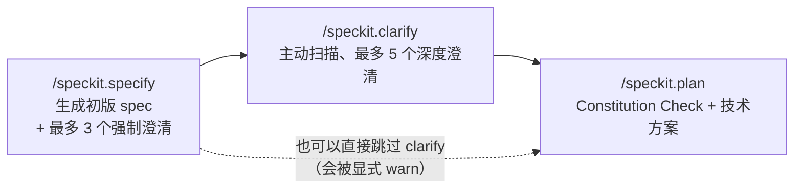


它是**可选但强烈建议**的一棒：

- `clarify.md` 开头写得很直白：*"This clarification workflow is expected to run (and be completed) BEFORE invoking `/speckit.plan`. If the user explicitly states they are skipping clarification ..., you may proceed, but **must warn that downstream rework risk increases**."*
- `extensions/git/extension.yml` 把 `before_clarify` 和 `after_clarify` 都配成 **optional hook**，所以不装 git 扩展时也能用。

### 4.2 和 `/speckit.specify` 的 "3 问 validation" 的区别

这是最关键的对比，放在前头。


| 维度           | `/speckit.specify` 的 3 问                            | `/speckit.clarify`                                                                |
| ------------ | --------------------------------------------------- | --------------------------------------------------------------------------------- |
| **触发时机**     | spec 首次生成后立即自检                                      | 用户主动发起，spec 已存在                                                                   |
| **扫描方式**     | 只看模板里**显式留下的 `[NEEDS CLARIFICATION]` 标记**           | **主动扫描整份 spec**，按 11 类 taxonomy 评估 Clear / Partial / Missing                      |
| **问题上限**     | **≤3 个**                                            | **≤5 个**                                                                          |
| **提问方式**     | **一次性把所有问题呈上**（批量）                                  | **逐条提问（sequential）**，一次只出一题                                                       |
| **AI 是否给推荐** | 否，只列 A/B/C/Custom                                   | **会**，每题有 `**Recommended:`** / `**Suggested:`** 带理由；用户可回 "yes"/"recommended" 直接采纳 |
| **答案类型**     | 多选 + Custom 自由填                                     | 多选（2-5 项，互斥）或短答（≤5 词）                                                             |
| **写入位置**     | 直接替换原 `[NEEDS CLARIFICATION: ...]` 内联标记             | 专门的 `## Clarifications` / `### Session YYYY-MM-DD` 段，**追加历史审计线索**；同时分发到对应章节       |
| **整合时机**     | 所有答案收齐后一次性更新 + 重跑 Quality Checklist                 | **每收到一个答案立即 atomic overwrite 写盘**（降低上下文丢失风险）                                      |
| **优先级启发式**   | `scope > security/privacy > UX > technical details` | `Impact × Uncertainty`，跨 11 类 taxonomy 做覆盖率平衡                                     |
| **覆盖率报告**    | 生成 `checklists/requirements.md` + pass/fail         | 输出 Coverage Table（Resolved / Deferred / Clear / Outstanding）                      |


**一句话区分**：

- `/speckit.specify` 那 3 个是**模板引导的填空**（写 spec 时模板本身留了问号）；
- `/speckit.clarify` 那 5 个是**AI 审查式挑刺**（spec 看似写完，但 AI 按 taxonomy 主动扫出未说清的地方）。

### 4.3 核心原理：11 类 taxonomy 扫描

整个命令的大脑是第 2 步那个**模糊性分类法**，覆盖 11 个维度：

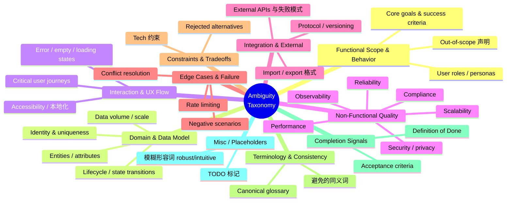


对每一类，AI 给 spec 打一个 `Clear / Partial / Missing` 的标签，生成**内部 coverage map**（不直接输出给用户），然后按 `Impact × Uncertainty` 启发式挑出前 5 个候选问题。

几个值得注意的**约束规则**：

- 跨类别要**覆盖率平衡**——不能在低影响维度上连问两个，导致 security 这种高影响维度完全没覆盖。
- **排除**已被回答过的、纯风格偏好、plan 阶段的执行细节（除非阻塞正确性）。
- **偏向**能减少下游返工的问题，而不是"想多了解一下"。

### 4.4 AI Agent 的 9 步执行流程

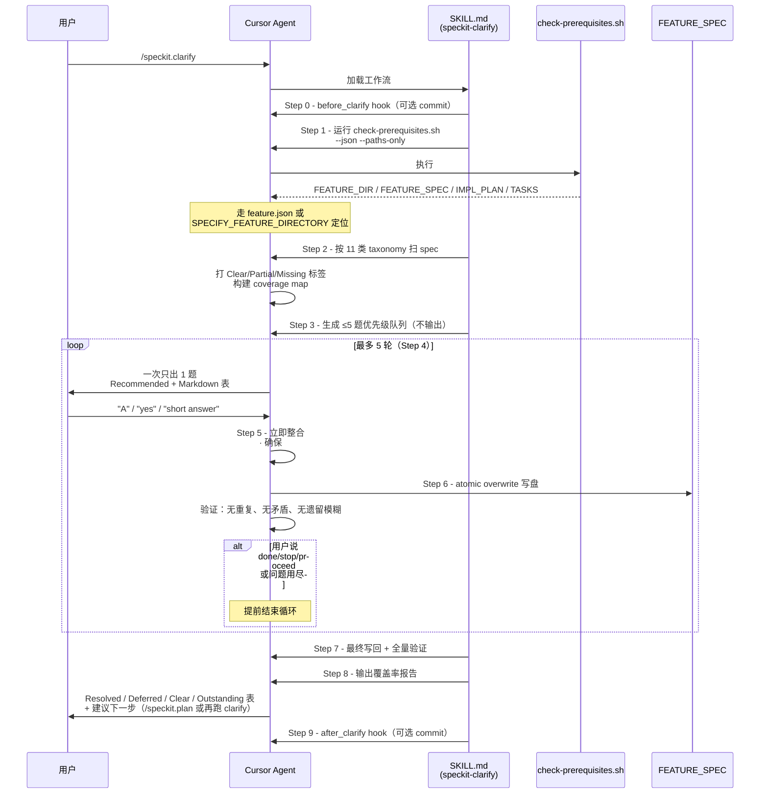


### 4.5 提问 UI 的三个硬约束

`/speckit.clarify` 的问答格式被写得非常严格，这是为了保证回答的**可机器化录入**：

1. **每题二选一格式**：要么多选（2-5 互斥选项，可加 `Short` 让用户自由填 ≤5 词），要么纯短答（`<=5 words`）。**不允许开放式讨论**。
2. **AI 必须先给推荐**（新版本加的能力），带 1-2 句理由，格式固定：
  ```text
   **Recommended:** Option B - 基于 XXX 最佳实践，兼顾 YYY

   | Option | Description |
   |--------|-------------|
   | A | ... |
   | B | ... |
   | C | ... |

   You can reply with the option letter (e.g., "A"), accept the recommendation
   by saying "yes" or "recommended", or provide your own short answer.
  ```
3. **永远不提前暴露后面的问题**（"Never reveal future queued questions in advance"）。

这三条组合起来，让每一轮答案都可以被确定性地解析和回写，**避免 spec 被自由文本污染**。

### 4.6 整合到 spec 的规则

这是 `/speckit.clarify` 和 `/speckit.specify` 整合能力的分水岭。它**两件事并行**：

**① 追加审计记录**（新建区）：

```markdown
## Clarifications

### Session 2026-04-22

- Q: Which auth method should be used? → A: OAuth2 with PKCE
- Q: What is the target RTO for recovery? → A: <= 1 hour
- Q: Storage for session tokens? → A: Server-side Redis
```

**② 把答案同时分发到对应章节**（修改原内容），分发规则是写死的：


| 澄清类型                      | 分发目标                                                    |
| ------------------------- | ------------------------------------------------------- |
| Functional ambiguity      | 更新/新增 Functional Requirements 条目                        |
| User interaction / actor  | User Stories 或 Actors 小节                                |
| Data shape / entities     | Data Model（字段、类型、关系）                                    |
| Non-functional constraint | Success Criteria > Measurable Outcomes（把 "robust" 变成指标） |
| Edge case / 负流程           | Edge Cases / Error Handling 新增条目                        |
| Terminology conflict      | 全文统一术语；必要时保留 `(formerly referred to as "X")`            |


**关键规则**：如果新答案使得某段早先的描述无效，**直接替换**而不是堆叠，保证 "no obsolete contradictory text"。

每轮整合后都会：

1. 立即 atomic overwrite FEATURE_SPEC（避免 crash 丢进度）
2. 跑 6 点 validation：一题一条 bullet、总数 ≤5、无遗留模糊、无矛盾、markdown 合法、术语一致

### 4.7 和 `constitution.md` 的关系与使用边界

同 `/speckit.specify`，**它也不直接读 `constitution.md`**。`clarify.md` 全文搜 `constitution` 是 0 个匹配。

那它和宪法的联系是什么？**间接的**——它把 spec 清理干净，使得 `/speckit.plan` 的 Constitution Check 能拿到一份**不含模糊形容词、不含无效占位、测试条件可度量**的 spec，门槛检查才有依据。

换句话说：`**/speckit.clarify` 是给 `/speckit.plan` 的 Constitution Check 喂"干净食材"的上游工序**。

**常见边界行为**：


| 情况                            | `/speckit.clarify` 的行为                                                                   |
| ----------------------------- | ---------------------------------------------------------------------------------------- |
| spec 文件不存在                    | 不创建新 spec，提示先跑 `/speckit.specify`                                                        |
| spec 已完美（无 Partial / Missing） | 输出 "No critical ambiguities detected worth formal clarification." + 建议直接 `/speckit.plan` |
| 用户说 "exploratory spike，跳过"    | 允许，但 **must warn** 下游返工风险                                                                |
| 用户中途说 "done / stop / proceed" | 立即终止，已答问题仍保留，输出部分 Coverage 表                                                             |
| 5 题用完但仍有高影响维度未决               | 明确列到 `Deferred` 段，并 recommend "post-plan 再跑一次 clarify"                                   |
| 多次运行同一天                       | `### Session 2026-04-22` 可累加 bullet，审计线连续                                                |


---

## 五、`/speckit.plan` 的作用与原理

先抛两个关键认知点：

> **认知点一**：`/speckit.plan` 是整个 SDD 流水线里**第一次从 WHAT 进入 HOW** 的命令，但它**只走到"设计产物"为止**，既不写任何代码、也不创建任务——`tasks.md` 是 `/speckit.tasks` 的工作。
>
> **认知点二**：`/speckit.plan` 是**第一个真正显式加载 `constitution.md` 的命令**。前面 `specify` / `clarify` 都只和宪法间接相关，到这里才有 "Constitution Check" 这个真正的**硬门槛**。

### 5.1 它在 SDD 流水线里的定位

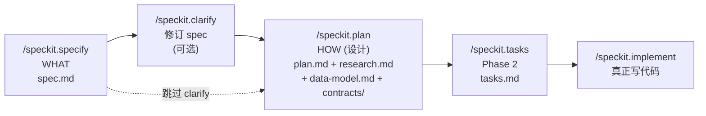


它的职责边界非常清晰，`plan.md` 命令模板里原话：

> "Command ends after Phase 2 planning. Report branch, IMPL_PLAN path, and generated artifacts."

这句话措辞有点绕——它是说**命令在 Phase 1 的产物全部生成后结束**，不越界到 `/speckit.tasks` 的 Phase 2。`plan-template.md` 里后面"Phase 2"只是占位/注释（给 `tasks.md` 留入口），实际由下一棒生成。

### 5.2 `setup-plan.sh`：先把骨架摆好

不同于前几个命令，`/speckit.plan` 的第一步是跑一段**实际的 shell 脚本**，不是让 AI 来定位 feature。`scripts/bash/setup-plan.sh` 做的事就三件：

1. 用 `get_feature_paths()`（`common.sh`）走那条**四级优先级**解析出 feature 目录：环境变量 → `.specify/feature.json` → git 分支前缀
2. `cp .specify/templates/plan-template.md → specs/<feature>/plan.md`（把骨架拷过来）
3. 输出 JSON：
  ```json
   {
     "FEATURE_SPEC": "specs/003-user-auth/spec.md",
     "IMPL_PLAN":    "specs/003-user-auth/plan.md",
     "SPECS_DIR":    "specs/003-user-auth",
     "BRANCH":       "003-user-auth",
     "HAS_GIT":      "true"
   }
  ```

然后 agent 解析 JSON，拿到后续所有步骤的输入。**注意**：到这一步时 `plan.md` 还是一份**全是 `[PLACEHOLDER]` 的空壳**，后面所有工作都是往里填。

### 5.3 整体 3 阶段结构（Pre → Phase 0 → Phase 1）

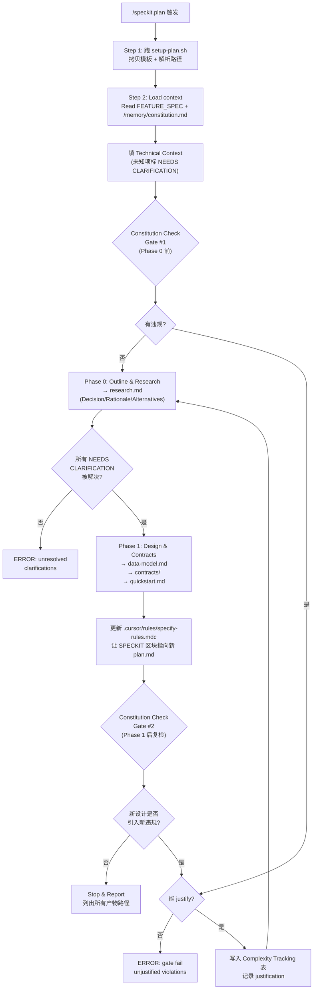


三个阶段的职责严格分层：


| 阶段          | 输入                        | 产物                                                                  | 关键约束                                             |
| ----------- | ------------------------- | ------------------------------------------------------------------- | ------------------------------------------------ |
| **Pre**     | spec.md + constitution.md | plan.md 的 Technical Context + Constitution Check                    | 未知项必须标 `NEEDS CLARIFICATION`；违规未 justify 则 ERROR |
| **Phase 0** | Technical Context 里的未知项   | `research.md`                                                       | 必须把所有 `NEEDS CLARIFICATION` 变成 Decision          |
| **Phase 1** | research.md + spec.md     | `data-model.md` / `contracts/` / `quickstart.md` + 更新 agent context | 设计完成后重跑 Constitution Check                       |


### 5.4 Phase 0：Outline & Research

这一阶段的本质是**把所有未决技术选型定下来**，但不是瞎定——每个选择都要有依据。

**① 研究任务的派发规则**。agent 会从 Technical Context 里抽出三类"待查项"：


| 来源                          | 派发的研究任务                                      |
| --------------------------- | -------------------------------------------- |
| 每个 `NEEDS CLARIFICATION` 标记 | "Research {unknown} for {feature context}"   |
| 每个依赖库                       | "Find best practices for {tech} in {domain}" |
| 每个集成点                       | "Find patterns for {integration}"            |


然后**为每一项派发独立的研究任务**（在 Cursor 下就是 agent 在同一会话里串行思考 / 查阅）。

**② `research.md` 的固定格式**。每条研究结论必须有 3 元组：

```text
- Decision: [what was chosen]
- Rationale: [why chosen]
- Alternatives considered: [what else evaluated]
```

这不是建议，是硬格式——下游 `/speckit.analyze` 会用这个结构做一致性检查。

**③ 通过标准**：**所有 NEEDS CLARIFICATION 必须被解决**，否则 Phase 1 不能开始。这就是为什么前面鼓励你先跑 `/speckit.clarify`——spec 阶段没清理干净的模糊，在这里会被翻出来重新逼问。

### 5.5 Phase 1：Design & Contracts

这一阶段产出**三份可被下游消费的设计文档**，都放在同一 `specs/<feature>/` 目录。

**① `data-model.md`**：从 spec 抽取（不是从 plan 臆想）：实体名、字段、关系、来自 requirements 的验证规则、生命周期状态转换。如果 `/speckit.clarify` 阶段你在 "Domain & Data Model" 类目下回答过问题，答案已经落到 spec 的 "Data Model" 段，这里会**直接消费**——这就是为什么 clarify 要求答案写回 spec 原位而不只是塞进 `## Clarifications` 审计段。

**② `contracts/`**：多态的目录，格式完全取决于项目类型：


| 项目类型         | `contracts/` 里放什么                      |
| ------------ | -------------------------------------- |
| Web service  | OpenAPI / gRPC proto / REST endpoint 表 |
| Library      | 公共 API 签名、语义约定                         |
| CLI 工具       | 命令 schema、参数定义、退出码                     |
| Parser / DSL | Grammar 定义、token 表                     |
| 桌面 / 移动 APP  | UI 契约、IPC schema                       |
| 纯内部脚本        | **跳过**（spec-kit 允许这一栏空）                |


**③ `quickstart.md`**：给别人（或未来的自己）一份"从 0 跑起来"的最小路径——依赖安装 → 启动命令 → 一个可验证的端到端样例。

**④ 更新 agent context file（容易被忽略的一步）**。`plan.md` 命令模板第 144-145 行原文：

> "Update the plan reference between the `<!-- SPECKIT START -->` and `<!-- SPECKIT END -->` markers in `__CONTEXT_FILE__` to point to the plan file created in step 1."

还记得前面讨论过的 `.cursor/rules/specify-rules.mdc` 那个"单跳路牌"吗？**就是在这一步被写活的**：

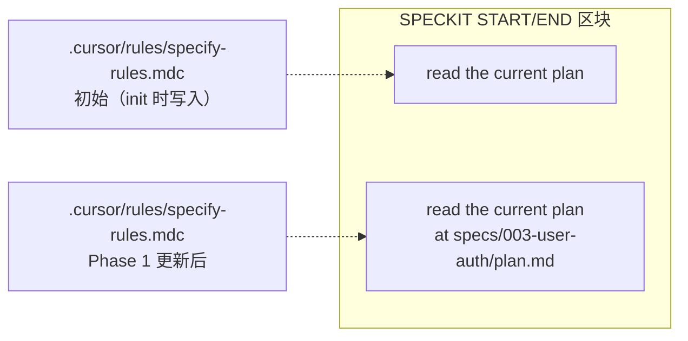


从此以后 Cursor 每次会话都会带上"指向 003-user-auth/plan.md 的路牌"，后续 `/speckit.tasks`、`/speckit.implement` 自动拿到当前设计上下文。

`__CONTEXT_FILE__` 是占位符，在生成 SKILL.md 时被 `IntegrationBase.process_template()` 替换成当前 integration 的 `context_file`（Cursor 就是 `.cursor/rules/specify-rules.mdc`）。这是"通用模板 → agent 专属指令"转换的一个典型例子。

### 5.6 Constitution Check：宪法真正"开审"的地方

这是 `/speckit.plan` 最核心的价值。`plan-template.md` 原文：

> `*GATE: Must pass before Phase 0 research. Re-check after Phase 1 design.*`

**两次门槛评估**：


| 时机                     | 检查什么                                                         | 为什么需要           |
| ---------------------- | ------------------------------------------------------------ | --------------- |
| **Gate #1**（Phase 0 前） | 初始 Technical Context 是否违反宪法原则                                | 在做研究之前就拦住错误方向   |
| **Gate #2**（Phase 1 后） | 设计阶段是否**引入了新违规**（例如为了性能加了 4th project、用了 Repository pattern） | 防止研究 / 设计过程"滑坡" |


**违规处理流程**：

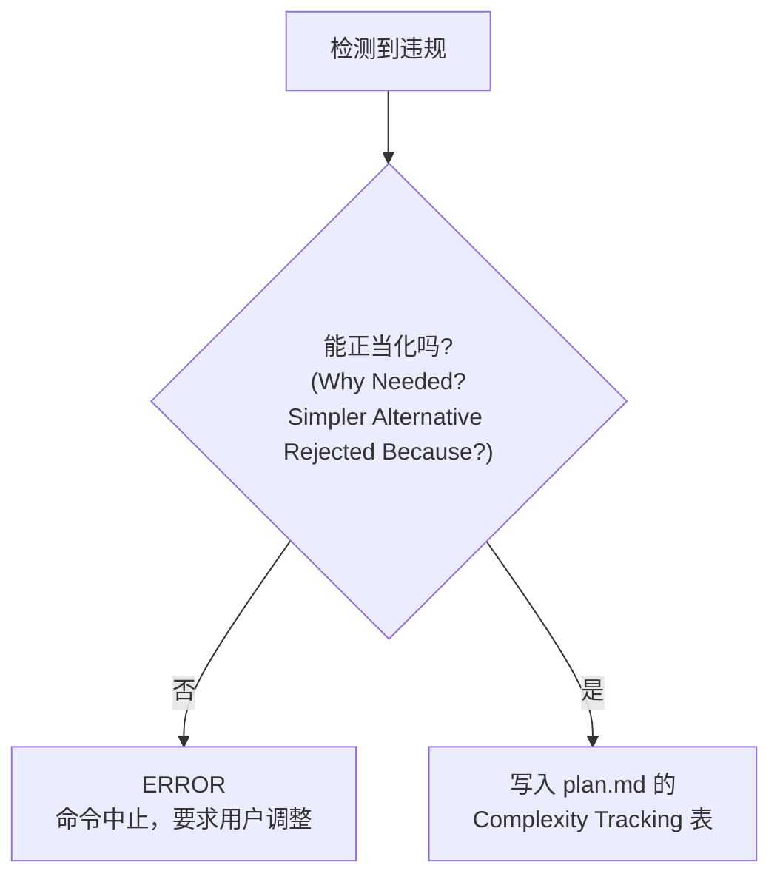


`plan-template.md` 末尾有一张专门的 "Complexity Tracking" 表：


| Violation          | Why Needed       | Simpler Alternative Rejected Because |
| ------------------ | ---------------- | ------------------------------------ |
| 4th project        | current need     | why 3 projects insufficient          |
| Repository pattern | specific problem | why direct DB access insufficient    |


这是一个**显式、可审计的"破例记录"**。没有这张表、只有"代码里这样写更方便"这种借口的违规，会被直接 ERROR。

**为什么这个设计很重要**：`constitution.md` 里的条款通常是像 "**Library-First**"、"**TDD NON-NEGOTIABLE**"、"**No abstractions without demonstrated need**" 这种硬原则。Complexity Tracking 表强迫你**用文字陈述"为什么这里必须偏离原则"**——如果你写不出像样的理由，说明真的不应该偏离。这是 spec-kit 用"**强迫 justify**"对抗"AI 过度设计"的核心机制。

### 5.7 完整执行时序

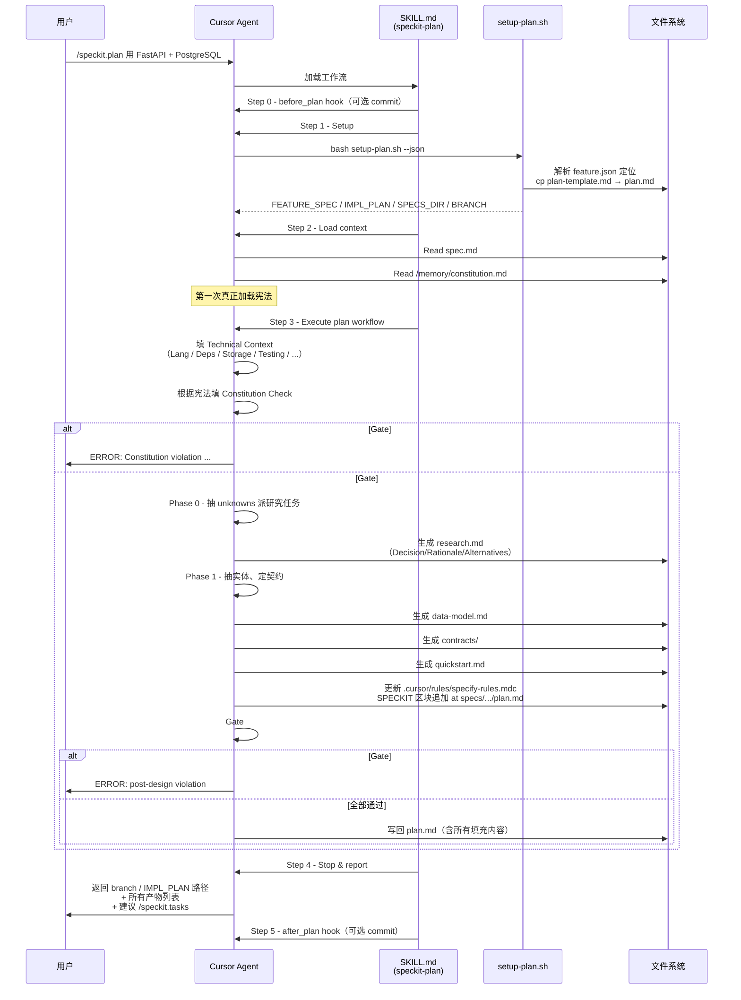


### 5.8 产出清单与 plan.md 内部结构

执行完后 `specs/<feature>/` 长这样：

```text
specs/003-user-auth/
├── spec.md                 # /speckit.specify + /speckit.clarify
├── checklists/
│   └── requirements.md     # /speckit.specify
├── plan.md                 # ← 本阶段主产物
├── research.md             # ← Phase 0
├── data-model.md           # ← Phase 1
├── contracts/              # ← Phase 1
│   ├── api-v1.yaml
│   └── ...
├── quickstart.md           # ← Phase 1
└── tasks.md                # /speckit.tasks（本阶段不生成）
```

`**plan.md` 内部结构**：

```text
## Summary                       ← 从 spec + research 提炼
## Technical Context             ← Phase 0 前填，含 Lang/Deps/Storage/Testing/...
## Constitution Check            ← Gate #1 + Gate #2 的结论
## Project Structure             ← Documentation 结构 + Source Code 结构 + Structure Decision
## Complexity Tracking           ← 仅在有 justify 违规时填
```

### 5.9 与前后命令的串联关系


| 数据 / 文件                                         | 来自                                      | 被谁消费                                               |
| ----------------------------------------------- | --------------------------------------- | -------------------------------------------------- |
| `spec.md`（User Stories / FR / Success Criteria） | `/speckit.specify` + `/speckit.clarify` | `/speckit.plan` Phase 1 的 data-model.md 抽取         |
| `/memory/constitution.md`                       | `/speckit.constitution`                 | `/speckit.plan` Constitution Check **首次显式加载**      |
| `plan.md` 全文                                    | `/speckit.plan`                         | `/speckit.tasks` 抽任务、`/speckit.analyze` 做一致性审计     |
| `research.md`                                   | `/speckit.plan` Phase 0                 | `/speckit.analyze` 校验"所有选型有依据"                     |
| `data-model.md` / `contracts/`                  | `/speckit.plan` Phase 1                 | `/speckit.tasks` 每条 contract / entity 通常对应 1-N 个任务 |
| `.cursor/rules/specify-rules.mdc`               | `/speckit.plan` Phase 1 step 3 更新       | 后续所有 Cursor 会话常驻加载                                 |


### 5.10 为什么停在 Phase 1，不顺手把 tasks 生成了

这是 spec-kit 刻意的设计决策。三条理由：

1. **Plan 可独立 review**：团队可以把"这个 feature 我们用什么技术、画什么契约"拿出去单独评审，不被一堆 TODO 任务冲淡。
2. **Plan 可多轮迭代**：evaluator 反对某个技术选型 → 改 plan → 重跑 `/speckit.plan` → **不影响已有 tasks.md**。如果一起生成，每次改 plan 都要重写 tasks。
3. **失败成本更低**：Constitution Check 在 Phase 1 结束后如果不过，只需要重新设计；不会像先生成一堆任务再发现宪法违规，浪费上下文 + 返工。

这也呼应了 spec-kit 的顶层哲学：**每个命令只负责一件事，把决策门槛尽量前置**。

---

## 六、`/speckit.tasks` 的作用与原理

### 6.1 它在 SDD 流水线里的定位

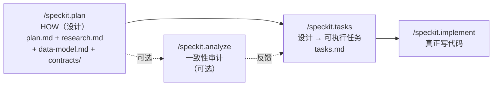


`/speckit.tasks` 是**从"设计产物"到"可执行任务清单"的翻译器**：

- 不做任何新决策（不挑技术栈、不定契约、不碰需求）
- 只把 `plan.md` + `spec.md` + `data-model.md` + `contracts/` 四份设计输入，**机械地拆成一条条带文件路径的 checkbox**
- 产物只有一个：`specs/<feature>/tasks.md`

一句话概括：**"把 Plan 里的静态设计物，翻译成 LLM 可直接执行的原子工作项"**。

### 6.2 输入 / 输出与执行骨架

**首先跑 `check-prerequisites.sh --json`**。和 `/speckit.plan` 的 `setup-plan.sh` 不同，这里**不会拷模板**，只是**发现 feature 和枚举已有设计文档**：

```json
{
  "FEATURE_DIR":     "specs/003-user-auth",
  "AVAILABLE_DOCS":  ["plan.md", "spec.md", "data-model.md",
                      "contracts/", "research.md", "quickstart.md"]
}
```

如果 plan.md 或 spec.md 缺失 → 直接报错；data-model / contracts / research / quickstart 缺了是**允许的**（tasks 模板里原话：*"Not all projects have all documents. Generate tasks based on what's available."*）。

**六步执行**：

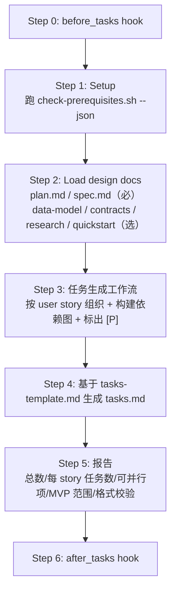


注意 Step 5 有一条 **"Format validation"**：显式要求**遍历全部 task，确认每条都满足 `checkbox + ID + [P?] + [Story?] + file path` 格式**，这一步保证粒度不会失控。

### 6.3 核心：任务组织的"三维切分"

`/speckit.tasks` 拆解任务走的是**三维正交分解**：

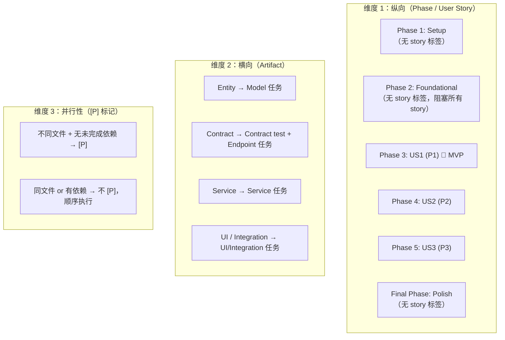


三个维度合起来给每个任务四个坐标：`**[TaskID] [P?] [Story?] Description with file path**`。

`tasks.md` 命令模板里的**格式铁律**（原文）：

> `- [ ] [TaskID] [P?] [Story?] Description with file path`

并附带反面例子：


| 示例                                                             | 是否合法                |
| -------------------------------------------------------------- | ------------------- |
| `- [ ] T012 [P] [US1] Create User model in src/models/user.py` | ✅                   |
| `- [ ] T001 Create project structure per implementation plan`  | ✅（Setup 无 story 标签） |
| `- [ ] Create User model`                                      | ❌ 缺 ID + Story      |
| `- [ ] T001 [US1] Create model`                                | ❌ 缺文件路径             |


### 6.4 粒度怎么把握：六条约束压出的"甜区"

spec-kit 没有"一条任务多少行代码"这种粗暴阈值，它用**六个相互约束的规则**把粒度压进一个很窄的区间。

**规则 1：文件路径锚点（粒度下限）**

> `tasks.md should be immediately executable - each task must be specific enough that an LLM can complete it without additional context.`

**描述里必须带文件路径**，这是粒度的"地板"：一个任务的作用域被**强制绑定到一个具体文件**。

→ 不会出现"实现用户认证模块"这种跨 10 个文件的巨无霸任务；也不会退到"在 `user.py` 第 42 行加一个参数"这种过细层级——因为这种粒度没办法给出独立的 `src/models/user.py` 作为有意义的工作单元。

**规则 2：`[P]` 并行约束（反推粒度上限）**

> `[P] marker: Include ONLY if task is parallelizable (different files, no dependencies on incomplete tasks)`

要能标 `[P]`，必须**与其他任务在不同文件**。这条反向施压：如果你把两个应该独立的功能塞进同一个任务 → 它们共享文件 → 永远不能 `[P]` → 失去并行机会。所以 agent 会主动**把一个"感觉有点大"的任务拆成多个落在不同文件的小任务**。

```text
- [ ] T012 [P] [US1] Create User model in src/models/user.py
- [ ] T013 [P] [US1] Create Session model in src/models/session.py
- [ ] T014 [US1] Implement UserService in src/services/user_service.py
                                             （不 [P]，依赖 T012、T013）
```

**规则 3：Artifact 一一映射（粒度的骨架）**


| 设计产物                          | 映射规则                                      | 典型粒度                                                                       |
| ----------------------------- | ----------------------------------------- | -------------------------------------------------------------------------- |
| 每条 **data-model.md 实体**       | 1 个 model 任务                              | `Create Xxx model in src/models/xxx.py`                                    |
| 每个 **contracts/ 接口**          | 1 个 contract test（若测试开） + 1 个 endpoint 任务 | `Contract test for POST /login`、`Implement POST /login in src/api/auth.py` |
| 每个 **spec 里的 service**        | 1 个 service 任务                            | `Implement AuthService in src/services/auth.py`                            |
| 每条 **functional requirement** | 至少 1 个实现任务                                | 视 FR 落地点而定                                                                 |
| **research.md 的决策**           | → Setup 阶段配置 / 依赖任务                       | `Configure Redis client in src/config/redis.py`                            |


这是一张**机械映射表**：有几个实体 / 契约 / 服务，就**刚好**有几个对应任务，不多不少。**粒度的"骨架"**就是靠这张表定下来的。

**规则 4：Phase 隔离（防止粒度越界）**

```text
Phase 1 Setup       → 项目初始化、依赖安装、lint 配置
Phase 2 Foundational → DB schema、auth 框架、base models、error handling
Phase 3+ User Story → 严格落在 "为这个 story 服务" 的文件
Polish              → docs、重构、性能、安全加固
```

同一个"日志"在不同 Phase 下粒度和描述都不同——Phase 2 里是 `Configure logging framework`；Phase 3 里是 `Add logging for user story 1 operations`。不允许跨 Phase 的大杂烩任务。

**规则 5：Checkpoint 独立可测（粒度的"外环约束"）**

每个 User Story 阶段的结尾都有：

> **Checkpoint**: At this point, User Story 1 should be fully functional and testable independently

这对粒度施加了**聚合约束**：

- 一个 story 内的所有任务加起来 = 一个**完整、端到端可跑、可独立验证**的增量
- 切得过细（30 个 2 行的改动）→ 跨任务耦合太高，单看一个任务没意义
- 切得过粗（一个 story 只有 2 个任务）→ checkpoint 之前没有中间可见进度

→ 典型一个 P1 story 的实现任务数 **≈ 5–10 条**。

**规则 6：Test 可选但模式固定（粒度的"可插拔因子"）**

> `Tests are OPTIONAL: Only generate test tasks if explicitly requested in the feature specification or if user requests TDD approach.`

测试任务**只有被显式请求时才生成**，但一旦生成，粒度模式是固定的：Contract test（每个契约一条 `[P]`）、Integration test（每个 Given-When-Then 场景一条 `[P]`）、Unit test（Polish 阶段可选追加）。是否开测试会显著改变 tasks 总数——**不是改变功能任务的粒度，而是成对追加一组同粒度的测试任务**。

**粒度区间的直观速查**：

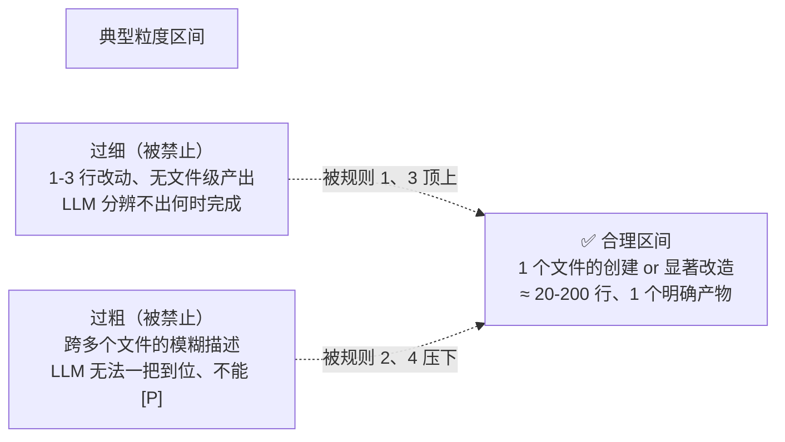


经验数：**一个中等规模 feature 生成 20–50 个任务，其中 30–60% 能带 `[P]` 并行**——这就是 spec-kit 刻意标定的"甜区"。

### 6.5 完整执行时序

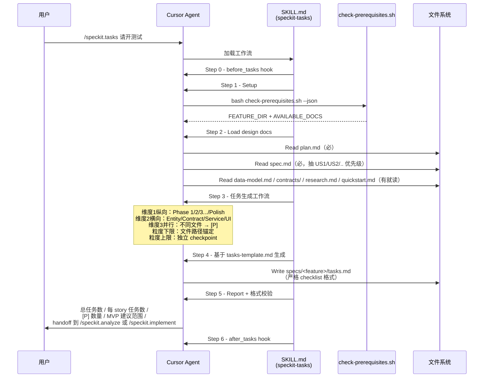


### 6.6 一句话总结粒度控制策略

> `/speckit.tasks` 的粒度**不是靠经验拍脑袋**，而是靠「**文件路径锚定**」做粒度下限、「**[P] 并行约束**」做粒度上限、「**Artifact 一一映射**」做骨架数量、「**Phase + Checkpoint 隔离**」做语义聚合、「**LLM 可独立执行**」做可行性底线。**五条约束正交叠加**，把每个任务压进"**一个文件 × 一个明确产物 × LLM 一次可完成**"这个甜区，既不会碎成无意义的小片，也不会胖成跨文件的模糊大任务。

---

## 七、Extensions 机制：可装拆的插件系统

前面六章讲的全是**核心命令**（`constitution / specify / clarify / plan / tasks`）。但真实项目里还会遇到一堆"非核心但必不可少"的场景：自动建 feature 分支、阶段性 `git commit`、把 tasks 同步到 Jira/Linear、提交到 GitHub Issues、自动触发一致性审计…… 如果这些全塞进核心，spec-kit 会迅速膨胀成一个 "万物皆命令" 的怪物。

Extensions 机制就是 spec-kit 刻意把这类**可选、可插拔的工作流**从核心剥离出去的设计，类似 VSCode 的扩展市场，但更轻量——它本质是**一组 Markdown 命令模板 + 一个 YAML 清单 + 可选的 shell 脚本**。

### 7.1 为什么需要 extensions


| 问题                        | 没有 extensions 会怎样 | Extensions 的回答                                  |
| ------------------------- | ----------------- | ----------------------------------------------- |
| 核心命令会不会越长越臃肿？             | 每加一个小工作流就改核心模板    | 核心永远只有那几条命令；新功能只是**装一个包**                       |
| 不同团队需求差异大                 | 核心必须做妥协，要么全有要么全无  | 团队按需组合：写 Web 服务装 git + issue 同步，写 CLI 只装 git    |
| 想加一个**"命令前 / 命令后"**的自动化步骤 | 得改核心命令模板          | **hooks 机制**注入 `before_`* / `after_`*，核心命令*零感知* |
| 第三方想贡献能力                  | 必须 PR 到主仓         | 独立仓库 + catalog 条目，`specify extension add` 一键装   |


### 7.2 不装 vs 装（以 `git` extension 为例）

**场景**：刚跑完 `specify init . --ai cursor-agent`，接下来想跑 `/speckit.constitution`、`/speckit.specify`、`/speckit.plan` 三连击。

**不装 extensions 时**：

```mermaid
flowchart LR
    A["specify init"]
    B["/speckit.constitution"]
    C["/speckit.specify<br/>（在当前分支原地写）"]
    D["/speckit.clarify"]
    E["/speckit.plan"]

    A --> B --> C --> D --> E

    note1["⚠️ 全程没有 git 分支隔离<br/>⚠️ 各阶段产物不自动 commit<br/>⚠️ 要手动 git checkout -b / git add / git commit"]
    C -.- note1
```


你要自己记得：

- 建一个 `003-user-auth` feature 分支
- constitution 写完先 commit
- specify 写完先 commit
- clarify 每次改 spec 要不要 commit
- plan 生成了 research.md / data-model.md / contracts/ 等 5 个文件，该一起 commit 吗
- 跑下来每一步都要在 IDE 或终端里手动操作 git

**装了 `git` extension 后**：

```bash
specify extension add git
```

再跑同一套命令：

```mermaid
flowchart LR
    A["specify init"]
    BH1["before_constitution<br/>🔁 speckit.git.initialize<br/>（若仓库未初始化）"]
    B["/speckit.constitution"]
    BH2["after_constitution<br/>💾 可选：commit 宪法"]
    CH1["before_specify<br/>🌿 speckit.git.feature<br/>（自动建 003-xxx 分支）"]
    C["/speckit.specify"]
    CH2["after_specify<br/>💾 可选：commit spec"]
    DH1["before_clarify<br/>💾 可选：commit 未提交改动"]
    D["/speckit.clarify"]
    E["/speckit.plan"]

    A --> BH1 --> B --> BH2 --> CH1 --> C --> CH2 --> DH1 --> D --> E

    style BH1 fill:#e1f5fe
    style BH2 fill:#fff9c4
    style CH1 fill:#e1f5fe
    style CH2 fill:#fff9c4
    style DH1 fill:#fff9c4
```


**具体有什么变化**：


| 行为           | 不装 extensions                | 装了 `git` extension                                                                                                             |
| ------------ | ---------------------------- | ------------------------------------------------------------------------------------------------------------------------------ |
| Git 仓库初始化    | 自己 `git init`                | `/speckit.constitution` 首次触发时自动初始化（`before_constitution`，`optional: false` 自动执行）                                               |
| Feature 分支管理 | 手动 `git checkout -b 003-xxx` | `/speckit.specify` 前自动建 `003-xxx` 分支（`before_specify`，**不需要用户确认**）                                                             |
| 阶段性 commit   | 手动 `git add && git commit`   | 每个命令执行后提示 *"Commit outstanding changes before plan?"*（`optional: true`，用户按 y 执行 `/speckit.git.commit`）                         |
| 远端推送         | 手动                           | 新增 `/speckit.git.remote`、`/speckit.git.validate` 等辅助命令                                                                         |
| 额外命令         | 只有核心 5 条                     | 新增 `speckit.git.feature` / `speckit.git.initialize` / `speckit.git.commit` / `speckit.git.validate` / `speckit.git.remote` 5 条 |


→ **用户视角**：核心命令用法完全不变，但每一步都被 git 能力"静默增强"了。

### 7.3 一个 extension 的物理组成

看一眼 `git` extension 的仓库结构（以仓内置版为例，实际可独立发布到第三方仓库）：

```text
extensions/git/
├── extension.yml              # 清单：id / 版本 / 命令 / hooks（核心）
├── config-template.yml        # 默认配置模板
├── git-config.yml             # 运行时可写的实际配置
├── README.md                  # 说明文档
├── commands/                  # 要注册到 agent 的命令模板
│   ├── speckit.git.feature.md
│   ├── speckit.git.validate.md
│   ├── speckit.git.remote.md
│   ├── speckit.git.initialize.md
│   └── speckit.git.commit.md
└── scripts/                   # 供命令内部调用的 shell 脚本
    ├── bash/
    │   ├── git-common.sh
    │   ├── create-new-feature.sh
    │   ├── initialize-repo.sh
    │   └── auto-commit.sh
    └── powershell/
        ├── git-common.ps1
        └── ...
```

`**extension.yml` 是核心清单**，决定了这个 extension 被装进去后的一切行为。摘取 `git` extension 的关键段落：

```yaml
schema_version: "1.0"

extension:
  id: git                               # 小写 + 连字符
  name: "Git Branching Workflow"
  version: "1.0.0"                      # 强制 SemVer
  description: "Feature branch creation, numbering, validation, ..."

requires:
  speckit_version: ">=0.2.0"            # 依赖 spec-kit 的版本区间
  tools:
    - name: git
      required: false                   # 建议装但不强制

provides:
  commands:
    - name: speckit.git.feature         # 必须是 speckit.{ext_id}.{cmd}
      file: commands/speckit.git.feature.md
      description: "Create a feature branch with sequential or timestamp numbering"
    # ... 其余 4 条命令

hooks:
  before_constitution:
    command: speckit.git.initialize
    optional: false                     # false → 自动执行，不需确认
    description: "Initialize Git repository before constitution setup"

  before_specify:
    command: speckit.git.feature
    optional: false                     # 自动建 feature 分支

  before_plan:
    command: speckit.git.commit
    optional: true                      # true → 提示用户确认
    prompt: "Commit outstanding changes before planning?"
    description: "Auto-commit before implementation planning"

  after_plan:
    command: speckit.git.commit
    optional: true
    prompt: "Commit plan changes?"
    description: "Auto-commit after implementation planning"
```

**关键字段说明**：


| 字段                         | 含义                                                                   |
| -------------------------- | -------------------------------------------------------------------- |
| `provides.commands[].name` | **必须**符合正则 `^speckit\.[a-z0-9-]+\.[a-z0-9-]+$`，且中间段 = `extension.id` |
| `hooks.<event>.command`    | 事件触发时执行哪条命令（可以是本 extension 或其他已装 extension 提供的命令）                    |
| `hooks.<event>.optional`   | `false` = 自动执行（"mandatory pre-hook"）；`true` = 弹提示让用户确认               |
| `hooks.<event>.condition`  | 可选的条件表达式，见 §7.6                                                      |


`<event>` 支持的完整清单（来自命令模板的预检逻辑）：`before_constitution / before_specify / before_clarify / before_plan / before_tasks / before_implement / before_checklist / before_analyze / before_taskstoissues` 以及**每个 before_ 对应的 after_ 版本**。

### 7.4 三板斧：发现 / 安装 / 管理

**① 发现**。Spec-kit 使用**双 catalog 架构**：

```mermaid
flowchart LR
    subgraph "Catalog 来源"
      C1["默认 catalog<br/>extensions/catalog.json<br/>（官方仓库，默认为空）"]
      C2["社区 catalog<br/>extensions/catalog.community.json<br/>（社区贡献，PR 合并）"]
      C3["企业自有 catalog<br/>通过 SPECKIT_CATALOG_URL<br/>环境变量指向私仓 JSON"]
    end

    U["specify extension search [keyword]"]
    R["聚合搜索结果<br/>标注来源与安装状态"]

    C1 --> U
    C2 --> U
    C3 -. 可选覆盖 .-> U
    U --> R
```


- **默认 catalog** 给企业/团队**自己维护**："只允许装这几个"，走审批流
- **社区 catalog** 给好奇用户**看看市面上都有啥**（第三方提交 PR 进来）
- 两者**都只是一份 JSON**，列出 `id / name / version / download_url / tags`，装的时候才真的去拉代码

**② 安装**。三种方式：

```bash
specify extension search              # 看当前所有 catalog 里有什么
specify extension info git            # 看某个扩展的详情
specify extension add git             # 按名字从 catalog 装

specify extension add my-ext \        # 直装，绕过 catalog
  --from https://github.com/org/repo/archive/refs/tags/v1.0.0.zip

specify extension add ./local-ext     # 从本地目录装（开发调试）
```

**装发生了什么**（`ExtensionManager` 逻辑）：

```mermaid
flowchart TD
    A["specify extension add git"]
    B["下载 / 定位源目录"]
    C["解析 extension.yml<br/>（ExtensionManifest）"]
    D{"校验"}
    D1["schema_version == 1.0"]
    D2["命令名全部匹配<br/>speckit.{ext}.{cmd}"]
    D3["不与 core 命令冲突"]
    D4["不与已装 extension 命令冲突"]
    D5["speckit_version 满足"]
    E["复制到 .specify/extensions/git/<br/>（排除 .extensionignore）"]
    F["渲染 config-template.yml<br/>→ .specify/extensions/git/git-config.yml"]
    G["注册 hooks 到<br/>.specify/extensions.yml"]
    H["若 --ai-skills：为每条命令生成<br/>.cursor/skills/speckit-git-*/SKILL.md"]
    I["更新 .specify/extensions/registry.json<br/>记录版本 / 来源 / 哈希"]
    J["✅ 完成"]

    A --> B --> C --> D
    D --> D1 & D2 & D3 & D4 & D5
    D --> E --> F --> G --> H --> I --> J
```


**③ 管理**：

```bash
specify extension list                # 已装列表
specify extension update git          # 按版本约束更新
specify extension remove git          # 卸载（同时反注册 hooks 和 skills）
specify extension disable git         # 不删文件，仅停用 hooks（可恢复）
specify extension enable git
```

### 7.5 Hook 机制：核心命令是怎么被"注入"的

这是 extensions **最精妙**的设计点——**核心命令模板本身并不知道有 git extension 存在**，但它在运行时会"询问"是否有 extensions 要在此刻插一脚。

**每个核心命令模板（如 `templates/commands/plan.md`）里都有两段样板代码**：

```markdown
## Pre-Execution Checks
**Check for extension hooks (before plan)**:
- Check if `.specify/extensions.yml` exists in the project root.
- If it exists, read it and look for entries under the `hooks.before_plan` key
- ...
- For each executable hook, output ...
  - Optional hook: 显示 "Prompt: ... / To execute: /{command}"
  - Mandatory hook: 输出 "EXECUTE_COMMAND: {command}" 让 agent 自动执行
```

注意关键点：**命令模板不会"直接调用"hook**，它只是**打印一条 agent 读得懂的信号**，然后 agent 根据是否 `optional`、用户是否确认来决定要不要先跳去执行那条 hook 命令。

**运行时数据流**：

```mermaid
sequenceDiagram
    participant U as 用户
    participant A as AI Agent (Cursor)
    participant S_plan as SKILL.md<br/>(speckit-plan)
    participant YML as .specify/extensions.yml
    participant S_commit as SKILL.md<br/>(speckit-git-commit)

    U->>A: /speckit.plan
    A->>S_plan: 加载工作流

    Note over A,S_plan: Pre-Execution Checks
    A->>YML: 读 hooks.before_plan
    YML-->>A: [{extension: git, command: speckit.git.commit,<br/>optional: true, prompt: "Commit ... before planning?"}]

    A->>U: 提示：Commit outstanding changes before planning?<br/>（y/n）
    U->>A: y

    A->>S_commit: 切去执行 speckit.git.commit
    S_commit-->>A: 执行 auto-commit.sh 完成

    A->>S_plan: 返回主流程继续<br/>（setup-plan.sh → Phase 0 → Phase 1 ...）

    Note over A,S_plan: plan 主体执行结束

    A->>YML: 读 hooks.after_plan
    YML-->>A: [{extension: git, command: speckit.git.commit,<br/>optional: true, prompt: "Commit plan changes?"}]
    A->>U: Commit plan changes? (y/n)
    U->>A: y
    A->>S_commit: 执行 speckit.git.commit
```


`**.specify/extensions.yml` 是 hook 中枢**，一个装了 `git` extension 的项目里它大概长这样：

```yaml
installed:
  - id: git
    version: "1.0.0"
    installed_at: "2026-04-20T14:32:10"

settings:
  auto_execute_hooks: true

hooks:
  before_constitution:
    - extension: git
      command: speckit.git.initialize
      enabled: true
      optional: false
      prompt: "Execute speckit.git.initialize?"
      description: "Initialize Git repository before constitution setup"
  before_specify:
    - extension: git
      command: speckit.git.feature
      enabled: true
      optional: false
  before_plan:
    - extension: git
      command: speckit.git.commit
      enabled: true
      optional: true
      prompt: "Commit outstanding changes before planning?"
  after_plan:
    - extension: git
      command: speckit.git.commit
      enabled: true
      optional: true
      prompt: "Commit plan changes?"
```

**每个 event 是一个数组**——装了多个 extension 时，它们会按注册顺序依次被询问。比如同时装了 `git` 和 `jira`，`before_plan` 里可能有两项：先建 commit，再同步 Jira。

**完整 hook 事件清单**（9 对 = 18 个事件，与 9 个核心命令对齐；取自 `extensions/git/extension.yml` 的实际声明）：


| 命令                       | `before_`* 事件          | `after_*` 事件          |
| ------------------------ | ---------------------- | --------------------- |
| `/speckit.constitution`  | `before_constitution`  | `after_constitution`  |
| `/speckit.specify`       | `before_specify`       | `after_specify`       |
| `/speckit.clarify`       | `before_clarify`       | `after_clarify`       |
| `/speckit.plan`          | `before_plan`          | `after_plan`          |
| `/speckit.tasks`         | `before_tasks`         | `after_tasks`         |
| `/speckit.analyze`       | `before_analyze`       | `after_analyze`       |
| `/speckit.checklist`     | `before_checklist`     | `after_checklist`     |
| `/speckit.implement`     | `before_implement`     | `after_implement`     |
| `/speckit.taskstoissues` | `before_taskstoissues` | `after_taskstoissues` |


最后一项 `/speckit.taskstoissues` 是**把 tasks.md 里的任务通过 GitHub MCP server 同步成 GitHub issues** 的特殊命令，主要供企业项目 / 团队协作场景使用；和它配套的 `before_/after_taskstoissues` 目前只有 `git` extension 在用（触发 auto-commit）。详见附录 D。

**Skill 模式下的 invocation 渲染**。`HookExecutor._render_hook_invocation()` 会根据当前 agent 类型决定 hook 命令怎么"被 agent 调用"：


| Agent                           | 渲染出的 invocation 字符串         |
| ------------------------------- | --------------------------- |
| **Cursor** (`ai-skills` 开)      | `/speckit-git-commit`       |
| **Claude Code** (`ai-skills` 开) | `/speckit-git-commit`       |
| **Codex** (`ai-skills` 开)       | `$speckit-git-commit`       |
| **Kimi**                        | `/skill:speckit-git-commit` |
| **其他** / 无 skills               | `/speckit.git.commit`       |


→ 这是 extensions 和 integrations 解耦的接缝：同一个 hook，注册时用 `speckit.git.commit`，到不同 agent 眼里自动变成那个 agent 能听懂的调用形式。

### 7.6 Hook 的 condition 表达式

有时候你希望一个 hook **只在特定条件下触发**。例如 `jira` extension 只在 `.specify/extensions/jira/jira-config.yml` 里填了 project_key 时才自动同步。这就是 `condition` 字段：

```yaml
hooks:
  after_tasks:
    command: speckit.jira.specstoissues
    optional: false
    condition: "config.project_key is set"
```

**支持的表达式形式**（全部由 `HookExecutor._evaluate_condition()` 解析，不走 eval）：


| 表达式                       | 含义                                |
| ------------------------- | --------------------------------- |
| `config.xxx.yyy is set`   | 该 extension 的 config 文件里存在这个键且非空  |
| `config.xxx == 'value'`   | 相等比较（布尔会自动转 `true` / `false` 字符串） |
| `config.xxx != 'value'`   | 不等比较                              |
| `env.VAR_NAME is set`     | 环境变量存在                            |
| `env.VAR_NAME == 'value'` | 环境变量等于某值                          |
| `env.VAR_NAME != 'value'` | 环境变量不等于某值                         |


**注意**：命令模板里的 Pre-Execution Check 段落**不评估 condition**（原文：*"do not attempt to interpret or evaluate hook condition expressions"*）——condition 评估完全交给 `HookExecutor`。如果模板看到一个非空 `condition`，它会**直接跳过**，等到 agent 需要执行该 hook 时才由 Python 侧真正判断。这避免了 prompt 里混入不安全的表达式求值。

### 7.7 原理全景：从 catalog 到命令执行

把上面所有环节串起来：

```mermaid
flowchart TD
    subgraph "发布侧"
      P1["extension 仓库<br/>extension.yml + commands/*.md + scripts/"]
      P2["GitHub Release（zip）"]
      P3["catalog.json 条目"]
    end

    subgraph "发现 / 安装侧"
      U1["specify extension search"]
      U2["specify extension add git"]
    end

    subgraph "项目本地（.specify/）"
      L1[".specify/extensions/git/<br/>（整包文件）"]
      L2[".specify/extensions.yml<br/>（全局 hook 注册表）"]
      L3[".specify/extensions/git/git-config.yml<br/>（用户可写配置）"]
      L4[".specify/extensions/registry.json<br/>（版本 + hash）"]
      L5[".cursor/skills/speckit-git-*/SKILL.md<br/>（若 ai-skills 开）"]
    end

    subgraph "运行时（每次执行核心命令）"
      R1["core command SKILL.md<br/>读 Pre-Execution Check 段落"]
      R2["HookExecutor.get_hooks_for_event()<br/>读 .specify/extensions.yml"]
      R3{"hook.optional?"}
      R4["agent 自动执行"]
      R5["agent 提示用户确认"]
      R6["调用 extension 的 SKILL.md / 命令"]
      R7["回到 core 命令主流程"]
    end

    P1 --> P2 --> P3
    P3 --> U1
    U1 --> U2
    U2 --> L1
    U2 --> L2
    U2 --> L3
    U2 --> L4
    U2 --> L5

    L2 --> R1
    R1 --> R2
    R2 --> R3
    R3 -->|optional: false| R4
    R3 -->|optional: true| R5
    R4 --> R6
    R5 --> R6
    R6 --> R7
```


**最顶层视角**：

> spec-kit 本身只管好"**宪法 / 规格 / 澄清 / 计划 / 任务**"这条 SDD 主干；一切**面向具体工具栈的自动化**（git、jira、github issues、linear、mcp 服务等）都被下放到 extension 层。**核心命令永远保持对 extensions 的零感知**——它只是在固定时机广播 `before_`* / `after_`* 事件，由哪个 extension 接、接了做什么、要不要问用户，全都由项目里的 `.specify/extensions.yml` 决定。

这种设计让 spec-kit 可以同时满足两类使用者：

- **个人项目**：0 extension，5 条核心命令跑完端到端
- **企业项目**：`git` + `analyze` + `jira` + 自研 extension 叠起来，核心命令流程照常但被 hook 增强成"会自动建分支、commit、同步任务到 Jira、生成合规报告"的完整工作流

---

## 八、`/speckit.implement` 的作用与原理

`/speckit.implement` 是整个 SDD 流水线的**收尾动作**——前面 6 个命令全在 `specs/<feature>/` 和 `.specify/` 里写文档，只有到了 `implement`，才第一次大规模动到 `src/` 下的业务代码。

### 8.1 它在 SDD 流水线里的定位

```mermaid
flowchart LR
    C["/speckit.constitution<br/>宪法"]
    S["/speckit.specify<br/>spec"]
    CL["/speckit.clarify<br/>修订 spec"]
    P["/speckit.plan<br/>设计 + 契约"]
    T["/speckit.tasks<br/>可执行任务清单"]
    A["/speckit.analyze<br/>一致性审计（可选）"]
    I["/speckit.implement<br/>真正写代码"]

    C --> S --> CL --> P --> T --> I
    T -. 审前检查 .-> A -. 反馈 .-> T
```


它和前面命令有**三条本质区别**：


| 维度      | `/speckit.specify` ~ `/speckit.tasks`                  | `/speckit.implement`                          |
| ------- | ------------------------------------------------------ | --------------------------------------------- |
| 改什么     | 只改 `specs/<feature>/` 和 `.specify/` 里的 Markdown / YAML | 第一次批量改 `src/`、`tests/`、`contracts/` 等**真实源码** |
| 需不需要审宪法 | plan 里做了两次 Constitution Check                          | **不再审宪法**（审判结果已固化在 plan + tasks 里）            |
| 是否有状态回写 | 多为"一次成型"的文档产物                                          | **持续回写 tasks.md**：完成一条就把 `- [ ]` 改成 `- [X]`   |


一句话：`**/speckit.implement` 是把 `tasks.md` 这张任务清单当成"持续消费 + 回写"的工作队列，驱动整个代码实现阶段**。

### 8.2 命令签名与前置脚本

**前置脚本的"硬门禁"**。命令头部定义：

```yaml
scripts:
  sh: scripts/bash/check-prerequisites.sh --json --require-tasks --include-tasks
```

注意和前面命令的差异，这里多了两个旗标：


| 旗标                | 作用                                                  |
| ----------------- | --------------------------------------------------- |
| `--require-tasks` | **tasks.md 不存在直接 ERROR 退出**，提示用户先跑 `/speckit.tasks` |
| `--include-tasks` | 把 tasks.md 一起列进 `AVAILABLE_DOCS` 输出，下游读得到           |


对比 `/speckit.plan` 只需要 spec、`/speckit.tasks` 要 plan+spec，`/speckit.implement` 的**硬依赖就是 tasks.md**：

```text
├── spec.md          plan 需要
├── plan.md          tasks 需要
├── tasks.md         implement 硬依赖 ← 缺则 ERROR
├── data-model.md    可选
├── contracts/       可选
├── research.md      可选
└── quickstart.md    可选
```

**输出的 JSON**：

```json
{
  "FEATURE_DIR": "/abs/path/to/specs/003-user-auth",
  "AVAILABLE_DOCS": [
    "research.md",
    "data-model.md",
    "contracts/",
    "quickstart.md",
    "tasks.md"
  ]
}
```

和 `/speckit.tasks` 输出几乎一样，但多了 `tasks.md`。所有路径都是**绝对路径**，避免 agent 在嵌套目录切换时走错。

### 8.3 九步执行骨架

```mermaid
flowchart TD
    H1["Step 0: before_implement hook<br/>通常走 git commit"]
    S1["Step 1: Setup<br/>跑 check-prerequisites.sh --require-tasks --include-tasks<br/>拿到 FEATURE_DIR + AVAILABLE_DOCS"]
    S2{"Step 2: Checklists 门禁<br/>扫 FEATURE_DIR/checklists/*.md<br/>统计 [ ] / [X] 数量"}
    S2A["生成 Pass/Fail 状态表"]
    S2B{"全部 PASS?"}
    Q["❓ 询问用户：是否继续？<br/>yes → 继续；no/stop → 中止"]
    S3["Step 3: Load context<br/>tasks.md + plan.md（必）<br/>data-model / contracts / research / quickstart（选）"]
    S4["Step 4: Project Setup Verification<br/>检测语言 + 工具链，创建/补齐<br/>.gitignore / .dockerignore / .eslintignore 等"]
    S5["Step 5: Parse tasks.md<br/>抽 Phase、Task ID、[P] 标记、文件路径、依赖关系"]
    S6["Step 6: Phase-by-phase 执行<br/>Setup → Tests → Core → Integration → Polish"]
    S7["Step 7: 实现规则<br/>TDD / 同文件串行 / [P] 并行 / 每 phase validation"]
    S8["Step 8: 进度跟踪 + 错误处理<br/>**回写 [X]** / 非并行失败立即停 / 并行失败继续其余"]
    S9["Step 9: Completion validation<br/>任务覆盖 + spec 契合 + 测试通过 + plan 一致"]
    H2["Step 10: after_implement hook<br/>通常走 git commit"]

    H1 --> S1 --> S2
    S2 --> S2A --> S2B
    S2B -->|否| Q
    Q -->|yes| S3
    Q -->|no| STOP["❌ 中止实现"]
    S2B -->|是| S3
    S3 --> S4 --> S5 --> S6 --> S7 --> S8 --> S9 --> H2
```


### 8.4 Checklists 门禁：动手前最后一扇门

这是 `/speckit.implement` **独有的机制**——执行前会先**扫所有 checklist 文件**，统计完成度，产出一张表：

```text
| Checklist   | Total | Completed | Incomplete | Status |
|-------------|-------|-----------|------------|--------|
| ux.md       | 12    | 12        | 0          | ✓ PASS |
| test.md     | 8     | 5         | 3          | ✗ FAIL |
| security.md | 6     | 6         | 0          | ✓ PASS |
```

**规则**：

- 任何 checklist 含 `- [ ]` → 整体 **FAIL**
- FAIL 时**停下来问用户**：*"Some checklists are incomplete. Do you want to proceed with implementation anyway? (yes/no)"*
- 用户回 `no/wait/stop` → 立即 halt
- 用户回 `yes/proceed/continue` → 记录决定，继续

**这个机制的作用**：

回想一下：`/speckit.specify` 生成时默认会建 `checklists/requirements.md`，`/speckit.analyze` 可能追加一致性检查单，团队也可以手动加 `ux.md`、`security.md`、`test.md`。这些 checklist 是**对需求 / 设计 / 风险的额外验收**。`/speckit.implement` 把它们当作"**代码动手前的最后一扇门**"——如果人都没检查完，让 AI 贸然动源码风险很大。

### 8.5 Project Setup Verification：ignore 文件自动维护

这是 `/speckit.implement` 另一个"反直觉"的工作。它在真正写代码前会**根据 plan.md 的技术栈 + 实际项目文件**，自动维护各种 ignore 文件：

```mermaid
flowchart TD
    A["读 plan.md 技术栈"]
    B["git rev-parse --git-dir 成功?"]
    C["Dockerfile*/Docker 在 plan?"]
    D[".eslintrc* 存在?"]
    E[".prettierrc* 存在?"]
    F[".tf 文件存在?"]

    A --> B & C & D & E & F
    B -->|是| G[".gitignore"]
    C -->|是| H[".dockerignore"]
    D -->|是| I[".eslintignore"]
    E -->|是| J[".prettierignore"]
    F -->|是| K[".terraformignore"]

    G & H & I & J & K --> L{"文件已存在?"}
    L -->|否| M["用全量模板创建"]
    L -->|是| N["只补齐缺失的关键 patterns"]
```


**语言层面的 pattern** 由模板内置（摘关键几条）：


| 栈            | 关键 patterns                                   |
| ------------ | --------------------------------------------- |
| Node.js / TS | `node_modules/`、`dist/`、`*.log`、`.env`*       |
| Python       | `__pycache__/`、`*.pyc`、`.venv/`、`*.egg-info/` |
| Java         | `target/`、`*.class`、`.gradle/`                |
| Go           | `*.exe`、`*.test`、`vendor/`                    |
| Rust         | `target/`、`*.rs.bk`、`.env*`                   |
| Terraform    | `.terraform/`、`*.tfstate*`、`*.tfvars`         |
| 通用           | `.DS_Store`、`Thumbs.db`、`.vscode/`、`.idea/`   |


**为什么要管这事**？因为后续任务里会：

- 新建 `src/`、`dist/`、`build/` 等产物目录
- 安装依赖产生 `node_modules` / `__pycache__`
- 生成 `.env`、密钥文件

如果这些没提前进 ignore，**第一次 commit 就会污染仓库**。`/speckit.implement` 把这一步做进执行前的"卫生准备"，实际作用类似于项目的"**二次初始化**"。

### 8.6 Phase-by-Phase 执行语义

**Phase 顺序不能跳**。`tasks.md` 的 5 个 Phase 在 implement 阶段是**严格纵向**执行的：

```mermaid
flowchart TD
    P1["Phase 1: Setup<br/>（项目初始化、依赖、lint）"]
    P2["Phase 2: Foundational<br/>（DB schema、auth 框架、base models）"]
    P3["Phase 3: US1 实现<br/>（按 P1 story 内 Tests→Models→Services→Endpoints 顺序）"]
    P4["Phase 4: US2 实现"]
    PN["Final Phase: Polish<br/>（docs、perf、security）"]

    P1 -->|完成并验证| P2
    P2 -->|完成并验证| P3
    P3 -->|完成并验证| P4
    P4 -->|完成并验证| PN
```


规则原文：

> `Phase-by-phase execution: Complete each phase before moving to the next`
> `Validation checkpoints: Verify each phase completion before proceeding`

**Phase 内部的并行规则**——用 `tasks.md` 里的 `[P]` 标记决定：

```mermaid
flowchart LR
    subgraph "Phase 3 US1 内部"
      T10["T010 [P] [US1]<br/>Contract test /login<br/>tests/contract/test_auth.py"]
      T11["T011 [P] [US1]<br/>Integration test signup<br/>tests/integration/test_signup.py"]
      T12["T012 [P] [US1]<br/>User model<br/>src/models/user.py"]
      T13["T013 [P] [US1]<br/>Session model<br/>src/models/session.py"]
      T14["T014 [US1]<br/>UserService<br/>src/services/user_service.py"]
      T15["T015 [US1]<br/>Login endpoint<br/>src/api/auth.py"]

      T10 -.并行.- T11
      T12 -.并行.- T13
      T14 --> T15
      T12 --> T14
      T13 --> T14
      T10 --> T14
    end
```


具体规则：


| 规则              | 说明                                                                                                            |
| --------------- | ------------------------------------------------------------------------------------------------------------- |
| **文件共享 → 强串行**  | 两个任务如果动同一个文件（哪怕都标了 `[P]`），也必须顺序执行                                                                             |
| **TDD 先于实现**    | 同一 story 内，`Contract test` / `Integration test` 任务必须**先跑、先确保失败**，再做对应的 implementation                         |
| **[P] 并行**      | 不同文件 + 无未完成依赖 → 可以一批并发（agent 实际是一次会话内串行思考 / 生成，但产物彼此独立）                                                       |
| **每 Phase 验证点** | Phase 结束后检查 Checkpoint 要求（"User Story 1 should be fully functional and testable independently"），不满足不进下一 Phase |


### 8.7 状态回写：tasks.md 的"活心脏"

这是 `/speckit.implement` 的**第二个独有机制**：

> `IMPORTANT: For completed tasks, make sure to mark the task off as [X] in the tasks file.`

执行流程：

```mermaid
sequenceDiagram
    participant A as AI Agent
    participant T as tasks.md
    participant FS as src/ 源码

    A->>T: 读取下一条 `- [ ] T012`
    A->>FS: 创建/编辑 src/models/user.py
    A->>A: 本地验证（lint/单测）
    A->>T: 回写 T012: `- [ ]` → `- [X]`
    Note over A,T: ✨ tasks.md 成为"活状态"文件

    A->>T: 读取 `- [ ] T013`
    A->>FS: 创建 src/models/session.py
    A->>T: 回写 T013: `- [X]`

    A->>T: 读取 T014（依赖 T012、T013）
    Note over A: 检测到 T012、T013 已 [X] → 可执行
    A->>FS: 创建 src/services/user_service.py
    A->>T: 回写 T014: `- [X]`
```


**这个机制带来什么好处**：

1. **可中断可续跑**：中途停了或出错，下次再跑只需从下一条 `- [ ]` 继续，不会重做
2. **可人工干预**：人类可以手动把某条标回 `- [ ]` 强制重做，或标 `- [X]` 跳过
3. **可视化进度**：`tasks.md` 本身就是进度条，Cursor / GitHub 上直接看得到
4. **与 git commit 绑定**：配合 `git` extension 的 `after_implement` hook，每批任务完成后一次性 commit，能做到"每个 story 一个 commit"的整洁历史

### 8.8 错误处理策略

```mermaid
flowchart TD
    TASK["执行某个任务"]
    OK{"成功?"}
    PAR{"任务是 [P] 吗?"}
    HALT["❌ 立即 halt<br/>报错上下文 + 建议 next steps"]
    CONT["✅ 继续下一个<br/>汇总报失败的并行任务"]

    TASK --> OK
    OK -->|是| CONT_OK["标记 [X]，下一个"]
    OK -->|否| PAR
    PAR -->|否（串行）| HALT
    PAR -->|是（并行）| CONT
```


差别化处理的道理：

- **串行任务失败** = 当前 Phase 的 checkpoint 走不过去了，硬停；否则后面的任务基础都不可靠
- **并行任务失败** = 同一批里其他条还能干，继续干完，再一起报错，减少整体延迟

### 8.9 Completion validation 与 Extensions 在 implement 阶段的位置

**Completion validation**（交付验证）。最后 agent 要逐项检查：


| 项                | 检查方式                                                   |
| ---------------- | ------------------------------------------------------ |
| 所有 required 任务完成 | `tasks.md` 里没有未标 `[X]` 的条目（允许 optional 的 Polish 任务未完成） |
| 实现与 spec 一致      | 交叉比对 `spec.md` 的 User Stories 和 FR，确认都有对应代码路径          |
| 测试通过             | 跑 test 任务产出的测试，验证覆盖率达到 plan.md 里设的目标                   |
| 与 plan 一致        | 目录结构、技术栈、契约与 `plan.md` 吻合                              |


输出一个**最终总结**：完成的 story 列表、测试通过数、被跳过的 polish 任务（如有）、下一步建议（通常是 handoff 到 `/speckit.analyze` 或 `/speckit.git.commit`）。

**Extensions 在 implement 阶段的高价值位置**。`/speckit.implement` 模板前后各有 extension hook：

```mermaid
sequenceDiagram
    participant A as Agent
    participant YML as .specify/extensions.yml

    A->>YML: 读 hooks.before_implement
    YML-->>A: git.commit（optional: true）<br/>+ 其他 extension 注入的 hook

    Note over A: 典型：<br/>1) 确认 tasks.md 干净<br/>2) commit 未提交改动<br/>3) 检查 CI 状态

    A->>A: 执行 Step 1~9（实际实现）

    A->>YML: 读 hooks.after_implement
    YML-->>A: git.commit（optional: true）<br/>+ e.g. github-issues sync

    Note over A: 典型：<br/>1) 分故事 commit<br/>2) 更新关联 issue 状态<br/>3) 触发 CI/CD
```


这里是 **extensions 价值最高的事件槽**，因为 implement 阶段会产生**最多的文件变更**，自动 commit / issue 同步 / 触发 CI 都是团队高频诉求。很多实际项目把 `git` extension 的 `after_implement` 设成 `optional: false`（强制 commit），避免实现完忘了提交。

**与前面命令的数据流汇总**：

```mermaid
flowchart LR
    SPEC["spec.md<br/>User Stories 优先级"]
    PLAN["plan.md<br/>技术栈 + 架构"]
    TASKS["tasks.md<br/>原子任务 + [P] + 依赖"]
    DM["data-model.md<br/>实体"]
    CTR["contracts/<br/>接口契约"]
    RES["research.md<br/>技术决策"]
    QS["quickstart.md<br/>端到端样例"]
    CL["checklists/*.md<br/>验收清单"]

    IMPL["/speckit.implement"]
    SRC["src/<br/>tests/<br/>真实源码"]

    SPEC -- "交付验证对照" --> IMPL
    PLAN -- "架构 / 栈 / 路径" --> IMPL
    TASKS -- "**驱动执行 + 状态回写**" --> IMPL
    DM -- "实体语义" --> IMPL
    CTR -- "接口实现 + 契约测试" --> IMPL
    RES -- "技术约束" --> IMPL
    QS -- "集成场景 / E2E 测试" --> IMPL
    CL -- "**门禁**" --> IMPL

    IMPL ==>|大批写入| SRC
    IMPL -. 持续回写 [X] .-> TASKS
```


`tasks.md` 是**唯一双向的**文件——implement 既读它又写它；其它文件都是**只读输入**。

### 8.10 为什么它没有 Constitution Check

细心的话你会注意到：`/speckit.implement` 的模板里**完全没提 `/memory/constitution.md`**。原因有三：

1. **宪法审判已在 plan 阶段完成**。`/speckit.plan` 做了两次 Constitution Check（Phase 0 前 + Phase 1 后），所有违规要么被 reject 要么进了 Complexity Tracking 表。到 tasks 时设计已经是宪法 compliant 的。
2. **tasks 是 plan 的机械翻译**。`/speckit.tasks` 只做"设计 → checkbox"的映射，不引入新决策，所以也不需要重审宪法。
3. **如果 implement 也审宪法，就破坏了分层**。宪法是"决策层"的约束；implement 是"执行层"的动作。让执行层审决策层会模糊责任——执行层只负责**忠实执行**被上游已经审过的决策。

→ 这是 spec-kit 的分层哲学：**宪法 = decision；plan = 审判；tasks = 翻译；implement = 执行**，每层只做自己该做的事。

**一句话总结**：

> `/speckit.implement` 是 SDD 流水线里**唯一真正改动源码的命令**，本质是"**以 tasks.md 为工作队列的状态机执行器**"——它用 **Checklists 门禁**作为动手前最后一扇门，用 **Phase-by-Phase + TDD + [P] 并行 + 文件串行** 四条规则串起执行顺序，用 `**- [ ] → [X]` 回写**把 tasks.md 变成"活状态"以支持中断续跑，并把 **ignore 文件维护**和 **Extensions hook（尤其是自动 commit）做进前后的"卫生准备"和"收尾动作"。它不再审宪法、不再做决策，只忠实地把 plan + tasks 审判过的设计翻译成真实代码**。

---

## 九、可选命令使用指南：`/speckit.clarify` / `/speckit.analyze` / `/speckit.checklist`

spec-kit 官方 README 把这三个命令标记为 *optional* ——意思是**即使完全不用它们，也能从 spec 一路走到 implement**。但"能跑通"不等于"跑得好"。这一章聚焦在**使用者视角**：它们各自堵的是什么风险？什么情况下值得花时间用？用前用后到底能差出多少？

### 9.1 为什么这三个命令是“可选”的

核心 SDD 流水线的最小集 `constitution → specify → plan → tasks → implement` 组成了“**决策 → 规格 → 设计 → 任务 → 实现**”的主干，本身已经能跑通。但真实项目还会遇到三类核心命令覆盖不到的问题：


| 风险维度            | 核心命令做了什么                                                  | 还剩下什么没做                                                         |
| --------------- | --------------------------------------------------------- | --------------------------------------------------------------- |
| **需求本身有歧义**     | `/speckit.specify` 只做 3 问 validation，像“用户可以上传大文件”这种描述会被放行 | 没人逐项盘问“大”是多大、支持哪些格式、失败怎么处理                                      |
| **跨文档不一致**      | `/speckit.plan` 只校验 plan 内部，`/speckit.tasks` 只校验 tasks 格式 | 没人把 **spec / plan / tasks 三份文档横向比对**，确认 FR-003 和 T015 是否讲的是同一件事 |
| **要求的“质量”无法量化** | 核心命令会检查“该填的段落有没有填”                                        | 但没人检查这个段落**写得够不够好**——是否可测、是否无歧义、是否覆盖边界                          |


这三个可选命令就是针对这三个维度的“**质量保险层**”：

```mermaid
flowchart LR
    subgraph CORE["核心主干（必做）"]
      direction LR
      C["/speckit.constitution"]
      S["/speckit.specify"]
      P["/speckit.plan"]
      T["/speckit.tasks"]
      I["/speckit.implement"]
      C --> S --> P --> T --> I
    end

    subgraph OPT["可选质量保险层"]
      direction TB
      CL["/speckit.clarify<br/>📝 问出来<br/>(填 spec 里的坑)"]
      AN["/speckit.analyze<br/>🔍 比出来<br/>(3 份文档横向对比)"]
      CH["/speckit.checklist<br/>📋 测出来<br/>(给 requirements 写单元测试)"]
    end

    S -. 可插 .-> CL -. 写回 spec .-> S
    T -. 可插 .-> AN -. 反馈给任一文档 .-> P
    S -. 可插 .-> CH
    P -. 可插 .-> CH
    T -. 可插 .-> CH
    CH -. implement 门禁消费 .-> I
```


### 9.2 三个命令各自回答什么问题


| 维度        | `/speckit.clarify`                           | `/speckit.analyze`                                     | `/speckit.checklist`                         |
| --------- | -------------------------------------------- | ------------------------------------------------------ | -------------------------------------------- |
| **核心问题**  | “spec 里还有什么没想清楚？”                            | “spec / plan / tasks 三者一致吗？”                           | “spec 的 requirements 写得够好吗？”                 |
| **工作方式**  | 按 **11 类 taxonomy** 扫 spec，问最多 5 个问题，写回 spec | 加载 spec + plan + tasks + 宪法，做 **6 类检测**，输出 findings 报告 | 生成一份 “requirements quality 单元测试”，人逐条打勾       |
| **产物**    | 更新 `spec.md`（含 `## Clarifications` 审计段）      | Markdown 报告（**不写文件**）                                  | `specs/<feature>/checklists/<domain>.md`（持久） |
| **是否改文件** | ✅ 改 spec                                     | ❌ STRICTLY READ-ONLY                                   | ✅ 新建或追加                                      |
| **下游消费者** | `/speckit.plan`（吃到更干净的 spec）                 | 人类判断是否返工                                               | `/speckit.implement` 的 Checklists 门禁         |
| **能否重跑**  | 可以，但每次再抛最多 5 个问题                             | 可以，**幂等**（相同输入产出一致）                                    | 可以，**追加到同一文件**（CHK001→CHK016 递增）             |
| **运行时机**  | specify 之后、plan 之前                           | tasks 之后、implement 之前                                  | 任意时点，建议 implement 之前                         |


一句话区分：

- `**clarify` = 主动追问**，填 spec 里的坑（纵向、深挖单份文档）
- `**analyze` = 横向审计**，找 3 文档之间的矛盾（横向、跨文档对比）
- `**checklist` = 写作打分**，评估 requirements 本身写得够不够好（纵向、打质量分）

### 9.3 什么情况下应该使用

`**/speckit.clarify` 用在**：

- spec 初稿里随口一写的需求很多（“用户管理”“文件上传”“支付集成”——但没说多细）
- feature 跨多个业务领域，怕有遗漏的边界条件
- 必须**在 `/speckit.plan` 之前跑**：plan 需要确切上下文，spec 越干净，plan 的技术决策越不会"脑补"
- 相对 `specify` 自带的 3 问 validation，它更**主动、更深入**（11 类 taxonomy、Impact × Uncertainty 排序）

`**/speckit.analyze` 用在**：

- `/speckit.tasks` 跑完后、`/speckit.implement` 动手前——这是**它唯一能跑的时机**（因为需要 tasks.md）
- 团队协作项目：不同人改 spec / plan / tasks，怕漂移
- 改过 spec 之后又跑过 plan 和 tasks，怀疑某些角落没同步
- 上游宪法有新修订，要检查现有设计是否违反新原则

`**/speckit.checklist` 用在**：

- 有明确的质量维度需要**反复把关**（UX / 安全 / 性能 / 无障碍 / 合规）
- 要过 PR review：让 reviewer 手头有一份"requirements quality 单元测试"可以逐项点
- 配合 `/speckit.implement` 的 **Checklists 门禁**：没打满就不让动源码
- 多人写 spec 时，让 PM / 设计 / 安全各生成一份领域 checklist，分工把关

**决策树**：

```mermaid
flowchart TD
    START["要不要跑这 3 个命令？"]
    Q1{"spec 初稿里有'用户可以...'<br/>这种动词+名词<br/>但没讲清的描述吗？"}
    Q2{"spec / plan / tasks 被<br/>多人改过或多次迭代过？"}
    Q3{"这个 feature 有<br/>强质量属性？<br/>UX / 安全 / 合规 / 性能"}
    Q4{"这是 MVP 探索 还是<br/>要发版的正式 feature？"}

    RUN_CL["✅ 跑 /speckit.clarify"]
    RUN_AN["✅ 跑 /speckit.analyze"]
    RUN_CH["✅ 跑 /speckit.checklist<br/>（按领域建多份）"]
    SKIP["⏭️ 可跳过"]

    START --> Q1
    Q1 -->|是| RUN_CL --> Q2
    Q1 -->|否| Q2
    Q2 -->|是| RUN_AN --> Q3
    Q2 -->|否| Q3
    Q3 -->|是| RUN_CH --> Q4
    Q3 -->|否| Q4
    Q4 -->|正式 feature| RUN_AN
    Q4 -->|MVP 探索| SKIP
```


### 9.4 如何融入 workflow

按项目规模和质量要求，有三种常见组合：

**① 最小集（1 人 1 个 feature / MVP 探索）**：

```mermaid
flowchart LR
    I0["init"] --> C["constitution"] --> S["specify"] --> P["plan"] --> T["tasks"] --> IM["implement"]
```


→ 不碰 3 个可选命令，追求最快跑通。

**② 标准团队（多人协作 / 正式 feature）**：

```mermaid
flowchart LR
    I0["init"] --> C["constitution"] --> S["specify"] --> CL["clarify"] --> P["plan"] --> T["tasks"] --> AN["analyze"] --> IM["implement"]

    style CL fill:#e1f5fe,stroke:#0288d1
    style AN fill:#fff9c4,stroke:#f9a825
```


→ `clarify` 修 spec 的坑，`analyze` 审三文档漂移，`implement` 前保底。

**③ 高质量要求（合规 / 支付 / 健康数据）**：

```mermaid
flowchart LR
    I0["init"] --> C["constitution"] --> S["specify"] --> CL["clarify"]
    CL --> CH1["checklist: security"]
    CH1 --> CH2["checklist: compliance"]
    CH2 --> P["plan"] --> T["tasks"] --> AN["analyze"]
    AN --> CH3["checklist: release"]
    CH3 --> IM["implement"]

    style CL fill:#e1f5fe,stroke:#0288d1
    style CH1 fill:#fce4ec,stroke:#c2185b
    style CH2 fill:#fce4ec,stroke:#c2185b
    style CH3 fill:#fce4ec,stroke:#c2185b
    style AN fill:#fff9c4,stroke:#f9a825
```


→ 多份 checklist 从不同维度并行打分；`analyze` 是发版前最后一次横向审计。

### 9.5 用前 vs 用后对比：三个真实案例

#### 案例 1：电商支付 feature（有 clarify / 无 clarify）

**原始 spec 里的一条 FR（两种路径下都一样）**：

> FR-007: 用户可以使用信用卡支付订单。支付成功后发送邮件通知。

**路径 A：不跑 `/speckit.clarify`——直接进 plan / tasks / implement**

```mermaid
flowchart LR
    S["spec 里 FR-007<br/>模糊描述"]
    P["/speckit.plan<br/>AI 脑补:<br/>• Stripe<br/>• Visa/Master<br/>• 3 次重试<br/>• 同步发邮件"]
    T["/speckit.tasks<br/>按脑补生成<br/>T014 集成 Stripe<br/>T015 邮件服务"]
    IM["/speckit.implement<br/>代码全写好"]
    BUG["🔥 上线后暴露<br/>• 业务方要银联，没支持<br/>• 邮件同步阻塞付款<br/>• 部分退款未考虑<br/>• 汇率未定来源"]

    S --> P --> T --> IM --> BUG
```


**路径 B：跑 `/speckit.clarify`**——它按 11 类 taxonomy 扫 spec，挑出 5 个高 Impact × Uncertainty 的问题：

```text
Q1 [Scope]: 支持哪些支付品牌？
  A) 仅 Visa/Master
  B) Visa/Master + 银联
  C) A + B + Apple Pay/Google Pay
  → 推荐 B：业务文档提到中国大陆用户占比 60%

Q2 [Error Handling]: 支付失败如何处理？
  A) 所有错误统一重试 3 次
  B) 按错误码分类（网络错误重试、余额不足不重试）
  C) 全部不重试，直接返回用户

Q3 [Non-Functional Quality]: 邮件通知要求同步还是异步？
  A) 同步阻塞直到邮件发送
  B) 异步（用户看到成功，后台再发）
  → 推荐 B：避免邮件服务抖动影响付款体验

Q4 [Domain & Data Model]: 退款流程是否在本 feature 范围？
Q5 [Integration & External Dependencies]: 是否支持多币种？汇率来源？
```

你逐个回答后，spec.md 被**原子地修改**（同时在 `## Clarifications / ### Session 2026-04-22` 留审计线索）：

```diff
- FR-007: 用户可以使用信用卡支付订单。支付成功后发送邮件通知。
+ FR-007: 用户可以使用 Visa/Master/银联信用卡支付订单。支付失败按错误码分类重试（网络错误 3 次指数退避；余额不足不重试）。
+ FR-007a: 支付成功后异步发送邮件通知（失败不影响付款完成状态）。
+ FR-007b: 支持 USD 和 CNY 两币种，汇率来源 XE API，每日缓存 1 次。
+ FR-007c: 退款功能不在本 feature 范围，由 FR-010（独立 feature）处理。
```

后续 plan / tasks 基于这个 spec 生成，**上线后暴露的 4 个问题被一次性前移到 spec 阶段解决**。

#### 案例 2：UI 组件库 feature（有 checklist / 无 checklist）

**spec 里的 NFR（两种路径下都一样）**：

> NFR-2: 所有交互组件必须响应流畅，支持键盘操作，样式一致。

**路径 A：不跑 `/speckit.checklist`**

AI 在 plan 里默默脑补：“响应流畅”≈200ms、“键盘操作”≈支持 Tab、“样式一致”≈复用同一个主题变量——然后直接往下走。上线后：

- 设计师：“flex-direction 在移动端和桌面不一致！”（“样式一致”的断点维度没定义）
- 测试：“Esc 键不能关闭 modal！”（“键盘操作”没枚举需要支持的 key）
- 无障碍：“tooltip 没给 ARIA label！”（a11y 要求根本没写进 spec）

**路径 B：跑 `/speckit.checklist` 为 UI 组件库生成一份 UX quality checklist**——生成 `specs/005-ui-library/checklists/ux.md`：

```markdown
## Requirement Clarity
- [ ] CHK001 - "响应流畅" 是否量化为具体的交互延迟阈值？[Clarity, Spec §NFR-2]
- [ ] CHK002 - "样式一致" 是否明确了需要统一的维度（颜色/间距/字重/圆角）？[Clarity, Spec §NFR-2]

## Coverage Gaps
- [ ] CHK003 - 是否定义了所有响应式断点（mobile/tablet/desktop）的布局要求？[Gap]
- [ ] CHK004 - 是否枚举了键盘操作需要支持的具体按键（Tab/Esc/Enter/方向键）？[Gap]
- [ ] CHK005 - 是否定义了 a11y 最低合规级别（WCAG 2.1 AA / AAA）？[Gap]

## Edge Cases
- [ ] CHK006 - 组件在 RTL 语言下的渲染要求是否说明？[Coverage]
- [ ] CHK007 - 在高对比度模式下的颜色覆盖要求？[Edge Case, Gap]
```

PM / 设计师在 PR review 时逐条看，**6 条里有 4 条是 spec 里根本没写清的**——直接反馈让作者补 spec；或者团队决定“本 feature 不做 RTL”，那就把 CHK006 打勾时标注 “out of scope”。

**关键差别**：checklist **不是在测“代码有没有做 RTL”**，而是测“**spec 有没有说到底要不要做 RTL**”。这就是官方模板里反复强调的 *“Unit tests for English”*——测 requirements 本身，不测 implementation。

在 `/speckit.implement` 的 Step 2 Checklists 门禁里，AI 会扫到这份文件还有 `- [ ]`，停下来问你要不要继续——你就能在动源码前补 spec。

#### 案例 3：spec 中途修改后的 analyze（有 analyze / 无 analyze）

**背景**：feature 推进到一半，PM 把 spec 里的 `FR-012: 支持导出 CSV` 改成 `FR-012: 支持导出 CSV 和 Excel`。

**路径 A：不跑 `/speckit.analyze`**

- `plan.md` 的 Technical Context 仍写着 `Storage: Postgres + csv 导出`
- `tasks.md` 的 T023 仍是 `Implement CSV export in src/export/csv.py`
- `implement` 按 tasks.md 执行，真的就只做了 CSV
- 测试、上线后 PM 才发现 “Excel 去哪了？”

**路径 B：跑 `/speckit.analyze`**——它加载 spec + plan + tasks + 宪法，做 6 类检测，输出一份 READ-ONLY 报告：

```text
## Specification Analysis Report

| ID | Category        | Severity | Location(s)                    | Summary                                             | Recommendation                                      |
|----|-----------------|----------|--------------------------------|-----------------------------------------------------|-----------------------------------------------------|
| G1 | Coverage Gaps   | CRITICAL | spec.md:FR-012 ↔ tasks.md      | FR-012 提到 Excel 导出但 tasks 只有 CSV 任务           | 新增 T023a: Implement Excel export in src/export/xlsx.py |
| I1 | Inconsistency   | HIGH     | plan.md:Technical Context      | plan 里 Storage 段只提 csv，未更新 Excel                 | 更新 plan.md 的 Technical Context 和 data-model.md    |
| A1 | Ambiguity       | MEDIUM   | spec.md:FR-012                 | “Excel” 未指定版本/扩展名（xlsx / xls？）                    | 澄清为 xlsx                                           |

Metrics:
- Total Requirements: 15
- Total Tasks: 28
- Coverage %: 93.3% (FR-012 partially covered)
- Critical Issues Count: 1

Next Actions:
- CRITICAL 存在 → 阻止直接跑 /speckit.implement
- 先修 tasks.md（加 T023a）+ 修 plan.md 的 Storage 段
```

这是 `analyze` 最典型的价值：**发现因改 spec 而产生的下游漂移**，在代码动手前修好。

### 9.6 三命令的关系与典型反模式

```mermaid
flowchart TB
    subgraph SPEC["spec 阶段"]
      A1["/speckit.specify<br/>模板填空 + 3 问 validation"]
      A2["/speckit.clarify<br/>11 类 taxonomy × 最多 5 问"]
      A3["/speckit.checklist<br/>生成 requirements quality 单元测试"]
    end

    subgraph CROSS["跨文档阶段"]
      B1["/speckit.plan"]
      B2["/speckit.tasks"]
      B3["/speckit.analyze<br/>3 文档 × 6 类检测 × READ-ONLY 报告"]
    end

    subgraph IMPL["implement 门禁"]
      C1["/speckit.implement<br/>Step 2 Checklists 门禁<br/>扫 checklists/*.md<br/>有 [ ] 则 halt / 问用户"]
    end

    A1 --> A2 --> B1
    A1 -. 可插 .-> A3
    B2 --> B3 -. 反馈修订 .-> A1
    B3 -. 反馈修订 .-> B1
    B3 -. 反馈修订 .-> B2
    A3 --> C1
    B2 --> C1
```


**职责三角（易记版）**：

```text
clarify  : spec 内，  纵深 —— 问 spec 里没讲清的坑
analyze  : spec+plan+tasks，横扫 —— 比三者之间的矛盾
checklist: spec/plan/tasks 任一份，纵向打分 —— 给写作质量打分
```

**3 个典型反模式**：


| 反模式                                                                   | 为什么错                                 | 正确做法                                |
| --------------------------------------------------------------------- | ------------------------------------ | ----------------------------------- |
| 把 `clarify` 放在 `plan` 之后                                              | 答案来不及喂给 plan，clarify 完还得再跑一次 plan    | 永远在 `specify` 后、`plan` 前跑           |
| 用 `analyze` 替代**人工 PR review**                                        | analyze 是机械对比，抓不到“这个 UX 文案没体感”类的主观问题 | analyze 做机械层、人做主观层，互补               |
| 把 `checklist` 写成 **implementation test**（Verify / Test / Confirm ...） | 就变成 QA 测试用例，和 spec 完全脱钩              | 始终用疑问句，问“**requirements 本身写得够清楚吗**” |


### 9.7 一句话总结

> 这三个可选命令对应 SDD 里的三把“质量保险刷”——`/speckit.clarify` 是**纵向扫 spec 内部的坑**、`/speckit.analyze` 是**横向扫 spec+plan+tasks 的漂移**、`/speckit.checklist` 是**给 requirements 本身写"单元测试"**。核心流水线 5 条命令保证“能跑通”，这三条命令保证“跑得好”——在真实团队协作和高质量要求场景下，它们直接决定了需求上线后的返工率。

---

## 十、`constitution.md` 的作用，以及与 `AGENTS.md` 的区别

### 10.1 它是项目的“宪法”而非“说明书”

在 `spec-kit` 的命令模板里可以看到它被**强制引用**：

- `plan` 阶段：必须读 `/memory/constitution.md`，并在 plan 里填 `Constitution Check`
- `plan-template.md` 明确写：`*GATE: Must pass before Phase 0 research. Re-check after Phase 1 design.`*
- `analyze` 阶段：声明 `The project constitution is non-negotiable`，**冲突直接升级为 CRITICAL**
- `tasks` 生成阶段会按原则追加任务（比如“可观测性任务”）

所以它不是一段文字提示，而是**会影响 plan/tasks/analyze 结果的“决策门槛”**。

### 10.2 它具体承担什么

可以理解成项目的 5 类硬约束来源：

1. **核心原则**：例如“必须 TDD”“先建独立库再拼装”“可观测性不可删”
2. **章节约束**：技术栈、性能底线、安全/合规要求
3. **治理规则**：修改流程、版本号规则、审查流程
4. **版本化元信息**：`Version / Ratified / Last Amended`，把宪法做成**可追溯的制品**
5. **被下游模板强制引用**：`plan`、`analyze`、`tasks` 都会 load 它

### 10.3 与 `AGENTS.md` / `CLAUDE.md` / `.cursor/rules/`* 的区别


| 维度        | `AGENTS.md` 等 agent 文件               | `constitution.md`                                |
| --------- | ------------------------------------ | ------------------------------------------------ |
| 受众        | AI agent                             | 整个项目流程（SDD 命令链）                                  |
| 作用        | 告诉 AI：目录结构、命名规范、工具使用、代码风格            | 定义项目不可妥协的原则和治理规则                                 |
| 被谁读       | agent 会话自动加载                         | 被 `spec-kit` 命令显式 `Read`                         |
| 是否版本化     | 一般不                                  | 强制 semver（MAJOR/MINOR/PATCH）                     |
| 修改门槛      | 随手改                                  | 必须走 `/speckit.constitution` + Sync Impact Report |
| 是否决策依据    | 否，只是提示                               | 是，违反 = CRITICAL                                  |
| 换 agent 后 | 可能要换格式/路径                            | 保留，属于项目资产                                        |
| 文件位置      | 仓库根或 `.cursor/rules/` / `.claude/` 等 | `.specify/memory/`                               |
| 格式        | 松散自由                                 | 占位符模板 + Governance 章节                            |


直观例子：

- `AGENTS.md` 写：“测试命令用 `pytest -v`，不要生成 async 代码”
- `constitution.md` 写：“**TDD 强制执行**；先写测试、审核通过、见到红灯、再实现；NON-NEGOTIABLE”

前者是**操作手册**，后者是**法律**。

### 10.4 为什么不能用 `AGENTS.md` 替代

三条硬原因：

1. **AGENTS.md 是 agent 相关的**：换 agent 可能丢规则。
2. **AGENTS.md 没有 Governance**：没法版本化、没有修宪流程。
3. **AGENTS.md 不进入 SDD 命令链**：`/speckit.plan` 只读 `constitution.md`，不会读 `AGENTS.md`。

---

## 十一、一张图串起各环节关系

```mermaid
flowchart TD
    subgraph "Agent 层（路牌/操作手册）"
        A1["AGENTS.md / CLAUDE.md"]
        A2[".cursor/rules/specify-rules.mdc<br/>（只指向 current plan）"]
        A3[".cursor/skills/speckit-*/SKILL.md"]
    end

    subgraph "项目层（决策门槛）"
        B1[".specify/memory/constitution.md<br/>（宪法，可修订）"]
        B2["specs/NNN-xxx/spec.md"]
        B3["specs/NNN-xxx/plan.md"]
        B4["specs/NNN-xxx/tasks.md"]
    end

    subgraph "模板源层（只读基线）"
        C1[".specify/templates/constitution-template.md"]
        C2[".specify/templates/plan-template.md"]
        C3[".specify/templates/spec-template.md"]
        C4[".specify/templates/tasks-template.md"]
    end

    A2 -. "单跳指向当前 plan" .-> B3
    B3 -. "plan 里的 Constitution Check<br/>携带宪法约束（由 /speckit.plan 填入）" .-> B1
    A3 -- "/speckit.constitution 执行工作流" --> B1
    A3 -- "/speckit.specify 生成初版" --> B2
    A3 -- "/speckit.clarify 按 taxonomy 修订<br/>+ 追加 ## Clarifications 审计段" --> B2
    A3 -- "/speckit.plan 读宪法并检查" --> B3
    A3 -. "/speckit.plan Phase 1<br/>写活 mdc 里的 plan 路径" .-> A2
    A3 -- "/speckit.tasks / analyze 引用宪法" --> B4

    C1 -. "init 时拷贝" .-> B1
    C2 -. "填充生成" .-> B3
    C3 -. "填充生成" .-> B2
    C4 -. "填充生成" .-> B4

    B1 === B3
    B1 === B4
```


---

## 附录 A：`specify` CLI 全貌

前面十一章聚焦在 `/speckit.*` 命令（**在 AI agent 里通过 `SKILL.md` 驱动的工作流**），但 `specify` 本身还是一个功能完整的本地 CLI（Typer app）。完整子命令树如下：

```text
specify
├── init                       # 初始化项目（前面 §一 已详述）
├── check                      # 探测本机 agent CLI / git / python 等工具是否到位
├── version                    # 打印 CLI 版本 + 平台信息
│
├── integration
│   ├── list [--catalog]       # 列出已装 / 可用的 AI agent integration
│   ├── install <key>          # 把另一个 agent 的命令也装进当前项目（共存）
│   ├── uninstall [<key>]      # 移除某个 agent 的命令（清理对应 .xxx/ 目录）
│   ├── switch <target>        # 在保留 .specify/ 的前提下换 agent
│   └── upgrade [<key>]        # 拿新版 CLI 重跑 integration.setup()
│
├── preset                     # Preset = 版本化的模板覆盖包（见附录 C）
│   ├── list / info / search
│   ├── add <preset_id> [--priority N]
│   ├── remove / enable / disable / set-priority
│   ├── resolve <template_name>    # 按优先级栈回答"现在 X 模板用的是谁的？"
│   └── catalog list / add / remove
│
├── extension                  # Extension = 挂 hook + 新增命令的插件（见 §七）
│   ├── list [--available]
│   ├── add <ext> [--priority N]
│   ├── remove / enable / disable / set-priority / update / info / search
│   └── catalog list / add / remove
│
└── workflow                   # Workflow = 可恢复的多步编排（见附录 C）
    ├── run <id|file> [--input k=v ...]
    ├── resume <run_id>        # 从上次暂停点继续
    ├── status [<run_id>]      # 查看运行 / 历史
    ├── list / info / search
    ├── add <source>           # 从仓库/本地路径安装 workflow
    ├── remove <id>
    └── catalog list / add / remove
```

几个容易被忽略但很有价值的子命令：

- `**specify integration switch gemini**` —— 从 Cursor 切到 Gemini 而**不丢任何 `.specify/` 状态**（换 agent、不换项目）；这是 integrations/extensions 解耦的直接红利。
- `**specify extension add <url-or-id>`** —— `<source>` 接受 catalog id、本地路径、zip URL 三种形态，让你可以先在本地写 extension 调通再发到 GitHub。
- `**specify preset resolve spec-template**` —— 你想知道"此刻 `/speckit.specify` 实际用的哪份 `spec-template.md`？"这个命令会按**附录 B 的模板解析优先级栈**回答你。
- `**specify workflow run speckit`** —— 直接跑 init 时自动装的 bundled `speckit` workflow（把 constitution → specify → clarify → plan → tasks → implement 串成一条自动化流水线，详见附录 C）。

CLI 与 `/speckit.*` 命令的分工：


| 做什么                          | 靠                               |
| ---------------------------- | ------------------------------- |
| 管理项目脚手架、agent、插件、工作流         | `specify` CLI（本地终端）             |
| 运行 SDD 主干工作流（宪法/规格/计划/任务/实现） | `/speckit.*` 命令（在 AI agent 会话里） |


这也解释了一个常见困惑——`**specify init` 不是命令链的一部分**：它只在项目创建/维护时偶尔跑一次，真正日常用的是那 9 个 `/speckit.`* 命令。

---

## 附录 B：`.specify/` 目录全景与模板解析优先级栈

`.specify/` 是 spec-kit 真正的"大脑"，十一章里各处零散提到过，这里集中看一眼。

### B.1 完整目录布局

```text
.specify/
├── memory/
│   └── constitution.md          # 宪法（init 时就有，可通过 /speckit.constitution 改）
│
├── templates/                   # 核心模板（core，由 CLI 版本决定）
│   ├── constitution-template.md
│   ├── plan-template.md
│   ├── spec-template.md
│   ├── tasks-template.md
│   ├── checklist-template.md
│   └── overrides/               # 项目级覆盖（priority 最高，见 B.2）
│       └── spec-template.md     # 例：定制你们公司的 spec 模板
│
├── scripts/
│   ├── bash/*.sh                # 非 Windows 用
│   └── powershell/*.ps1         # Windows 用
│
├── presets/                     # 见附录 C
│   ├── .registry                # JSON：preset id → {version, priority, enabled}
│   ├── healthcare-compliance/
│   │   └── templates/
│   └── ...
│
├── extensions/                  # 见 §七
│   ├── git/                     # init 时自动装
│   │   ├── extension.yml
│   │   ├── commands/speckit.git.*.md
│   │   ├── scripts/
│   │   └── git-config.yml       # 用户可写（branch_numbering 在这里）
│   └── registry.json            # 已装 extension 的版本+hash
│
├── workflows/                   # 见附录 C
│   └── speckit/                 # init 时自动装 bundled 版
│       └── workflow.yml
│
├── extensions.yml               # 全局 hook 注册表（多个 extension 在同一 event 排队）
├── integration.json             # { "integration": "cursor-agent", "version": "x.y.z" }
├── init-options.json            # 本次 init 的 CLI 入参快照
└── feature.json                 # { "feature_directory": "specs/003-user-auth" }
```

几条**容易混淆的边界**：

- `memory/` vs `templates/` → 前者是"活的项目数据"（宪法等），后者是"只读基线"
- `extensions/` vs `presets/` → 前者加 hook、加命令；后者只改模板（见附录 C）
- `integration.json` vs `init-options.json` → 前者只记当前 agent + CLI 版本（供 `integration upgrade/switch` 读），后者记**完整入参**（供 `HookExecutor` 渲染 skill 调用字符串时读）
- `feature.json` vs `SPECIFY_FEATURE_DIRECTORY` 环境变量 → 前者是"持久化默认值"，后者是"本次 shell 的临时覆盖"

### B.2 模板解析优先级栈（关键机制）

几乎所有 `speckit.`* 命令在拷贝模板时都走同一个入口：`common.sh::resolve_template <name> <repo_root>`。它按 **4 级优先级** 找模板：

```mermaid
flowchart TD
    R["命令需要某模板<br/>如 spec-template.md"] --> P1{".specify/templates/overrides/<br/>有 spec-template.md?"}
    P1 -->|有| U1["✅ 用项目级覆盖（最高优先）"]
    P1 -->|没| P2{".specify/presets/<br/>任一 preset 的 templates/ 有?"}
    P2 -->|有| U2["✅ 按 .registry 的 priority 取优先级最高的"]
    P2 -->|没| P3{".specify/extensions/<br/>任一 extension 的 templates/ 有?"}
    P3 -->|有| U3["✅ 用 extension 提供的"]
    P3 -->|没| U4["✅ 回落到 .specify/templates/ 核心模板"]
```


→ 这就是**让同一条 `/speckit.specify` 在不同项目里产出不同 spec 结构**的秘诀。你不需要 fork spec-kit，只要把定制的 `spec-template.md` 放进 `.specify/templates/overrides/` 就能接管，升级 CLI 也不会被覆盖（Manifest 保护）。

### B.3 非 git 场景降级

`common.sh` 里所有函数都做了 "**有 git 走 git、没 git 走文件系统**" 的双路径：


| 场景            | 有 git                             | 无 git                      |
| ------------- | --------------------------------- | -------------------------- |
| 获取当前分支        | `git rev-parse --abbrev-ref HEAD` | 扫 `specs/` 取最新 feature 目录名 |
| 校验分支命名        | 强校验 sequential/timestamp/gitflow  | 打 warning 但**不阻断**         |
| 创建 feature 分支 | `git checkout -b`                 | 不创建分支，直接 mkdir             |
| remote 编号避让   | `git ls-remote --heads`           | 跳过                         |


加上 `SPECIFY_FEATURE` / `SPECIFY_FEATURE_DIRECTORY` 环境变量，spec-kit 可以在**完全没有 git 的目录**里跑通整条 SDD 流水线——这在 notebook、离线文档库、空白实验目录等场景里很有用。

---

## 附录 C：Presets 与 Workflows（Extensions 之外的两条扩展线）

第七章讲了 **Extensions**——加 hook、加命令。但 spec-kit 还有另外两套**同等重要但职责不同**的扩展机制：**Presets** 和 **Workflows**。三者关系：


| 机制            | 改什么                              | 何时生效                        | 典型用法                                                   |
| ------------- | -------------------------------- | --------------------------- | ------------------------------------------------------ |
| **Extension** | 加新命令 + 在核心命令前后插 hook             | 运行时（`before_`* / `after_`*） | `git` 自动建分支/commit、`jira` 同步 issue                     |
| **Preset**    | 替换 / 覆盖**模板**（spec/plan/tasks 等） | 模板解析时（见附录 B.2）              | 医疗合规 preset 换掉 spec-template、强制 HIPAA 章节               |
| **Workflow**  | 编排一连串命令（含 AI 调用）成一条可恢复的流水线       | `specify workflow run`      | 一键跑完 constitution→specify→clarify→plan→tasks→implement |


三者**可以同时存在**，互不冲突。

### C.1 Presets：版本化的模板覆盖包

Preset 定义在 `src/specify_cli/presets.py`，核心是一个 **manifest 文件 + templates 目录** 的 zip 包：

```yaml
# preset.yml
id: healthcare-compliance
name: "Healthcare Compliance Preset"
version: "2.1.0"
priority: 5          # 数字越小优先级越高（同级 extension 优先级更低）
compatibility:
  speckit: ">=0.3.0"

templates:
  - name: spec-template.md
    file: templates/spec-template.md      # 物理文件放这里
  - name: checklist-template.md
    file: templates/checklist-template.md
```

安装到项目后在 `.specify/presets/healthcare-compliance/templates/` 下。下次任何 `/speckit.*` 命令拷贝 `spec-template.md` 时，按附录 B.2 的优先级栈，**医疗 preset 的版本会胜出**。

`**{CORE_TEMPLATE}` 占位符**（很有用）：preset 的模板里可以写 `{CORE_TEMPLATE}`，在解析时被**核心模板的原文**替换——这意味着你可以写一份"**基础 + 企业补丁**"的 preset 而不是整个重写。例如：

```markdown
<!-- healthcare-compliance/templates/spec-template.md -->
{CORE_TEMPLATE}

## HIPAA Compliance (added by healthcare-compliance preset)
- [ ] PHI data minimization plan
- [ ] Audit log retention policy
- [ ] BAA checklist
```

### C.2 Workflows：可恢复的多步编排

`src/specify_cli/workflows/` 不是另一套 `/speckit.*` 命令，而是一个**把多条命令、脚本、条件分支和人工门禁串起来的编排引擎**。它解决的问题不是"让 AI 不经 review 一口气写完所有东西"，而是：

- **把标准顺序固定下来**：新人不用记 `/speckit.specify → /speckit.plan → /speckit.tasks → /speckit.implement` 的顺序、参数和中间检查点。
- **把 review 点写进流程本身**：例如 spec 生成后暂停、plan 生成后暂停，人工确认后再继续。
- **让流程可恢复、可审计**：每一步结果都会写入 `.specify/workflows/runs/<run_id>/`，中断后可以 `resume`，也能回看当时输入和步骤状态。
- **让团队定制一条"公司标准 SDD 流水线"**：例如在 `plan` 后插入架构 gate，在 `tasks` 后跑 lint/test，在 `implement` 前要求 checklist 全部通过。

所以，文档里说的"一次性入口"不应该理解成"一次性把所有文件盲目生成完"。更准确地说，它是**一次启动一个受控流程**：流程自动跑到下一个 gate，然后停下来等人 review；review 通过后再 `specify workflow resume <run_id>` 继续。对于 CI 场景，因为 `gate` 在非交互式终端里会返回 `PAUSED`，它天然适合做成"自动生成到可审核节点，然后等待人工继续"的流程。

#### C.2.1 适合什么场景？

Workflow 最适合那些**步骤固定、参与人多、容易漏步骤、需要留下运行记录**的场景：


| 场景              | 不用 workflow 时                             | 用 workflow 后                                                             |
| --------------- | ----------------------------------------- | ------------------------------------------------------------------------ |
| 新员工按 SDD 做第一个需求 | 需要人工记住每一步命令和参数，容易漏掉 plan/tasks 前的 review  | 只运行 `specify workflow run speckit --input spec="..."`，流程自动停在 review gate |
| 公司内部标准化落地       | 每个团队自己决定什么时候 clarify、什么时候 checklist、什么时候测 | 把公司规则固化到 workflow：该 gate 的地方 gate，该跑脚本的地方跑脚本                             |
| CI/平台触发规格生成     | CI 很难交互式调用一串 AI 命令，也不知道中间文件是否需要审核         | CI 跑到 `gate` 后状态变成 `PAUSED`，平台记录 `run_id`，人工审核后恢复                        |
| 长流程被打断          | 终端关了、AI 命令失败了，只能靠人回忆跑到了哪一步                | `.specify/workflows/runs/<run_id>/state.json` 记录当前 step，可从断点继续           |
| 企业合规/审计         | 很难证明某需求是否经过 spec review、plan review       | run 目录里有 `inputs.json`、`state.json`、`log.jsonl`，可追踪每一步                   |


不适合的场景也很明确：如果需求很小、开发者需要在每一步深度思考和改写提示词，直接手动跑 `/speckit.`* 更灵活；workflow 更适合**成熟流程的自动化入口**，不是探索阶段的替代品。

#### C.2.2 当前 bundled `speckit` workflow 做了什么？

`specify init` 会把仓库内置的 `workflows/speckit/workflow.yml` 安装到项目的 `.specify/workflows/speckit/workflow.yml`。当前真实配置的核心结构如下：

```yaml
schema_version: "1.0"
workflow:
  id: "speckit"
  name: "Full SDD Cycle"
  description: "Runs specify → plan → tasks → implement with review gates"

inputs:
  spec:
    type: string
    required: true
    prompt: "Describe what you want to build"
  integration:
    type: string
    default: "copilot"
  scope:
    type: string
    default: "full"
    enum: ["full", "backend-only", "frontend-only"]

steps:
  - id: specify
    command: speckit.specify
    integration: "{{ inputs.integration }}"
    input:
      args: "{{ inputs.spec }}"

  - id: review-spec
    type: gate
    message: "Review the generated spec before planning."
    options: [approve, reject]
    on_reject: abort

  - id: plan
    command: speckit.plan
    integration: "{{ inputs.integration }}"
    input:
      args: "{{ inputs.spec }}"

  - id: review-plan
    type: gate
    message: "Review the plan before generating tasks."
    options: [approve, reject]
    on_reject: abort

  - id: tasks
    command: speckit.tasks
    integration: "{{ inputs.integration }}"
    input:
      args: "{{ inputs.spec }}"

  - id: implement
    command: speckit.implement
    integration: "{{ inputs.integration }}"
    input:
      args: "{{ inputs.spec }}"
```

这里有几个容易误解的点：

1. `command: speckit.specify` 不是让 workflow 引擎自己实现 specify，而是让它通过当前 integration 的 CLI 去调用已安装的 spec-kit 命令。真正发给 agent 的可能是 `/speckit.specify ...`、`/speckit-specify ...`，或者某个 agent 特有的调用形式。
2. `gate` 是人工 review 点。交互式终端里它会让你选 `approve` 或 `reject`；非交互环境里它不会硬闯过去，而是把 workflow 标记为 `PAUSED`。
3. 当前 bundled 版本只是一个基础示例：它串了 `specify → plan → tasks → implement`，并在 spec、plan 后设置 gate；它**没有**自动跑 `/speckit.constitution`、`/speckit.clarify`、`/speckit.analyze`、`/speckit.checklist`，也没有在 `tasks` 和 `implement` 之间加 gate。企业落地时通常应该复制一份，再按公司流程补这些节点。
4. `requires.integrations.any` 里声明的是 `copilot`、`claude`、`gemini`。源码里 `requires` 当前主要是声明信息，尚未在运行时强制校验；真正能不能执行取决于该 integration 是否支持 CLI dispatch，以及本机是否能找到对应 CLI。
5. 对 Cursor 要特别注意：`cursor-agent` 当前是 IDE/skills 集成，`requires_cli` 为 `false`，workflow 的 `command` step 不能像 Claude/Gemini/Copilot CLI 那样直接调起 Cursor IDE 执行技能。所以在 Cursor 场景下，这个 workflow 更适合作为**流程模板和企业改造蓝图**；如果要真正自动跑，需要选择支持 CLI dispatch 的 integration，或后续为 Cursor 增加对应的非交互执行能力。

#### C.2.3 它是如何执行的？

一次运行大致是这样：

```bash
specify workflow run speckit \
  --input spec="给后台系统增加订单导出功能" \
  --input integration=claude
```

对应源码链路：

```mermaid
flowchart TD
    A["specify workflow run speckit"] --> B["WorkflowEngine.load_workflow('speckit')"]
    B --> C["读取 .specify/workflows/speckit/workflow.yml"]
    C --> D["WorkflowDefinition.from_yaml() 解析 YAML"]
    D --> E["validate_workflow() 校验 workflow.id / inputs / steps"]
    E --> F["_resolve_inputs() 合并 --input 与 default"]
    F --> G["创建 RunState，生成 run_id"]
    G --> H["持久化 workflow.yml / inputs.json / state.json"]
    H --> I["_execute_steps() 顺序执行 steps"]
    I --> J{"step type"}
    J -->|默认 command| K["CommandStep.execute()"]
    J -->|gate| L["GateStep.execute()"]
    K --> M["integration.dispatch_command() 调 agent CLI"]
    L --> N{"交互终端？"}
    N -->|是| O["等待 approve / reject"]
    N -->|否| P["返回 PAUSED"]
    M --> Q["记录 step_results + log.jsonl"]
    O --> Q
    P --> R["保存 current_step_index，提示 resume"]
    Q --> S{"还有下一步？"}
    S -->|有| I
    S -->|无| T["RunStatus.COMPLETED"]
```


关键源码对象可以这样理解：

- `WorkflowDefinition`：把 YAML 解析成 `id/name/version/inputs/steps`。
- `RunState`：管理一次运行的状态，落盘到 `.specify/workflows/runs/<run_id>/`。
- `StepContext`：执行时的上下文，包含 `inputs`、前面步骤的 `steps.<id>.output`、默认 integration/model/options。
- `STEP_REGISTRY`：把 YAML 里的 `type` 映射到具体实现类。省略 `type` 时默认是 `command`。
- `CommandStep`：解析 `{{ inputs.spec }}` 这类表达式，然后调用 integration 的 `dispatch_command()`。
- `GateStep`：人工门禁。交互式环境里询问选择；CI/管线里因为没有 TTY，直接暂停等待后续 `resume`。

`resume` 的原理也很直接：`WorkflowEngine.execute()` 每一步前后都会保存 `state.json`；暂停时 `current_step_index` 指向当前 gate。运行：

```bash
specify workflow resume <run_id>
```

引擎会读取 `.specify/workflows/runs/<run_id>/state.json` 和当时复制进去的 `workflow.yml`，恢复 `inputs` 与已经完成的 `step_results`，然后从 `current_step_index` 对应的 step 重新执行。这样即使原始 workflow 文件被移动或修改，已启动的那次 run 仍可按当时的定义继续。

#### C.2.4 10 种 step 类型该怎么理解？

`src/specify_cli/workflows/__init__.py` 会把 10 种内置 step 注册到 `STEP_REGISTRY`：


| type       | 作用                                        | 典型配置                                                  |
| ---------- | ----------------------------------------- | ----------------------------------------------------- |
| `command`  | 调已安装的 spec-kit 命令；省略 `type` 时默认就是它        | `command: speckit.plan`                               |
| `prompt`   | 直接把一段内联 prompt 发给 integration CLI，不依赖命令文件 | `prompt: "Review {{ inputs.file }}"`                  |
| `shell`    | 执行本地 shell 命令，捕获 exit code/stdout/stderr  | `run: "npm test"`                                     |
| `gate`     | 人工 review/approval 门禁；CI 中会暂停             | `options: [approve, reject]`                          |
| `if`       | 条件分支，满足时返回 `then` steps，否则走 `else`        | `condition: "{{ inputs.scope == 'full' }}"`           |
| `switch`   | 按表达式值选择多个分支之一                             | `expression: "{{ steps.review.output.choice }}"`      |
| `while`    | 条件为真时重复执行内部 steps                         | `condition: "{{ steps.test.output.exit_code != 0 }}"` |
| `do-while` | 至少执行一次，再按条件决定是否重复                         | `max_iterations: 3`                                   |
| `fan-out`  | 对数组中的每个 item 执行一个 step 模板；当前实现是顺序展开       | `items: "{{ inputs.modules }}"`                       |
| `fan-in`   | 汇总 fan-out 结果，供后续步骤使用                     | `wait_for: [parallel-impl]`                           |


#### C.2.5 企业落地的推荐改造

如果要在公司里推广，建议不要直接把 bundled `speckit` workflow 当最终版，而是把它当**起点模板**。更实用的版本通常会变成：

```yaml
steps:
  - id: specify
    command: speckit.specify
    input:
      args: "{{ inputs.spec }}"

  - id: clarify
    command: speckit.clarify

  - id: review-spec
    type: gate
    message: "产品/研发负责人确认 spec 是否足够清楚。"
    options: [approve, reject]
    on_reject: abort

  - id: plan
    command: speckit.plan

  - id: architecture-review
    type: gate
    message: "确认数据库表结构、API 设计、权限、监控、兼容性方案。"
    options: [approve, reject]
    on_reject: abort

  - id: tasks
    command: speckit.tasks

  - id: task-review
    type: gate
    message: "确认任务是否可独立验收、是否适合并行开发。"
    options: [approve, reject]
    on_reject: abort

  - id: implement
    command: speckit.implement

  - id: test
    type: shell
    run: "npm test"
```

最佳实践是：**把 workflow 用来固化流程骨架，把模板/constitution/checklist 用来固化内容标准，把 gate 用来保留人的判断权**。这样既不会退回到"人工一条条输命令"，也不会变成"AI 不经审核一路写到底"。

---

## 附录 D：`/speckit.taskstoissues`——把 tasks 翻译成 GitHub issues

这是*第九条 `speckit.` 命令**（前八条是 constitution/specify/clarify/plan/tasks/analyze/checklist/implement），模板在 `templates/commands/taskstoissues.md`，它比较特别：

**定位**：tasks.md 是项目内部的"工作队列"，但团队协作需要把任务真正推到**项目管理工具**里。taskstoissues 就是把 tasks.md 里 `- [ ]` 项逐条变成 GitHub issue 的桥梁。

**技术要点**：

1. **依赖 GitHub MCP server**（frontmatter 里声明 `tools: ['github/github-mcp-server/issue_write']`）——spec-kit 自己不直接调 GitHub API，而是让 AI agent 通过 MCP 调，解耦得很干净
2. **极强的 remote 校验**——命令里有两处 `> [!CAUTION]`：
  - "ONLY PROCEED TO NEXT STEPS IF THE REMOTE IS A GITHUB URL"（非 GitHub 远程直接中止）
  - "UNDER NO CIRCUMSTANCES EVER CREATE ISSUES IN REPOSITORIES THAT DO NOT MATCH THE REMOTE URL"（防止误在别的仓库开 issue）
3. **hook 点位**：`before_taskstoissues` / `after_taskstoissues`——和其它 8 个命令一样有 pre/post hook 槽位（`git` extension 默认挂 auto-commit）
4. **check-prerequisites.sh 参数**：`--json --require-tasks --include-tasks`——强制要求 tasks.md 存在，且把 tasks.md 也列进 `AVAILABLE_DOCS`

**什么时候用 ≠ 什么时候不用**：

- 适合：多人协作、每个任务要指派/看板/追踪 → 一键把 20~~50 个 tasks 推成 20~~50 条有 label 的 issue
- 不适合：个人小项目、每天只实现 1-2 个任务 → 直接 tasks.md + `/speckit.implement` 更轻

---

## 附录 E：`.github/workflows/`——spec-kit 仓库自己的 CI/CD

这是**仓库自身**的持续集成/发布配置，与**用户项目里的 SDD 工作流完全解耦**——用户用 spec-kit 开发自己的项目时，`.github/workflows/` 不会出现在用户项目里。它只关心一件事：**如何把 spec-kit 这个 CLI 做好并发布出去**。

```mermaid
flowchart LR
    subgraph "开发期 (pull_request / push)"
        T["test.yml<br/>ruff + pytest × OS/Python 矩阵"]
        L["lint.yml<br/>markdownlint-cli2"]
        C["codeql.yml<br/>Python + Actions 安全扫描"]
    end

    subgraph "发布期 (tag v*)"
        RT["release-trigger.yml<br/>（手动触发）<br/>bump 版本 + 改 CHANGELOG + 推 tag + 开 PR"]
        R["release.yml<br/>监听 v* tag → 建 GitHub Release"]
    end

    subgraph "日常维护"
        D["docs.yml<br/>push 到 main 改 docs/ → 重建并发布到 GitHub Pages"]
        S["stale.yml<br/>自动关长期不活跃 issue/PR"]
    end

    RT -->|push tag v*| R
```


**为什么要"两步发布"（release-trigger → release）**：

- 第一步 `release-trigger.yml` 是**受控的本地化变更**：在仓库里 bump `pyproject.toml`、更 `CHANGELOG.md`、创建 tag、发 PR 给 maintainers review——所有内容都可审计
- 第二步 `release.yml` 是**被动触发**：它只在"tag 真的被推上去"后才跑，生成 GitHub Release 资产——这保证"tag 上的内容 = PR 里通过 review 的内容"

*与 `/speckit.` 命令的关系 = 几乎没有。grep 全仓库，`.github/workflows/*.yml` 和 `templates/commands/*.md` 之间*零代码引用*。唯一的"间接桥"是：`release.yml` 产出的 wheel 被用户 `pip install specify-cli` 装到本地，他们才能跑 `specify init`——**发布艺术工件才是唯一接缝**。

这种清晰的分层让两类贡献者各司其职：

- **spec-kit maintainer**：关心 `.github/workflows/` 稳定、release 流畅
- **spec-kit 用户 / 插件作者**：关心 `.specify/`、`/speckit.`* 命令和 extension/preset/workflow——根本不需要看仓库 CI

---

**一句话总结**：

> `specify init` 的本质是“**把本地资产按 agent 约定布线**”；`/speckit.constitution` 的本质是“**让 AI 按 SKILL.md 的工作流生成并维护项目宪法**”；`/speckit.specify` 的本质是“**把自然语言需求翻译成 WHAT-only 的结构化 spec，并为本 feature 开辟独立工作目录**”，它不直接审判宪法，把硬门槛留给 `/speckit.plan`；`/speckit.clarify` 的本质是“**按 11 类 taxonomy 主动扫描已有 spec 并修订，给 `/speckit.plan` 喂干净食材**”，它和 `/speckit.specify` 的 3 问 validation 是"**模板填空 vs 主动挑刺**"的关系；`/speckit.plan` 的本质是“**第一次从 WHAT 进入 HOW，通过 Pre/Phase 0/Phase 1 三段式把技术选型、研究结论、数据模型、契约文件全部定稿，并以两次 Constitution Check 作为硬门槛**”——它是 SDD 里**第一个真正显式加载并审判宪法的命令**；`/speckit.tasks` 的本质是“**把设计产物机械地翻译成带文件路径的原子 checkbox**”，通过**文件路径锚点 + [P] 并行约束 + Artifact 一一映射 + Phase 隔离 + Checkpoint 独立可测 + LLM 可独立执行**六条正交约束把粒度压进"一个文件 × 一个明确产物"的甜区；`/speckit.implement` 则是“**SDD 流水线里唯一真正改动源码的命令**”，本质是"**以 tasks.md 为工作队列的状态机执行器**"——用 Checklists 门禁守住动手前最后一扇门、用 Phase-by-Phase + TDD + `[P]` 并行 + 文件串行四条规则串执行、用 `[ ] → [X]` 回写让 tasks.md 变成可中断续跑的"活状态"、把 ignore 文件维护与自动 commit hook 做成前后的"卫生准备 / 收尾动作"，它不再审宪法、不再做决策，只忠实执行上游审判过的设计；**Extensions 机制**则是“**把核心永远保持精简、把一切面向工具栈的自动化下放到插件层**”的设计——核心命令对 extensions 零感知，仅在固定时机广播 `before_`* / `after_`* 事件，由项目级 `.specify/extensions.yml` 决定谁来接、接了做什么；而 `/speckit.clarify`、`/speckit.analyze`、`/speckit.checklist` 这三个**可选命令**则组成了 SDD 的"质量保险层"——`clarify` 纵深扫 spec 内部的坑（11 类 taxonomy × 最多 5 问）、`analyze` 横扫 spec+plan+tasks 的漂移（3 文档 × 6 类检测 × READ-ONLY 报告）、`checklist` 给 requirements 本身写"单元测试"（"Unit tests for English"，被 implement 的 Checklists 门禁消费），核心 5 条命令保证"能跑通"、这 3 条命令保证"跑得好"；`constitution.md` 不是给 AI 的说明书，而是**被整个 SDD 命令链反复读取的决策门槛**，这正是它和 `AGENTS.md` 这类 agent 指南的根本区别；而 SDD 主干之外还有三条并行的扩展线——**Extensions**（加 hook/加命令）、**Presets**（版本化覆盖模板）、**Workflows**（10 种 step 类型组成的可恢复编排引擎，init 时就自动装了一条 bundled `speckit` workflow）——通过**项目级 `.specify/` 共享基础设施 + 4 级模板解析优先级栈**把 "一次 init，任意切 agent、任意叠插件、任意换模板、任意编排流水线" 变成可能；第九条命令 `/speckit.taskstoissues` 则是把 tasks.md 桥接到 GitHub issues 的 MCP 封装，供团队协作场景使用；最后 `.github/workflows/` 只是**仓库自身**的 CI/CD，和用户项目的 SDD 工作流完全解耦，唯一的接缝是发布出的 wheel 被用户 `pip install` 装到本地。

